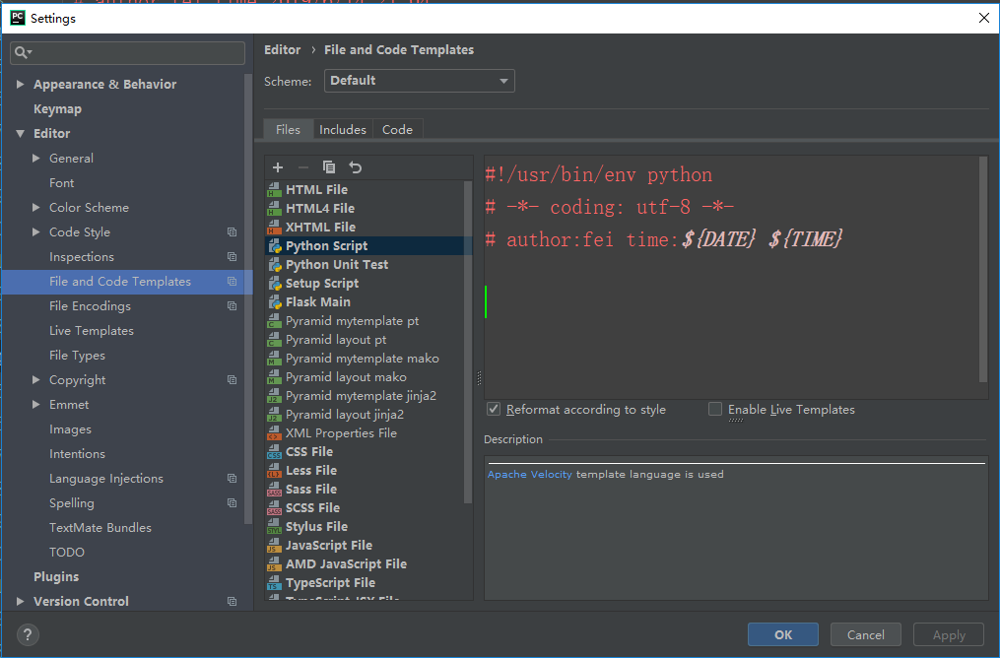
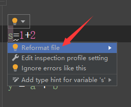

#### 1.typora下载+md文件的编写

##### 1.1 介绍

```
Python代码---->编写工具---->pycharm
markdown文件---->编写工具---->typora
```

##### 1.2 下载


##### 1.3 注意点：图片的路径设置


#### 2.pycharm使用

##### 2.1常用操作（新建项目、新建文件、配置解释器、安装模块）

**解释器路径**


第一种：创建项目时指定：

第二种：项目已经生成，进行解释器的更改或重新配置

##### 2.2界面设置

**一旦找到自己舒服的界面就不要再动**

1. 字体设置

2. 编辑器字体：

3. 设置编码

4. 设置脚本头

   ```
   #!/usr/bin/env python		# 指定Python解释器的路径，这个在linux类的操作系统才有意义
   # -*- coding: utf-8 -*-		# 指定当前文件字符编码格式为“utf-8”
   # author:fei time:${DATE} ${TIME}
   ```

   ##### 2.2快捷键

   ```
   1.ctrl+d ：快速复制一行；ctrl+y：快速删除一行
   2.shift+回车：快速换行
   3.ctrl+/ :注释、批量注释、取消注释、批量取消注释
   4.Tab：缩进；shift+tab：取消缩进
   5.ctrl+-折叠；ctrl+shift+-：全部折叠；展开用加号
   ```

#### 3.Python书写格式

##### 3.1注释

```
def add(x, y):
    """
    实现注册功能
    :param x: 用户名
    :param y: 密码
    :return: 是否可以登录
    """
    s = x + y
    # 返回用户是否可以登录的flag
    return s


# 缩进是Python里表示语句块的唯一方法
# 缩进表示包含关系
# 养成代码洁癖，拒绝波浪线
```

#### 4.变量命名规则

```
#  命名规则
'''
1.字母
2.数字（不能开头）
3.下划线
4.不要使用关键字
'''
"""
1.见名知意。比如：名字--->name, 定义get函数：def get(self):
2.类命名：驼峰命名法：FirstName
3.下划线命名：变量、函数名：first_name
"""
# 关键字：python中一些具有特殊功能的标志符。

import keyword
print(keyword.kwlist)
"""
['False', 'None', 'True', 'and', 'as', 'assert', 'break', 'class', 'continue', 'def', 'del', 'elif', 'else', 'except', 'finally', 'for', 'from', 'global', 'if', 'import', 'in', 'is', 'lambda', 'nonlocal', 'not', 'or', 'pass', 'raise', 'return', 'try', 'while', 'with', 'yield']
"""
```




