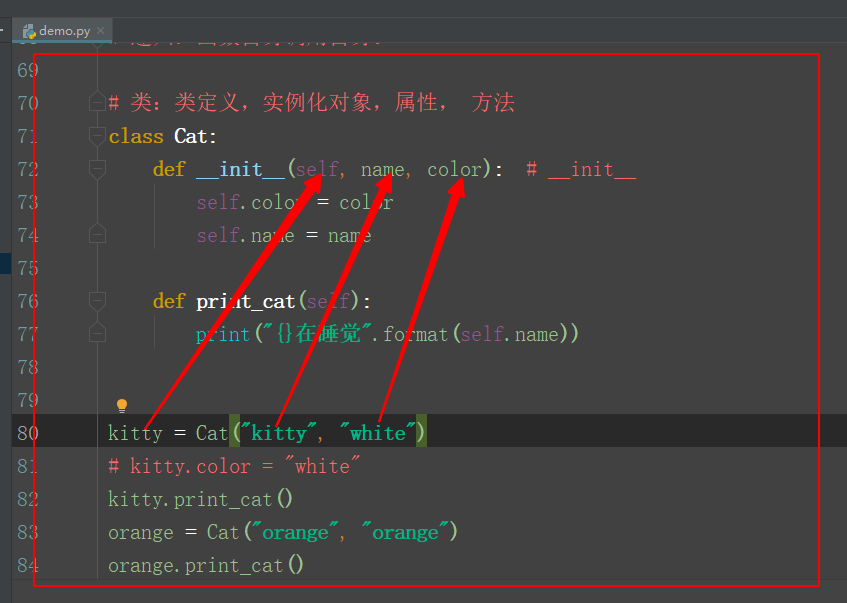

### 复习：从函数到类

#### 一、函数

##### 1.函数的定义

```
def f():
	"""
	注释类文字，解释这个函数的作用，说明函数的参数及返回值
	"""
	函数体
	返回值

函数名即变量
```

##### 2.函数调用

```
f()
```

##### 3.函数参数

```
a = 5
b = 6
sum = a + b
print(sum)


def f(a, b, d, c=666):    # 形参，必须参数, c=666,你不传参的时候，它就默认使用当前值，如果你传参它就使用你传进来的值。
    sum = a + b
    print(sum)
    print("c:", c)
    print("d:", d)


f(5, 6, 88)     # 实参，位置参数
# .........
f(8, 9, d=8)    # d=8, 关键字参数


# 动态参数
def f(a, b=666, *args, **kwargs):  # *args, 接收多余的位置参数，生成一个元组
    print("a:", a)                  # **kwargs，接收多余的关键字参数，生成一个字典
    print("b:", b)
    print("args:", args)
    print("kwargs:", kwargs)


f(5, 6, 8, 9, 100, k1="v1", k2="v2", k3="v3")
```

##### 4.匿名函数、函数作用域、闭包、递归

```
# 匿名函数
# f = lambda x, y: x + y


# 函数作用域：变量的作用范围
# 全局变量是定义在函数外的变量，它的作用范围就是全局作用域
# 局部变量是定义在函数内的变量，它的作用范围就是局部作用域。如果想要在函数内定义一个全局变量，global
# 嵌套函数的内部函数想要使用或修改外部函数的变量，nonlocal

# 闭包
# 外层函数把内层函数的函数名作为变量返回
def outer():
    print("外层函数")

    def inner():
        print("内层函数")

    return inner


res = outer()


# 闭包：变量在函数执行后，会被释放。把外层函数需要保留下来的变量给包在内层函数里，只要内层函数不执行，变量就不会释放
def f(a, b):
    def inner():
        sum = a + b
        print(sum)
    return inner


res = f(5, 6)
res()

# 递归：函数自身调用自身。
```

#### 二、类



```
# 类：类定义，实例化对象，属性， 方法
class Cat:
    count = 0   # 类属性

    def __init__(self, name, color, eat):  # __init__
        self.color = color  # 实例属性
        self._name = name   # 私有属性
        self.__eat = eat
        print("self:", self)

    def print_cat(self):
        print("{}在睡觉".format(self.__eat))

    def __secret(self):
        print("私有方法")

    def test(self):
        self.__secret()
        self.print_cat()
        print("新增功能")


kitty = Cat("kitty", "white", "food")
print("kitty:", kitty)
print(kitty._name)
# print(kitty.__eat)
# kitty.color = "white"
kitty.test()
# orange = Cat("orange", "orange")
# orange.print_cat()
```

