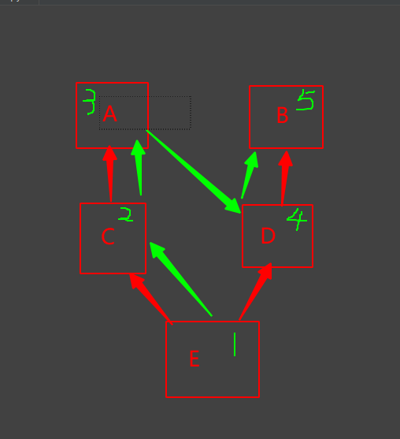
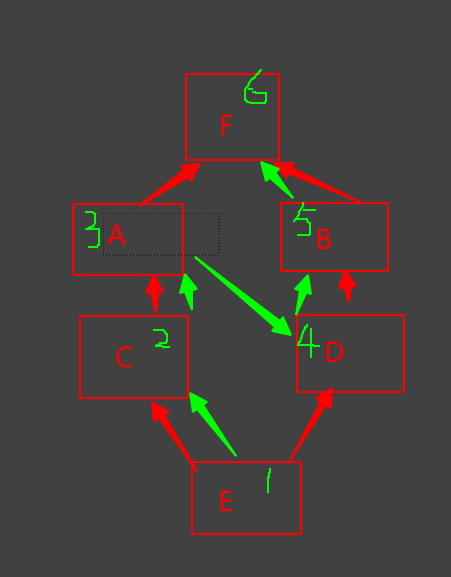
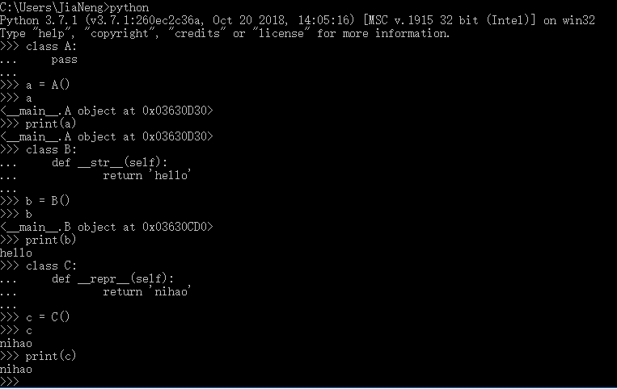

### 10-继承、多继承、魔术方法

#### 1.继承

封装：self参数传入的是创建的对象，self可以直接将对象带参数传入类中方法，这种在对象中封装数据，对类进行了优化的方法就叫封装。


#### 2.多继承

##### 1.第一种情况：红色是继承关系，绿色是方法选择的优先级



##### 2.第二种情况：



##### 3. 重写

```
子类是可以继承父类，如果子类不想使用父类的方法（构造方法），可以通过重写来覆盖父类的方法（构造方法）。
```

##### 4.子类想继承，又想有自己的方法

- 第一种：

  ```
  class A:
      def run(self):
          print("happy")
  
  
  class B:
      def eat(self):
          print("miaomiaomiao")
  
  
  class C(A, B):
      def run(self):
          A.run(self)
          print("fly")
  
  
  c = C()
  c.run()
  ```

  

- 第二种：

  ```
  class C(A, B):
      def run(self):
          super().run()
          print("fly")
  ```


#### 3.魔术方法

- 运算方法

```

class Test:
    """这是一个测试类"""
    def __init__(self, num):
        self.num = num

    def __add__(self, other):
        res = self.num + other.num
        print(res)
        # return res


a = Test(66)
b = Test(88)

a + b
# res = a + b
# print(res)
```

- `__str__`和`__repr__`

  ```
  # __str__:适合print输出的，对用户比较友好，返回值必须是字符串
  # __repr__:是__str__备胎，如果有__str__方法，那么print都会去先执行__str__，并且使用__str__的返回值。repr的输出对python友好，适合eval函数去编译对象。
  ```

  

- `__call__`

  ```
  # __call__:让实例能够直接被调用
  class B:
      """这是一个测试类"""
      def __init__(self, num):
          self.num = num
          self.eat = "food"
          self.run = "happy"
  
      def __call__(self, *args, **kwargs):
          print("ok")
  
  
  b = B(66)
  b()  # 直接调用会报错，想要直接调用，加上__call__
  
  print(b.__class__)  # <class '__main__.B'> 查看类名
  print(b.__dict__)   # {'num': 66}   查看全部的属性（属性和属性值的键值对）
  print(b.__doc__)    # 这是一个测试类, 查看对象文档即类的注释部分
  ```

  

  