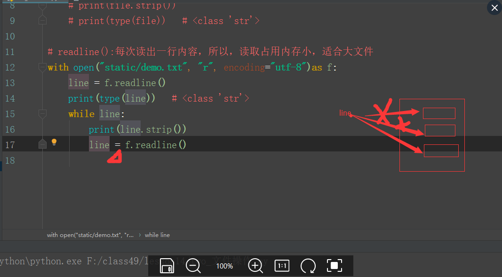

### 13-文件+异常

#### 1.上下文管理

```
# 1.read():读取文件（从指针所在的位置到文件结束为止）,字符串对象
# 2.readline():每次读出一行内容，所以，读取占用内存小，适合大文件，字符串对象
# 3.readlines():读取整个文件所有行,保存在一个列表里，每行作为一个元素，读取大文件比较占内存
```



```
# with为什么可以实现文件自动打开和关闭呢？
from datetime import datetime


# with ---->__enter__和__exit__
class RunTime:
    def __enter__(self):
        print("进来了")
        self.start_time = datetime.now()
        print(self.start_time)

    def __exit__(self, exc_type, exc_val, exc_tb):
        self.end_time = datetime.now()
        print(self.end_time)
        print("出去了")
        print("运行时间：{}".format(self.end_time - self.start_time))


run = RunTime()

with run as a:  # 上下文管理器
    print("我是type")
    for i in range(100000):
        type("hello")
```

```
# io流
import io   # 导入io模块

sio = io.StringIO()  # 创建一个对象（进行保存读取）--->字符流

sio.write("hello")  # 写
print(sio.getvalue())   # 读

sio.close()  # close后内容就没有了


bio = io.BytesIO()

bio.write(b'abcd')
print(bio.getvalue())

bio.close()
```

#### 2.工具

```
# os模块：python和操作系统做交互的模块
import os

# os.system("pwd")  # linux系统命令（连虚拟机）

# 路径拼接
l1 = os.path.join('lin', 'fei', 'hello')

print(l1)

# os.mkdir('test')    # 创建文件夹，如果文件已存在时，报错
# os.rename('test', 'test1')  # 修改文件名字

print(dir(os))
```

```
import shutil

# 将文件移动到目标文件夹
# shutil.move(r'F:\class49\lesson14\static\demo.txt', r'F:\class49\lesson14\test1')
# 将目标文件夹复制到后面的目录，注意后面的目录应该是不存在
# shutil.copytree(r'F:\class49\lesson14\test1', r'F:\class49\lesson14\static')
# 删除文件夹
# shutil.rmtree(r"F:\class49\lesson14\test1")


print(dir(shutil))
```

#### 3.认识异常

```
# 异常就是报错
# 异常处理
# 常见的报错信息
# a + 1   # NameError: name 'a' is not defined 变量未定义
# for i in range(5)：# SyntaxError: invalid character in identifier 语法错误
# 5 - "b"  # TypeError: unsupported operand type(s) for -: 'int' and 'str' 类型错误

# 自查和解决报错的能力
# 问题描述清楚的能力，掌握如何去提问

```

#### 4.异常处理

```
#   1.一旦发生异常，程序终止
# print("one")
# aaa
# print("two")

# 2.处理
print("one")
try:
    aaa
except:
    print("three")
print("two")

# try和except与if和else相似，但if和else可以不要else，try和except必须成对出现
# 基本用法：
"""
先执行try里面的代码，try不满足条件，捕获异常，执行except里面的代码
先执行try里面的代码，try满足条件，直接执行try里面的代码，不再执行except里面的代码
"""

# 巩固
# f = open("haha.py", "r")    # 当文件不存在时，会报错FileNotFoundError: [Errno 2] No such file or directory: 'haha.py'

try:
    f = open("haha.py", "r")
except:
    print('发生了异常')

# 1/0  # ZeroDivisionError: division by zero
try:
    1 / 0
except:
    print("发生了异常")

# 拓展：捕获具体的异常

try:
    # f = open("haha.py", "r")
    aaa
except ZeroDivisionError:
    print("分母为零了")
except FileNotFoundError:
    print('文件不存在')
except Exception as e:
    print(e)    # name 'aaa' is not defined

try:
    1 / 0
except ZeroDivisionError:
    print("分母为零了")

# 捕获具体异常：让你捕获你想要捕获的异常


# 自动抛出异常
# raise
# def func(name):
#     if name == '胡涛':
#         raise TypeError("黑名单用户，拒绝访问")
#
#
# func("胡涛")

try:
    # raise TypeError("主动抛出的类型错误")    # 自制异常
    a = 5
except ZeroDivisionError:
    print("分母为零了")
except FileNotFoundError:
    print('文件不存在')
except Exception as e:
    print(e)
else:
    print("try里的代码无异常，正常执行后执行else")
finally:
    print("代码不管是否正常执行，最后都会执行finally")

```

