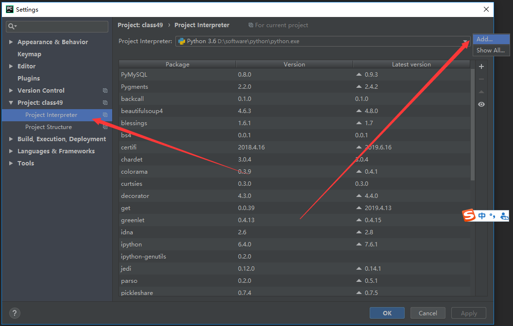
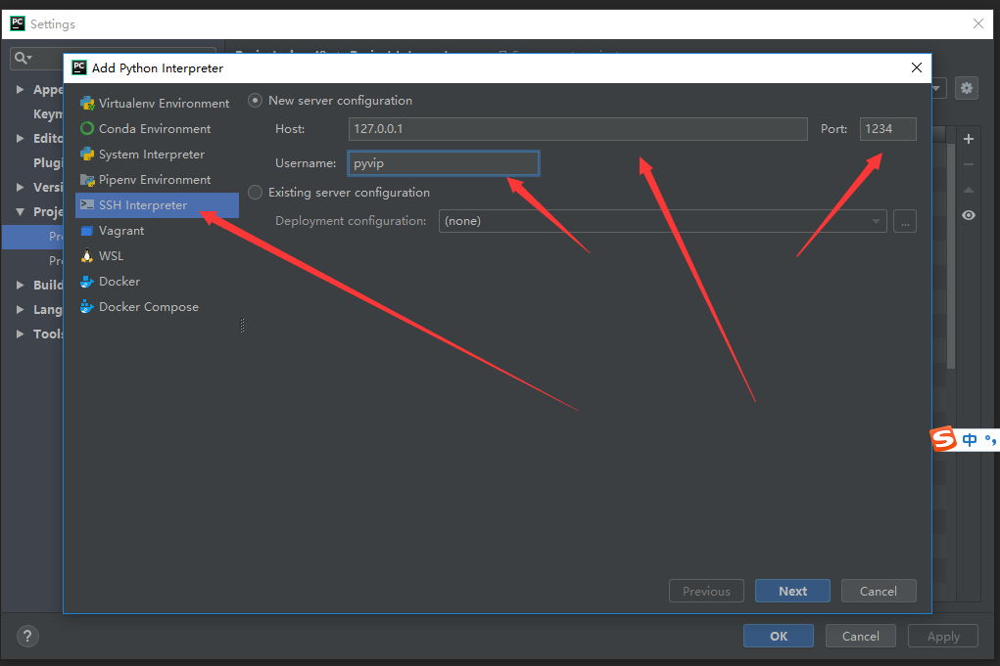
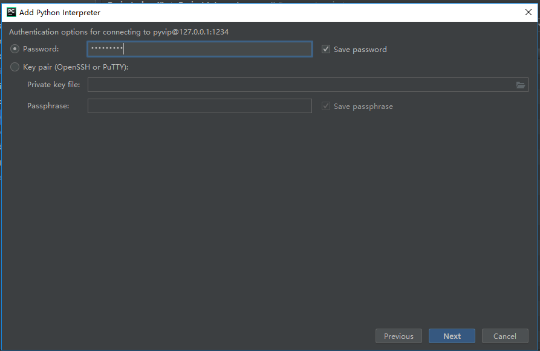
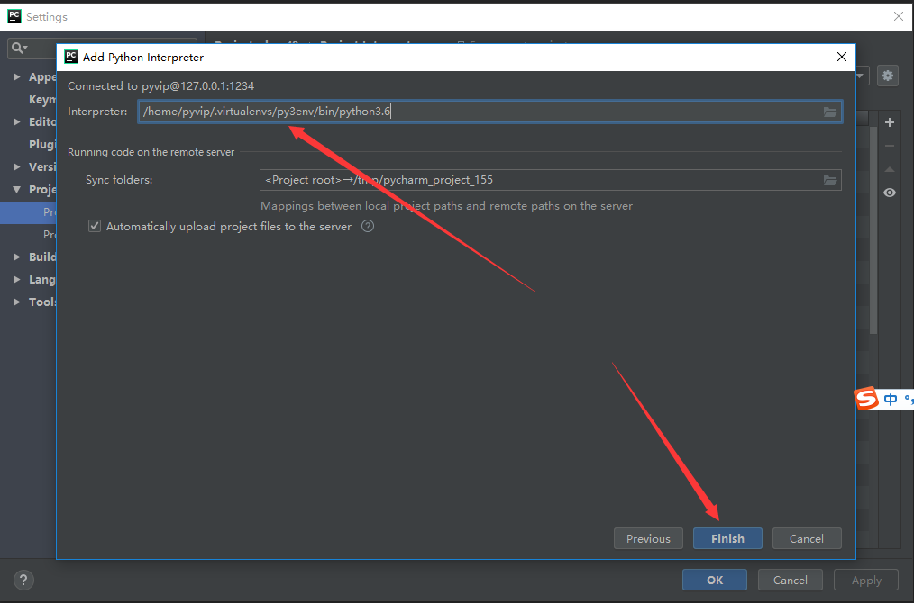
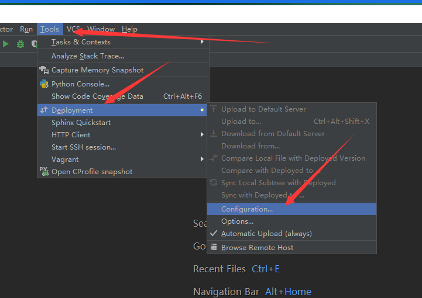
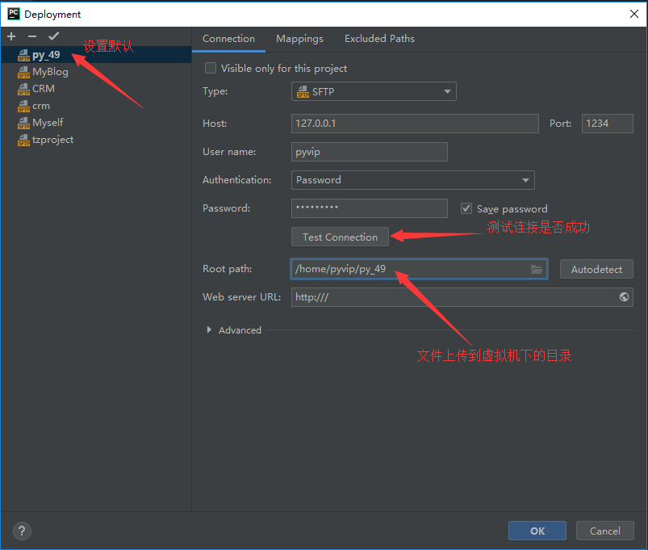
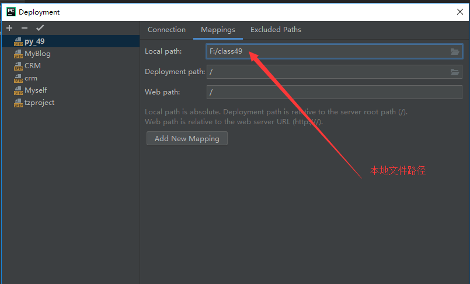
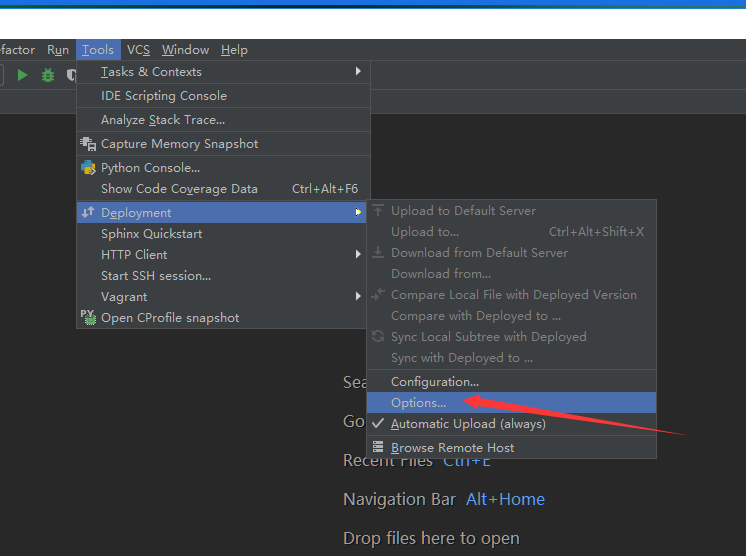
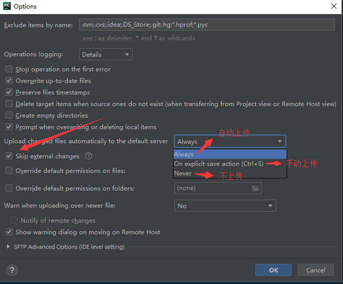

#### pycharm远程连接虚拟机

##### 1.pycharm连本地环境

##### 2.xshell远程连接虚拟机

##### 3.pycharm远程连接虚拟机

1.打开虚拟机

2.打开pycharm

add local 添加本地解释器

add remote 添加远程解释器

3.解释器配置完成后，配置文件上传的路径

mkdir 文件名：这个文件就专门用来存放我们上传上来的代码

配置：本地文件路径和虚拟机文件路径关联起来

4.配置上传方式

