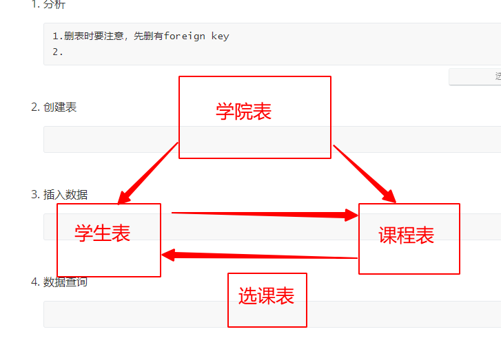

#### 作业：表关系

建立选课系统中的4张表: (学院表，学生表，课程表，选课表) , 并每张表插入4条数据。

1. 分析

   ```
   1.删表时要注意，先删有foreign key
   2.分析表关系
   ```

   

2. 创建表

   ```
   # 创建学院表
   mysql> create table department(
       -> d_id int primary key auto_increment,	# 学院id
       -> d_name varchar(20) not null);	# 学院名
   
   # 创建学生表
   mysql> create table student(
       -> s_id int primary key auto_increment,	# 学生id
       -> s_name varchar(20) not null,	# 学生名字
       -> s_age tinyint,	# 学生年龄
       -> d_id int not null,	# 所属学院的id
       -> foreign key(d_id) references department(d_id)	# 外键关联
       -> );
   
   # 创建课程表
   mysql> create table course(
       -> c_id int primary key auto_increment,	# 课程id
       -> c_name varchar(20) not null,	# 课程名
       -> d_id int not null,	# 所属学院的id
       -> foreign key(d_id) references department(d_id)
       -> );
   # 创建选课表（中间表）
   mysql> create table sel(
       -> s_id int,	# 用来记录学生id
       -> c_id int,	# 用来记录课程id
       -> primary key(s_id,c_id),	# 联合主键
       -> foreign key(s_id) references student(s_id),	# 关联学生id
       -> foreign key(c_id) references course(c_id)	# 关联课程id
       -> );
   ```

   

3. 插入数据

   

   ​			


4.数据查询

```

```

#### 索引

create index 索引名 on 表名（字段名称（长度））

where子句的列（字段）

```
import pymysql.cursors

db_config = {
    'user': 'root',
    'password': 'qwe123',
    'db': 'py_49',
    'charset': 'utf8',
    'cursorclass': pymysql.cursors.DictCursor
}

# 1. 连接数据库
conn = pymysql.connect(**db_config)
try:
    with conn.cursor() as cursor:
        # 2. 构造sql语句
        sql1 = 'INSERT INTO index_test (title) values ("title_%s")'
        # 3. 执行sql语句
        for i in range(100000):
            cursor.execute(sql1, args=(i,))
        # 4. 提交事务
        conn.commit()
except Exception as e:
    # 5.异常处理
    print(e)
    # 6.回滚 也可以不写
    conn.rollback()
finally:
    # 7. 关闭连接
    conn.close()
    print(1111111111111111)
```

