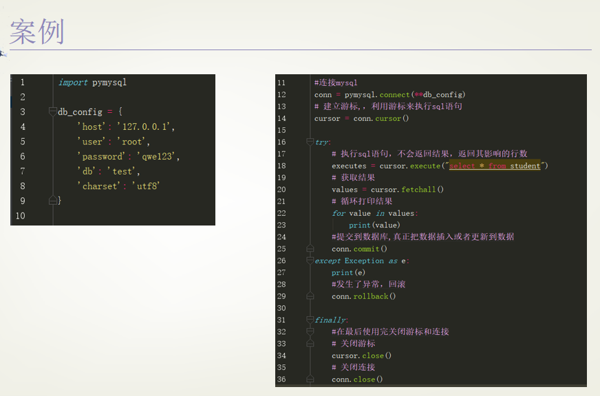

#### python与数据库交互

##### 1.DB-API

##### 2.python操作MySQL

```
workon  # 查看全部虚拟环境
workon py3env # 进入py3虚拟环境
pip list    # 查看已经安装好的第三方库（不要根据pip提示升级去升级，如果安装过程中一旦有问题，容易导致旧的卸载了，但是新的还没装好）
pip install pymysql # 安装（pymysql大小写忽略PyMySQL）
```



事务：回滚（rollback）、提交（commit）


##### 3.python操作Redis

```
workon  # 查看全部虚拟环境
workon py3env # 进入py3虚拟环境
pip list    
pip install redis # 安装
pip uninstall redis # 卸载
```

