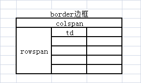
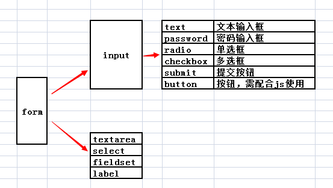

#### 0-开班典礼

##### 1.知识点

```
不需要精通，但是要了解。
```

##### 2.时间安排

```
周一二四五
8:00-8:30 解答+作业讲解
8:30-10:30 正式课

周三六
8:30-10:30 答疑课

要么跟着自己的学习进度---录播
要么跟着班级的进度---直播
```

##### 3.学习工具

开发工具：pycharm

浏览器：谷歌

##### 4.联系方式

微信号：shenshui8080

跟班qq：3003781845

#### 1-html标签

##### 1.常用标签

块级标签

```
标题标签（h1~h6）
段落标签（p)
列表标签
    <!--ul>li*3  unordered list-->
    <ul>
        <li>苹果</li>
        <li>梨子</li>
        <li>香蕉</li>
    </ul>

    <ol>
        <li>乒乓球</li>
        <li>游泳</li>
        <li>画画</li>
    </ol>

    <dl>    <!-- definition list -->
        <dt>湖南省</dt>
        <dd>长沙市</dd>
        <dd>岳阳市</dd>
        <dt>湖北省</dt>
        <dd>黄冈市</dd>
        <dd>武汉市</dd>
    </dl>
    
div标签：页面布局
本身是没有任何样式，div对页面进行基本布局
```

行内标签

```
粗体/斜体标签：<b><strong>/<i><em>
图片标签
超链接a：实现页面跳转
 <a href="javascript:void(0);">我想要a标签的样式，但是我不想让他跳转</a>
 <a href="https://www.baidu.com" title="实现网页跳转" target="_blank">点击我，可以去百度哦</a>
 <a href="#test1" title="页面内跳转">第一章</a>
 span 标签：本身没有样式。局部文字特效
```

##### 2.特殊符号

```
&开头；结尾
```

##### 3.表格标签



##### 4.表单标签




