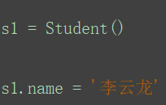

#### django11期班级qq：3003781845

#### 请备注好：姓名--原班期--潭州账号，谢谢

[TOC]

## 模型基础

#### 一、数据库连接配置步骤

##### 1.对应环境下`pip install pymysql`

##### 2.创建数据库

- 创建数据库用户（授权）

- 创建数据库

- ```
  # 1.创建新的数据库并指明字符编码格式
  create database CRM charset=utf8;	
  # 2.创建用户名为fei密码为fei的数据库用户，并将CRM下所有表的操作权限授予给用户，支持远程访问
  grant all privileges on CRM.* to 'fei'@'%' identified by 'fei';
  flush privileges;
  # 3.数据库进入命令
   mysql -ufei -pfei -A CRM
  ```

  

##### 3.修改配置文件

```
DATABASES = {
    'default': {
        'ENGINE': 'django.db.backends.mysql',
        'NAME': 'CRM',  # 数据库名
        'USER': 'fei',
        'PASSWORD': 'fei',
        'HOST': '127.0.0.1',
        'PORT': 3306,
    }
}
```

##### 4.导入API

```
import pymysql

pymysql.install_as_MySQLdb()
```


### 二、ORM

用面向对象的方式，去描述数据库，操作数据库，达到不用编写sql语句对数据库进行增删改查


### 三、模型的创建和映射

##### 1.模型文件：teacher/models.py

##### 2.创建模型

```
from django.db import models


# Create your models here.
class Student(models.Model):
    name = models.CharField(max_length=20)
    age = models.SmallIntegerField()
    sex = models.SmallIntegerField(default=1)   # 设置默认值
    qq = models.CharField(max_length=20)
    phone = models.CharField(max_length=20)
    # c_time = models.DateTimeField(verbose_name="创建时间", auto_now_add=True)    # auto_now_add=True
    c_time = models.DateTimeField("创建时间", auto_now_add=True)    # auto_now_add=True自动填充当前时间
```

##### 3.激活模型

```
# 1.app是否注册
# 2.迁移
python manage.py makemigrations teacher	# 指定app生成迁移
python manage.py makemigrations # 全部模型进行迁移
python manage.py sqlmigrate teacher 0001	# 查看原生sql语句
```


以上操作完成，保存更改，但是操作还没生效

```
# 3.迁移生效
python manage.py migrate teacher	# 指定app迁移生效
python manage.py migrate
```

**重点**：注意

迁移功能是非常强大的,在开发项目时随时更改模型，不需要删除数据库或创建新的表----实时升级数据库而不丢失数据。

**总结：模型修改三部曲**

1. 修改模型（创建模型）
2. 运行`python manage.py makemigrations`创建迁移
3. 运行`python manage.py migrate`迁移生效

### 四、数据的增删改查

进入交互式python shell中

```
 pip install ipython
 python manage.py shell
```

##### 1.增

```
from teacher.models import Student  	# 导入模型
# 第一种方式：需要将创建的对象保存
```


```
# 第二种方式：创建空实例，再属性赋值，记住对象要保存
```




```
# 第三种方式：create直接写入数据库
 Student.objects.create(name="阙浩枫", age=16)
 
# 第四种方法：get_or_create，先查，没有才创建
s = Student.objects.get_or_create(name="朦胧", sex=0,age=18)  
```

##### 2.查

```
# 查所有
In [14]: res = Student.objects.all()                                                                                     

In [15]: res                                                                                                             
Out[15]: <QuerySet [<Student: Student object (1)>, <Student: Student object (2)>, <Student: Student object (3)>, <Student: Student object (4)>]>

In [16]: print(res.query)                                                                                                
SELECT `teacher_student`.`id`, `teacher_student`.`name`, `teacher_student`.`age`, `teacher_student`.`sex`, `teacher_student`.`qq`, `teacher_student`.`phone`, `teacher_student`.`c_time` FROM `teacher_student`

# 查单条，通过同时符合条件的有多个，报错
In [17]: Student.objects.get(pk=1) 	# 主键不一定会命名为id，为了避免错误，使用pk，它会自动的去找表的主键，而不去管表的字段名                                                                                      
Out[17]: <Student: Student object (1)>

# 带条件查询
```


##### 3.改

- 第一种方式：修改单条数据
- 

- 第二种方式：调用update，修改多条数据

- ```
  In [13]: Student.objects.filter(age=18).update(qq="789456")                                                              
  Out[13]: 2	# 修改数据的条数
  
  ```

##### 4.删

- 删一条

- ```
  In [14]: s = Student.objects.get(pk=3)                                                                                   
  
  In [15]: s                                                                                                               
  Out[15]: <Student: 阙浩枫>
  
  In [16]: s.delete()                                                                                                      
  Out[16]: (1, {'teacher.Student': 1})
  ```

- 删多条

- ```
  In [17]: Student.objects.filter(age=18).delete()                                                                         
  Out[17]: (2, {'teacher.Student': 2})
  
  In [18]: Student.objects.all().delete()                                                                                  
  Out[18]: (1, {'teacher.Student': 1})
  ```


