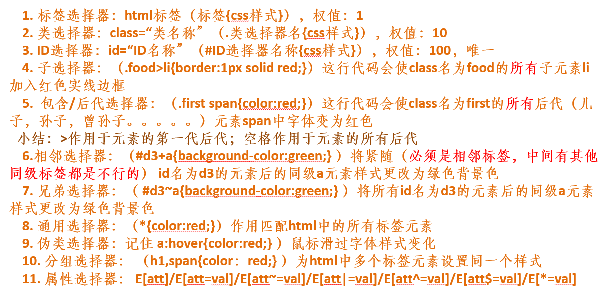

#                                            css-层叠样式表

```
html里的注释<!--www-->
css里的注释/**/
script里
多行注释：
/**/
单行注释：
//wdaf
//waf
//awfafaf
```

## 一、导入样式

```
第一种css导入方式：head标签里style标签
<html>
	<style>
		.class{}
		#id{}
	</style>
</html>

第二种css导入方式：直接写在行内
<div style="color:blue">哈哈哈</div>

第三种css导入样式：通过head标签外部文件导入。
外链：<link rel="stylesheet" href="test.css">

优先级：谁里标签近就用谁！！！
```

## 二、css选择器（重点）

```
基本选择器：标签选择，器权重值：1，class选择器，权重值：10，id选择器,权重值：100

后代选择器和子代选择器
<div class="box1">
	<span>鹅鹅鹅，</span>
	<p>曲<span>项</span>向天歌<p>
</div>
此时，第一个span和p是div的儿子，下面的span是div的孙子。
父子： .box1>span{}改变第一个span样式
后代选择器：.box1 span{}包含所有的后代

兄弟选择器相邻选择器
<p>我就是我，不一样的烟火</p>
<div class="box2"></div>
<p>白毛浮绿水</p>
<p>红掌拨清波</p>
兄弟：.box2~p{}把第一个看成参照物，后面所有平级的都选上
相邻：.box2+p{}第一个当做参照物，选择目标标签后面的标签。

全选择器
*{} 是body里面所有的选择器

属性选择器
可能class和id都不够用时
<style>
div[hh="test"]{}
div[class="box3"]{}
</style>
<div class="box3" hh="test">我是属性选择器</div>

分组选择器
<div class="box4"></div>
<p class="box5"></p>
.box4,box5{}

伪类选择器
a:link{}访问前
a:visited{}访问后
a:hover{}覆盖
a:active{}点击没有松开-激活
```



## 三、文字样式

```
<style>
	font-family:华文彩云，华文中宋;
	字体样式;
	默认微软雅黑，可以设置多个字体，以备不测
	
	font-size:14px;
	单位(px,rem,%,em)
	字体大小：
	px:谷歌默认16px可识别最小12px。
	rem:html根大小的倍数谷歌默认16px所以就是16px*n
	em:父级字体*n
	%:父级字体*%
	
	font-weight:bolder;
	字体宽度：bolder更粗体
	normal默认
	lighter变细
	bold 加粗
	可以给值但必须是100-900的整百数
	正常400,700为blod，900位bloder
	
	font-style:italic;
	字体样式：
	italic、oblique斜体
	normal默认
	
	color:red；
	文字颜色
	1.英文单词2.#0000003.rgb(299,233,21)4.rgba a:0-1表示透明度(199,21,133,0.7)
</style>

<div>测试对象</div>
```


## 四、文本样式

```
<style>
	p{
		text-indent:2em;(首行缩进)
		line-height:32px;(设置行高此时的一行为32px且文字显示在中间部分)
		
	}
	div{
		height:200px;
		width:200px;
		border:1px solid red;
		linr-height:200px;
		文字上下居中，值应该等于高度
		text-align:center;
		文本大写小写
		text-transform:capitalize;(首字母大写)且uppercase全部大写，lowercase全部小写
		letter-spacing:50px(字间距)
		word-spacing:50px(单词间距)
		display:block/inline/none显示模式行内块
		margin:0 auto;(div居中显示)
	}
	a{
		text-decoration:none;(没有任何东西)underline（下划线）overline（上划线）line-through(删除线)
	}
	.box{
	white-space:nowrap;(不换行)
	overflow:hidden;(超出部分隐藏)
	text-overflow:ellipsis;(影藏部分用点来表示)
	}
</style>

<div class="box">我就是我我就是我我就是我我就是我我就是我</div>
<div>文字居中,hello,Hello</div>
<p>我就是我</p>
<a href="javascript:void(o)">我是标签</a>
```

## 五、背景样式

```
使用div必须定义宽高，不然不会显示出来
<style>
	.box1{
		width:200px;
		height:200px;
		border:1px solid skyblue;
		/*背景色*/
		background-color:red;
		
		/*背景图片*/
		background-image:url("图片地址");/*注：地址里面一个.代表上一级*/
		
		/*背景图片是否平铺：默认平铺*/
		background-repeat:no-repeat;
		
		/*背景图片定位：position*/
		background-position:200px 200px
		
		/*背景图片大小:size*/
		background-size:200px 200px;
		①：输入长和宽的大小也可以只写一个值，等比缩放
		②：contain；/*等比例缩放，以内容为准，将图片完全可见，不一定铺满整个背景*/
		③：cover；/*铺满整个背景，但是图片可能残缺*/
		
		/*背景的复合样式color image repeat position/size*/因为大小和定位都有可能是px，所以看/的前后来查看
		background:url("") no-repeat top/cover
		
		/*字体的复合样式style weight size family后面两个必须有*/
		font:italic bolder 30px 华文彩云;
		
		/*行内块标签display:inline inline-block block*/
		display:inline;
		/*注：行内标签没有宽高*/
	}
</style>

<div class="box1">hello</div>
<div class="box2">hello</div>
```

## 六、盒子模型

一层：边框border

二层：内容content

​			内边距padding

三层：背景图像，背景色background

四层：外边距margin

**注意四点：**

**A：盒子模型要牢记**

**B：padding调整外部div内边距，他调整的是自身的大小，所以如果不希望破坏外观，则尽量使用margin布局（padding有可能成大外盒子，但如果是margin过大，则盒子内容会被挤出，但不会改变盒子大小）；**

**C：内部div和外部div定位时需要找到边界，外部div如果没有设置border，则内部div的margin设置时会一直往上找，直到找到边界位置。**

**D：内部相邻div间的margin，取值为两个div各自设置margin的最大值，而不是相加值**

### 6.1、一层：边框border

```
<style>
	.box{
		width:200px;
		height:200px;
		border:1px solid red;/*位置随意*/
		border-top:20px solid red;
		border-bottom:20px double skyblue;
		border-right:20px dotted yellow;
		border-left:20px dashed green;
	}
</style>
<div class="box"></div>
```

### 6.2、二层：内边距padding

```
<style>
	.box{
		height:200px;
		width:200px;
		boeder:5px solid red;
		padding-top:20px;
		padding-right:20px;
		padding-bottom:20px;
		padding-left:20px;
		/*组合写法 */
		paddding:20px 30px 40px 50px;/*按照顺时针方向。三个参数为上右下且左和右相同，两个参数，上等于下，左等于右*/
	}
</style>
<div class="box">我就是我</div>
```

### 6.3、三层：外边距margin

```
<style>
	.box{
		background:red;
		margin-top:100px;
		margin-right:100px;
		margin-bottom:100px;
		margin-left:100px;
		margin:0 atuo;
	}
	.box1{
		background:yellow;
	}
</style>
<div class="box">我就是我</div>
<div class="box1">参照物</div>
```

### 6.4、内外边距总结

```
<style>
    .pad{
        height:200px;
        width:200px;
        background: skyblue;
        /*padding-left:100px;*/
        /*注：上面这个相当于把这个盒子撑大*/
        margin-bottom:50px;
        /*注：这个和下面的div如果一起设置margin时中间的间距变为100*/
    }
    .mar{
        height:200px;
        width:200px;
        background: #9090fb;
        border:1px solid red;
        margin-top:100px;/*注：此时和上面的bottom是选择最大的那个作为间距*/
    }
    .mar>div{
        height:100px;
        width:100px;
        background: plum;
        /*margin-left:500px;*/
        /*注：上面这个相当于里面的小盒子往右边走了500px的大小*/
        /*margin-top:100px;*/
        /*注：如果外部div没有设置border效果，这个时候是两个盒子一起往下跑，解释：盒子套盒子时，如果设置margin-top要小心,内部的盒子需要找到一个定位的地方，这时需要为外部盒子设定border才可以达到预期效果*/
    }
</style>
<div class="pad">padding测试</div>
<div class="mar"><div>margin测试</div></div>
```

## 七、重置css（reset css）

```
https://meyerweb.com/eric/tools/css/reset/

初学者可以：
*{
	margin:0;
	padding:0;
}
```

## 八、浮动（float）

**脱离文档流：一个文档应该在什么地方，但是他脱离了这个地方**

```
<style>
    ul{
        list-style: none;
        /*将小圆点去掉*/
    }
    li{
        float:left;
        /*设置左浮动*/
        margin-left:20px;
        /*使他出现间距更好看*/
    }

    .box{
        border: 10px solid red;
        /*如果浮动起来且内部没有更多东西的话，将只能看到border的两根线条*/
        /*overflow: hidden;*/
        /*只在纯浮动时有效，超过部分隐藏不推荐使用，如果存在定位，就会超过部分隐藏*/
    }
    .box div{
        height:100px;
        width:100px;
    }
    .left{
        background: #54b9e2;
        float:left;
    }
    .right{
        background: #6fa026;
        float:right;
    }
    
    /*通用消除高度塌陷使用以下方法！！！*/
    .clearfix::after{
        display: block;
        clear:both;
        content:"";
    }
    /*使用伪类元素，这样可以来消除高度塌陷。建议使用。原因：当你出现浮动时，他自动触发伪类元素标签，使得高度塌陷不会出现。*/
</style>
    
<!--浮动的应用：一列变一行-->
<!--<ul>-->
    <!--<li>首页</li>-->
    <!--<li>在线课堂</li>-->
    <!--<li>搜索</li>-->
<!--</ul>-->
<!--浮动带来的问题：高度塌陷-->
<div class="box clearfix">
    <div class="left"></div>
    <div class="right"></div>
    <!--<div></div>-->
    /*多一个空的div这样也可以使高度不塌陷，也不推荐使用*/
    <!--如果浮动布局多，要增加很多的div-->
</div>
```

## 九、定位（position）

### 9.1、固定定位

**不管浏览器怎么动，设置的东西，始终在浏览器固定的位置，这个也是脱离文档流**

```
<style>
    div{
        height:200px;
        width:200px;
        background: #54b9e2;
        position:fixed;
        right:30px;
        bottom:30px;
    }
</style>
<div>我是小广告</div>
```

### 9.2、相对定位

**相对定位：以自身为参照物，不脱离文档流，偏移前的位置保留不动，不管怎么移动，下面的东西始终不动**

```
    <style>
        div{
            height:200px;
            width:200px;
            background: peru;
        }
        .test{
            background: red;
            position:relative;
            left:300px;
            top:300px;
        }
    </style>
    
	<div class="test"></div>
	<div class="tar">参照物</div>
```

### 9.3、绝对定位

 **绝对定位：脱离文档流。参照物：浏览器/已定位的父元素**

```
    <style>
        div{
            height:200px;
            width:200px;
            background: peru;
        }
        .test{
            background: red;
            position:absolute;
            left:300px;
        }
    </style>
    
	<div class="test"></div>
	<div class="tar">参照物</div>
```

### 9.4、应用：父相子绝

```
	<style>
        .parent{
            height:800px;
            width:800px;
            background: antiquewhite;
            position:relative;
        }
        .child{
            height:100px;
            width:100px;
            background: #54b9e2;
            position:absolute;
            left:100px;
            top:500px;
        }
        .child1{
            height:100px;
            width:100px;
            background: peru;
            position:absolute;
            border-radius: 50%;
            /*可以将边缘圆角化*/
            left:500px;
            top:300px;
        }
        .child2{
            height:100px;
            width:100px;
            background: purple;
            position:absolute;
            
            /*如果要将东西移到正中心，那么你先将盒子移动到整个页面中心，然后再往左边和上面移动各自长和宽的一半*/
            left:50%;
            margin-left:-50px;
            top:50%;
            margin-top:-50px;
        }
    </style>
    
    <div class="parent">
        <div class="child"></div>
        <div class="child1"></div>
        <div class="child2"></div>
    </div>
```

## 十、z-index：改变层级（大的在上面）

```
    <style>
        *{
            margin:0;
            padding:0;
        }
        div{
            height:200px;
            width:800px;
            background: #6fa026;
            margin:0 auto;
            position:relative;
        }
        ul{
            list-style: none;
        }
        img{
            height:200px;
            width:800px;
            position:absolute;
        }
        .btn li{
            height:10px;
            width:10px;
            border:1px solid black;
            float:left;
            border-radius: 50%;
            margin-left:5px;
        }
    </style>
    
    <div>
        <!--<ul class="img">-->
            <!--<li></li>-->
            <!--<li></li>-->
        <!--</ul>-->
        <!--<ul class="but">-->
            <!--<li>&lt;</li>-->
            <!--<li>&gt;</li>-->
        <!--</ul>-->
        <ul class="btn">
            <li></li>
            <li></li>
            <li></li>
            <li></li>
        </ul>
    </div>
```

## 十一、display补充

块级元素占一行，可以设置宽高：div

行内元素一行有多个，不可以设置宽高，你的内容是多少，它就显示多少

：span

inline-block:元素在一行内显示，同时可以设置宽高。

## 十二、补充-css选择器是否空格

**css选择器有哪些**
**基本选择器：标签选择器（标签名）；id选择器（#id名）; class选择器（.class名）**
**复合选择器：子代选择器（基本选择器>基本选择器）；后代选择器（基本选择器 基本选择器）；相邻+；兄弟~**

```
div .test/这个是后代选择器
div.test/这个是class的值为test的div
```

## 十三、小手的显示

```
cursor:pointer;
```

