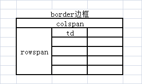
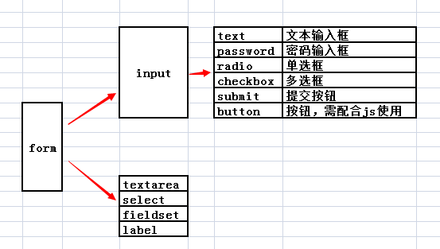

# html标签

**html超文本标记语言**

```
<!DOCTYPE html>  <!--文档类型-->
<html>           <!--根标签-->
<head>           <!--网页头部-->
<title></title>  <!--标签-->
<meta name="keywords" content="网页，音乐"><!--关键字-->
<meta name="description" content="浙江省"><!--展示在网页搜索时出现的字-->
</head>
<body>
<h1>你好，世界！</h1>
</body>
</html>
```

### 1.常用标签

#### 块级标签

```
标题标签（h1~h6）
段落标签（p）

列表标签
    <!-- ul>li*3这样可以快捷创建多个标签  unordered list-->
    
    无序列表
    <ul>
        <li>苹果</li>
        <li>梨子</li>
        <li>香蕉</li>
    </ul>
    
    有序列表
    <ol>
        <li>乒乓球</li>
        <li>游泳</li>
        <li>画画</li>
    </ol>
    
    自定义列表    <!-- definition list -->
    <dl> 
        <dt>湖南省</dt>
        <dd>长沙市</dd>#大标签
        <dd>岳阳市</dd>#小标签
        <dt>湖北省</dt>
        <dd>黄冈市</dd>
        <dd>武汉市</dd>
    </dl>
    
div标签（盒子）：页面布局
本身是没有任何样式，div对页面进行基本布局
快捷：div#top ==<div id="top"></div>创建id为top的div标签

id用#来进行编译
class用.wad 来编译
```

#### 行内标签

```
粗体/斜体标签：<b><strong>/<i><em>

图片标签


超链接a：实现页面跳转
target：
_black(新的页面打开)
_self(当前页面)
_top（在整个窗口中打开）
_parent（在父框架中打开）

 <a href="https://www.baidu.com" title="实现网页跳转" target（目标）="_blank">点击我，可以去百度哦</a>
  
 <a href="#test1" title="页面内跳转">第一章</a>
 <a href="#" title="调到页面头部">头部</a>
 
  <a href="javascript:void(0);">我想要a标签的样式，但是我不想让他跳转</a>
 
 span 标签：
 本身没有样式。局部文字特效
```

### 2.特殊符号

```
&开头；结尾
&lt； <
&gt； >
&emsp；字符宽
用户名
密&emsp;码
可以使文字对齐

&nbsp空格
```

### 3.表格标签

```
<table>
	<caption>表格名</caption>
	thead>tr>th*3==一个表头，一行和三个单元格(th只在头部的表格才有自动加粗自动居中)
	tbody>tr*3>td*3==创建三行三列的表格
	<tr>
		<td colspan="3">1</td>
		#进行合并列，将这一行的三列合并为一个单元格
	</tr>
	
	<tr>
		<td rowspan="2">1</td>
		#进行合并行，
	</tr>
</table>
```



### 4.表单标签



```
<form action="这里是提交的目的地" method="提交方式（get或者post）" enctype="multipart/form-data"参数只有这个时才能实现文件上传>

	<p>用户名：
		<input type="text" name="usr" placeholder="请输入用户名">
	</p>
	注：应为前后端交互时，文件传世使用的是json文件，所以是通过键值对来进行传输，此时键为标签内的name，value为输入的值,placeholder可以显示灰色字体在表格内
	
	<p>
		<lable for="target">密&emsp;码：</lable><input type="password" name="psw" id="target">
	</p>
	注：lable可以点击lable所选区域时，等于点击要输入的那个地方
	
	<p>性&emsp;别：
		<input type="radio" name="gender" value="meal">男
		<input type="radio" name="gender" value="femeal">女
		<input type="radio" name="gender" value="secret">保密
	</p>
	注：因为性别只能选一个，此时一定要保证name这里的值一定要一样，这样才能保持进行单选操作。且这个value值可以在你提交时知道你所提交的值为哪一个。
	
	<p>爱&emsp;好:
		<input type="checkbox" name="hoppy" value="singing">唱歌
		<input type="checkbox" name="hoppy" value="dancing">跳舞
		<input type="checkbox" name="hoppy" value="drawing">画画
	</p>
	
	<p>上传文件：<input type="file"></p>
	
	###下拉列表框
	
	<p>地&emsp;址
		<select name="addr" id="">
			<optgroup label="浙江省">
				<option value="js" selected(默认被选中)>金华市</option>
				<option value="wz">温州市</option>
				<option value="hz">杭州市</option>
			</optgroup>
			<optgroup label="湖南省">
				<option value="yy">岳阳市</option>
				<option value="cs">长沙市</option>
			</optgroup>
		</select>
	</p>
	
	###文本域
	
	<p>个人简介：<textarer rows="10" col="30"></textarer></p>
	
	设置区域，并且将其命名在legend里面
	
	<fieldset>
		<legend>个人简介：</legend>
		<textarer rows="10" col="30"></textarer>
	</fieldset>
	
	
	
	<p>重置：<input type="reset"></p>
	<p>用户名：<input type="submit" value="提交"（这里可以改提交按键的名字）></p>
</form>
```

#### 4-衍生

```
method="提交方式（get或者post）"
·当选择为get时，点击提交，网页上方的网址会进行重新编排，将你上次所提交的一些信息会写上去这样会非常不安全
·post方式时，网址他不会添加任何东西

<form action="https://www.sogou.com/web" method="get">
    <input type="text" name="query">
    <input type="submit" value="搜索">
</form>
这样会形成一个简易的搜狐搜索功能，当把get改为post时，此项目将不会再进行

<form action="https://www.baidu.com/s" method="get">
    <input type="text" name="wd">
    <input type="submit" value="搜索">
</form>
这样会形成简易的百度搜索功能。
综上所述，当需要改搜索网页器时，先查看网页的后面的代码，看web/s。在看搜索的值为什么：query/wd
```


