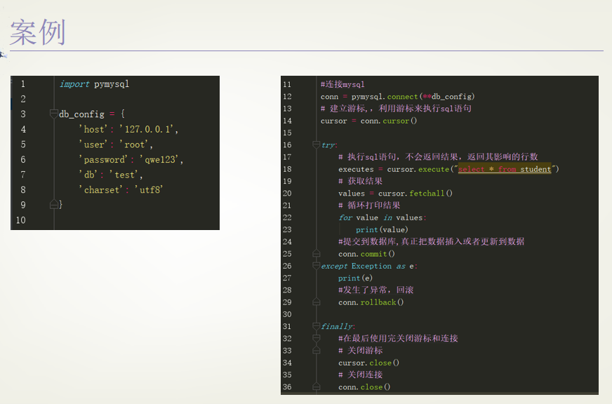

#### python与数据库交互

##### 1.DB-API

##### 2.python操作MySQL

```
workon  # 查看全部虚拟环境
workon py3env # 进入py3虚拟环境

```



事务：回滚（rollback）、提交（commit）


##### 3.python操作Redis

```
workon  # 查看全部虚拟环境
workon py3env # 进入py3虚拟环境
pip list    
pip install redis # 安装
pip uninstall redis # 卸载
```

