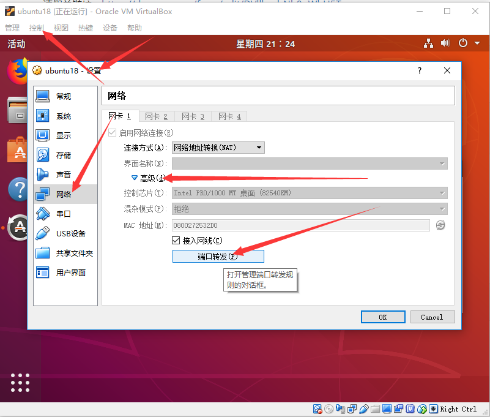
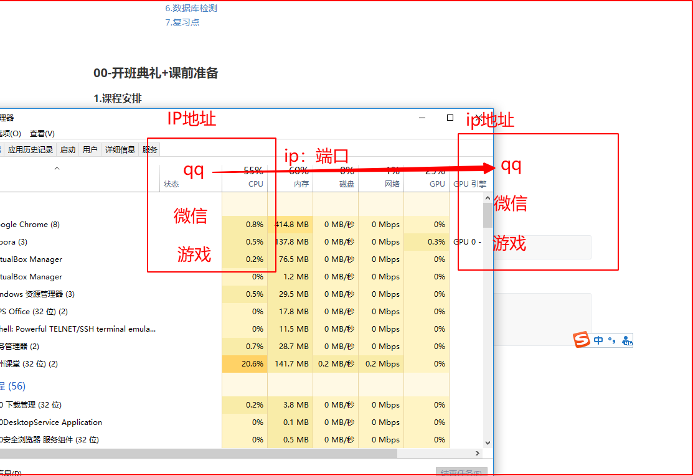
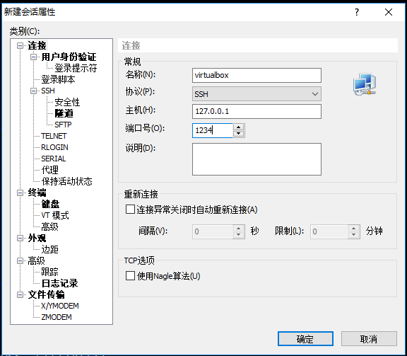

[TOC]

#### 00-开班典礼+课前准备

##### 1.课程安排

##### 2.请假，录播

如果时间不够，根据自己的进度，一节课一节课的推进，不要总是从头开始。

请假单写明跟录播。

请假单链接：https://docs.qq.com/form/edit/DVllkcnhNb0pWbU5T

##### 3.数据库

```
数据库就是特指的是计算机系统中一种提供数据存储和检索的一种软件。
```

###### 数据库分类

```
MySQL、Redis、MongoDB
关系型数据库：MySQL--->使用最多的免费关系型数据库
非关系型数据库：Redis：缓存存储，内存、MongoDB：存储数据，硬盘
```

python与数据库的交互：

##### 4.总结

1.上课先听懂

2.下课复习+笔记

##### 5.xshell远程连接虚拟机

```
1.开虚拟机
2.
```







##### 6.数据库检测

```
1.mysql
mysql -uroot -p
2.redis
redis-cli
3.MongoDB
mongo
```

##### 7.复习点

1.虚拟机

2.xshell远程连接虚拟机

3.检查数据库

4.复习基础知识：基本数据类型、模块、类（继承）


