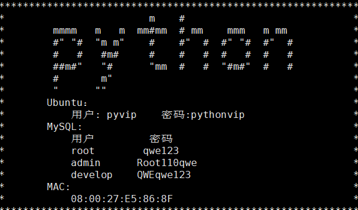

#### 补：数据库账户管理



##### 1.查看用户

```
select host ,user, authentication_string from user;
```

##### 2.创建用户

```
grant 权限列表 on 数据库.表名 to ‘用户名’@‘访问主机’ identified by ‘密码’

create，update，drop，insert，select，alter，delete
all privileges
```

```
查看用户哪些权限
show grants for tanzhou@localhost;
```

```
修改权限
grant 权限名称 on 数据库 to 账户@主机 with grant option
刷新权限
flush privileges;#刷新权限
```

##### 3.修改密码

```
update user set authentication_string=password('新密码') where user='用户名'；

注意修改后要刷新权限
flush privileges;
```

##### 4.删除账户

```
# 语法1
drop user '用户名'@'主机'；
# 语法2
delete from user where user='用户名'；
操作结束后，刷新权限
flush privileges;
```
