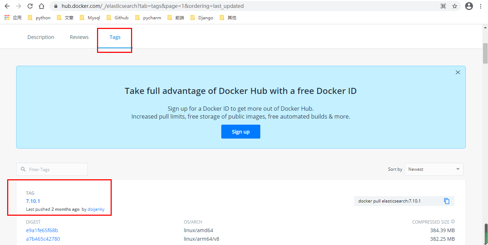

# Error response from daemon: manifest for elasticsearch:latest not found

### 事情起因

自己跟着课程视频走的时候，老师使用的django版本位2.1，并且elasticsearch版本位2.4.6。但是我自己现在django版本为3.1，因此跟着老师之前的步骤走下来会发现有一些错误，因此我想这把之前的elasticsearch删除，然后重新使用docker拉一个最新的elasticsearch试试，就出现如下报错：Error response from daemon: manifest for elasticsearch:latest not found

### 问题

Error response from daemon: manifest for elasticsearch:latest not found

### 解决办法

这个办法是应为docker无法确定您需要下拉的镜像是具体那个版本，你需要自己指定一个版本。

如何去查看这个版本呢？去官网，地址如下：https://hub.docker.com/_/elasticsearch?tab=tags&page=1&ordering=last_updated



从上面可以看出，当前最新版本为7.10.1，那我们就可以使用这个版本来拉去镜像

命令：

```
docker pull elasticsearch==7.10.1
```


