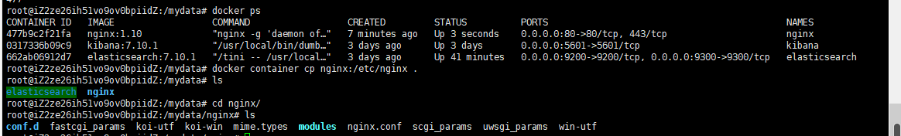
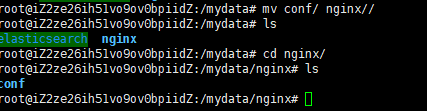
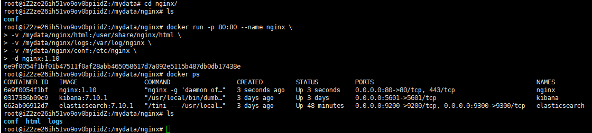

# Docker安装与配置nginx

## 1. 随便启动一个nginx实例

目的是为了复制出配置

```
docker run -p 80:80 --name nginx -d nginx:1.10
```

## 2. 文件拷贝

将容器内的配置文件拷贝到当前目录：

```
docker container cp nginx:/etc/nginx . 
```

别忘了后面的`.`



剩下的就是停止nginx和删除即可

## 3. 再处理

首先，将复制出来的文件夹`nginx`进行重命名，变成`conf`，然后再次创建nginx把conf放入即可



## 4. 启动nginx

```
docker run -p 80:80 --name nginx \
-v /mydata/nginx/html:/usr/share/nginx/html \
-v /mydata/nginx/logs:/var/log/nginx \
-v /mydata/nginx/conf:/etc/nginx \
-d nginx:1.10
```



浏览器输入自己的ip和80端口，如果出现如下页面说明成功


有人会问，我以前运行的时候，是出现如下页面，为什么现在是上面的情况？因为nginx有一个默认的index.html，直接输入80端口会自动展示这个文件内的内容。但是我们将文件挂在到容器之后，应为外面的文件中没有任何文件，所以容器内部的index也会自动消失。不影响后面操作


至此，nginx就已经下载完成。

## 6. 下面是ubuntu下载与配置nginx

### 1, ubuntu安装 nginx

```
sudo apt install nginx
```

### 2 强制修改用户名

```
cd /etc/nginx/
vim nginx.conf
把第一行用户名改为自己的服务器名字
强制保存
:w !sudo tee %
```

### 3 启动nginx

查看启动状态，如果启动状态未active，则代表启动成功

```shell
sudo systemctl start nginx && sudo systemctl status nginx
```

### 4 可以查看一下是否提供web服务

默认开启80端口

```
curl -I 192.168.216.137
```

### 5 管理命令

To **stop** your web server, type:

```nginx
sudo systemctl stop nginx
```

To **start** the web server when it is stopped, type:

```nginx
sudo systemctl start nginx
```

To **stop** and then **start** the service again, type:

```nginx
sudo systemctl restart nginx
```

If you are simply making configuration changes, Nginx can often **reload** without dropping connections. To do this, type:

```nginx
sudo systemctl reload nginx
```

By default, Nginx is configured to start automatically when the server boots. If this is not what you want, you can **disable** this behavior by typing:

```nginx
sudo systemctl disable nginx
```

To re-enable the service to **start up at boot,** you can type:

```nginx
sudo systemctl enable nginx
```

### 6 基本命令

-   查看nginx 进程

    ```
    ps -e | grep nginx
    ```

-   杀进程pid

    ```
    sudo pkill -9 nginx
    ```

-   查端口

    ```
    netstat -a
    ```

-   查看指定端口

    ```
    netstat -ap | grep 8000
    ```

    

