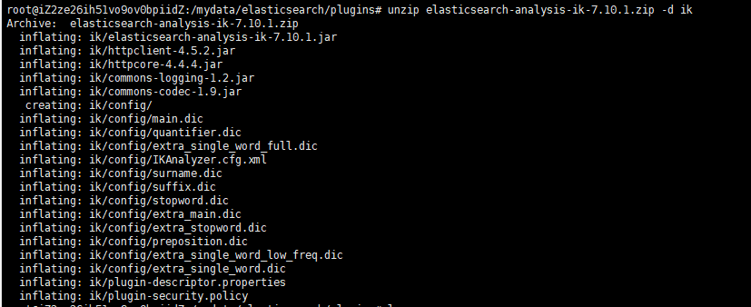

# Elasticsearch安装中文（ik）分词器

应为elasticsearch是由外国人进行开发的，因此如果使用ES默认的分词器很难达到预期的目的，因此，将中文分词器与ES结合就非常有必要了。

## 一、准备阶段

在安装IK之前，你需要知道自己的ES版本是多少。因此，启动ES，在浏览器输入自己的ip:9200查看当前的ES版本

```
{
  "name" : "662ab06912d7",
  "cluster_name" : "elasticsearch",
  "cluster_uuid" : "k9689FaLQEKO5JkjM33JqQ",
  "version" : {
    "number" : "7.10.1",
    "build_flavor" : "default",
    "build_type" : "docker",
    "build_hash" : "1c34507e66d7db1211f66f3513706fdf548736aa",
    "build_date" : "2020-12-05T01:00:33.671820Z",
    "build_snapshot" : false,
    "lucene_version" : "8.7.0",
    "minimum_wire_compatibility_version" : "6.8.0",
    "minimum_index_compatibility_version" : "6.0.0-beta1"
  },
  "tagline" : "You Know, for Search"
}
```

以上是我的，可以看出我的版本的7.10.1，因此我就需要下载7.10.1的IK版本。

接下来就是进入github寻找合适的版本。

github地址：https://github.com/medcl/elasticsearch-analysis-ik


## 二、安装

注意：不能用默认 `elasticsearch-plugin install xxx.zip`进行自动安装

如果你的ES是使用docker安装的，则进入docker内部的plugins目录，如果不是，则直接找到下载的ES文件即可。由于elasticsearch容器启动时，指定了文件挂载：-v /mydata/elasticsearch/plugins:/usr/share/elasticsearch/plugins 。所以，只需要将ik分词器下载到 /mydata/elasticsearch/plugins，并进行解压。

### 1. 进入docker容器内部命令

```
docker exec -it id号 /bin/bash
```

这里直接在挂在文件进行操作：进入plush文件夹，然后进行下载。


## 三、解压

先创建一个文件夹ik，然后将压缩的文件指定放入该文件夹

命令:

```
mkdir ik
unzip 下载文件名 -d ik
```



然后赋予该文件夹777权限

```
chmod -R 777 ik
```


最后，把zip文件删除即可

## 四、检查

我们可以进入docker容器，或者直接进入安装目录，进入bin目录查看是否存在


如果看到有ik说明是没问题的

最后就是重启

```
docker restart elasticsearch
```

## 五、使用ik

### 1. ik_smart

```
# 使用ik分词器
POST _analyze
{
  "analyzer": "ik_smart",
  "text": "我是中国人"
}
```


### 2. ik_max_smart

```
POST _analyze
{
  "analyzer": "ik_max_word",
  "text": "我是中国人"
}
```

