# Elasticsearch

## 一、初步检索

### 1. `_CAT`

查询ES的一些信息

#### 1-1 `GET /_cat/nodes`

-   查看所有节点

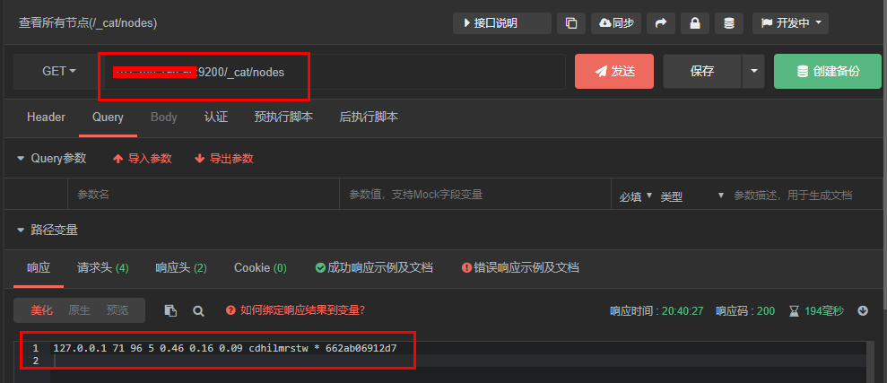

上面的662a就是我们elasticsearch的容器id。

#### 1-2 `GET /_cat/heath`

-   查看es健康状况

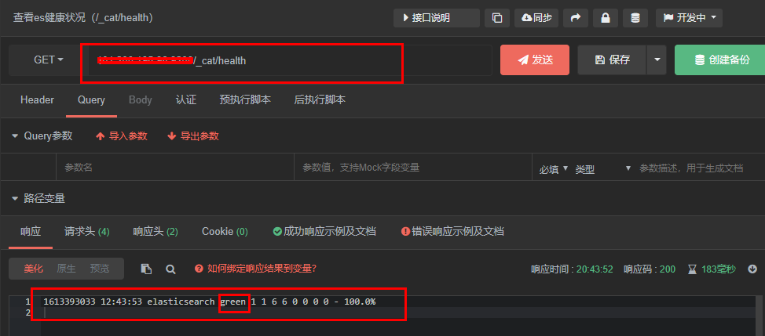

绿色表示一切正常, 黄色表示所有的数据可用但是部分副本还没有分配,红色表示部分数据因为某些原因不可用

#### 1-3 `GET /_cat/master`

-   查看主节点

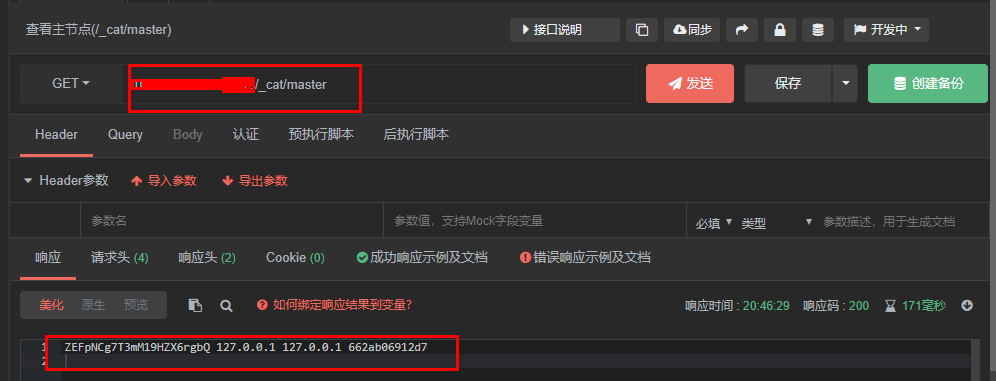

#### 1-4 `GET /_cat/indices `

-   查看所有索引，类似于mysql中的show databases

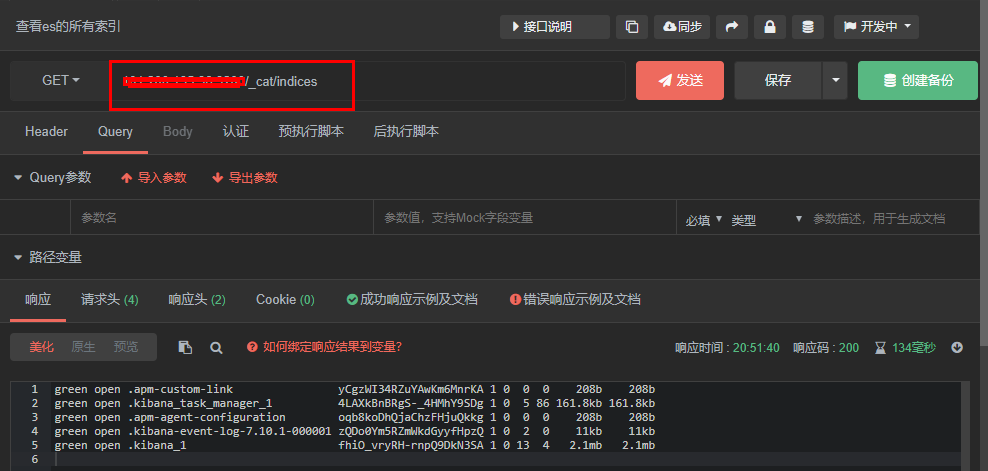

### 2. 添加数据

#### 2-1 PUT

```
PUT /blog_django/tb_tag/7
```

保存一个数据，保存在那个索引的哪个类型下面，指定用哪个唯一标识

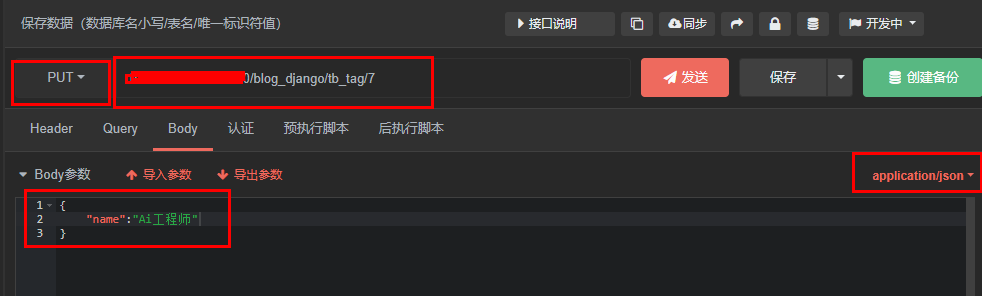

上面，我们使用IP:9200/数据库名（必须小写）/表名/唯一标识符值

并且，在body部分，我们使用json数据传入该下面值

```json
{
    "name":"Ai工程师"
}
```

我们来看看响应结果：

```
GET /blog_django/tb_tag/7
```

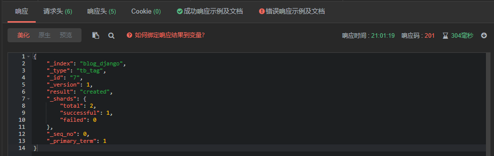

凡是带`_`就表示元数据

-   `_index`：表示索引的名字
-   `_type`：表示什么类型
-   `_id`：id名
-   `_version`：版本
-   `result`：结果
    -   第一次是create
    -   第二次为update
-   `_shards`：分片

而此时，回去查看当前的索引索引，就会发现多了一个blog_django

```
GET /_cat/_indices
```

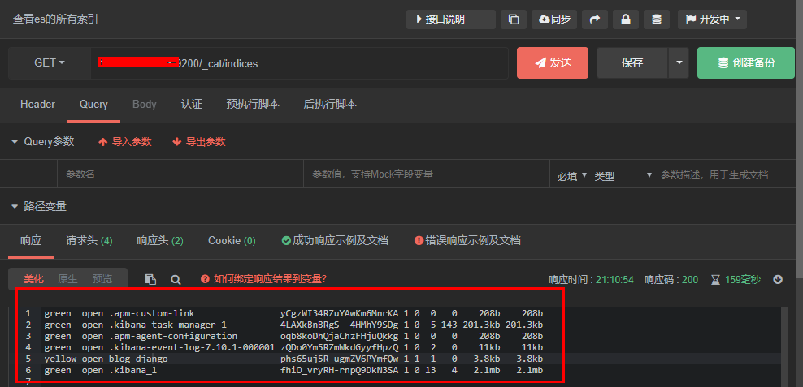

同样，也可以使用POST

#### 2-2 POST

```
POST /blog_django/tb_tag/7
```

post与put方法类似，

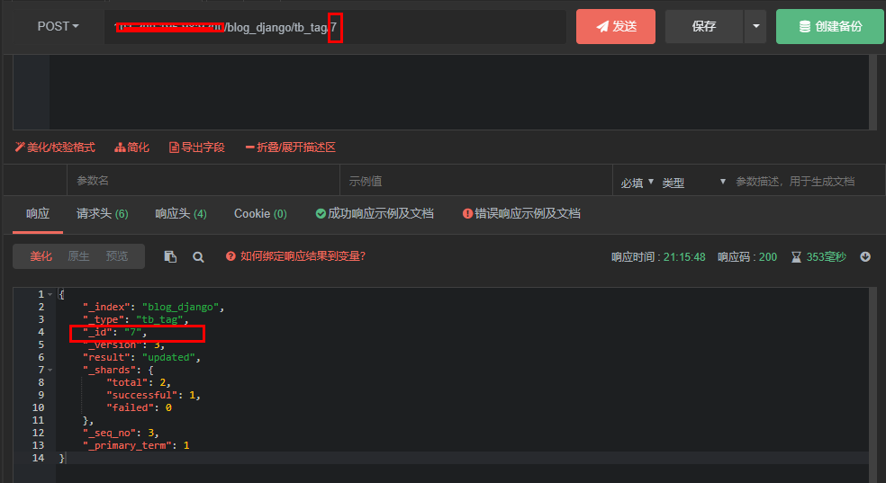

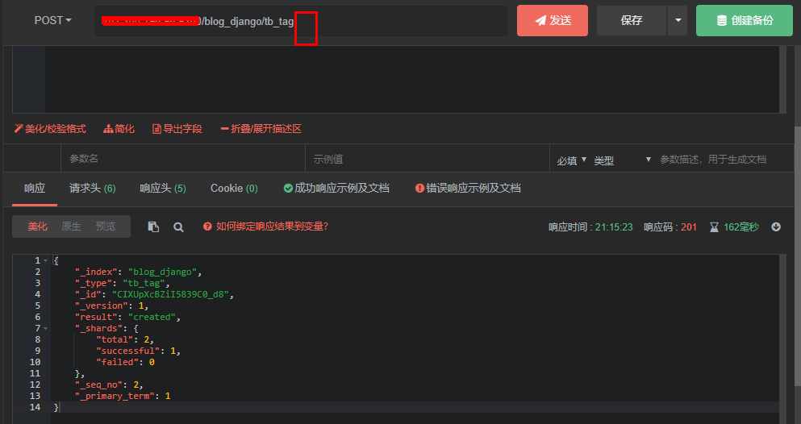

上面可以看出，如果在使用post情况下，如果添加标识符，则id是输入的标识符，但如果不输入标识符，则id显示的是自己创建的值。

并且，如果添加了id的值，每次发送result都是update，而不添加id的时候，result的值始终是create

#### 总结

PUT 和 POST都可以进行新增操作

PUT必须要带id

带id的情况下，多次PUT/POST是修改

不带id的情况下，多次POST是新增

### 3. 查询文档

```
GET /blog_django/tb_tag/7
```

查询与添加类似，同样是索引名，类型名和一个标识符

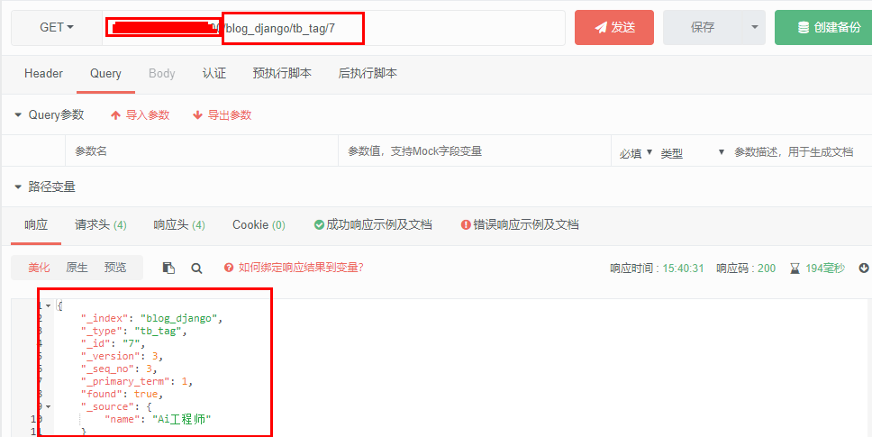

`_seq_no`：并发控制字段，用来做乐观锁，每次更新就会+1

`_primary_term`：同上，主分片重新分配，如重启，就会变化。

#### 补充

`_seq_no`是用来做乐观锁的

比如有A和B两个进程都想对一个数据进行操作，但是肯定有一个先后问题。我们设想的是：A进入，如果`_seq_no`为0的情况下就进行修改，如果不是则不修改。

如果A先进入，此时的`_seq_no`为0，因此可以进行修改。但如果B先进入，他率先对值进行修改之后，此时的`_seq_no`自动加一。再等A进入时，查看`_seq_no`的值已经不为0了，所以就不再进行修改。这就是`_seq_no`的作用。每当我们对该数据进行依次进行更新或者创建的时，都会自增一。

因此我们可以使用这个乐观锁来进行修改尝试：

```
PUT /blog_django/tb_tag/7?if_seq_no=3&if_primary_term=1
```

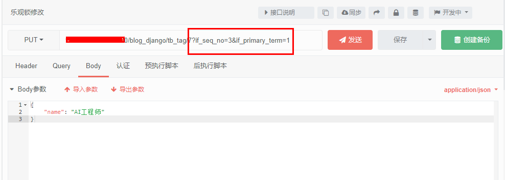

此时再次查询数据，会发现seq已经改变了

```
GET /blog_django/tb_tag/7
```

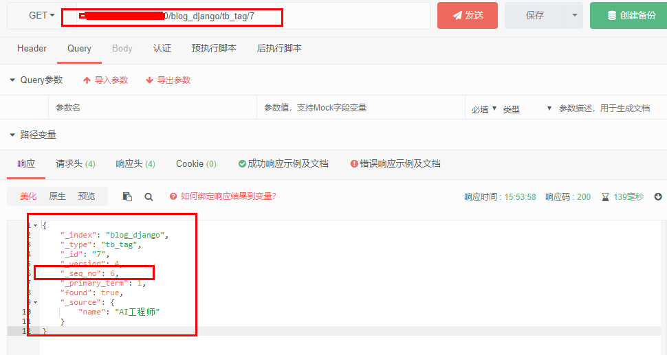

### 4. 更新文档

文档更新的方法有多种，参数还是与上面相同：

#### 4-1 第一种：POST带update

```
POST /blog_django/tb_tag/7/_update
```

索引名/类型名/唯一标识符/_update

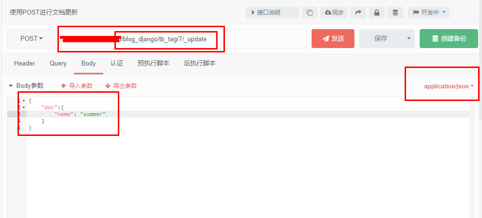

注意，传入的数据必须再doc下面。

来看看返回结果和现在的数据情况：

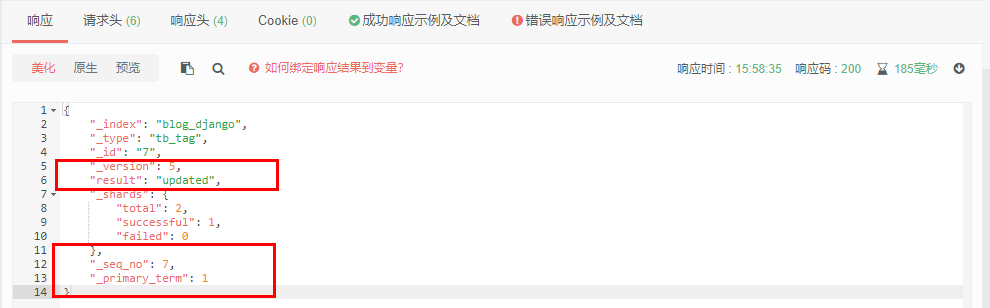

下面是查询的数据：

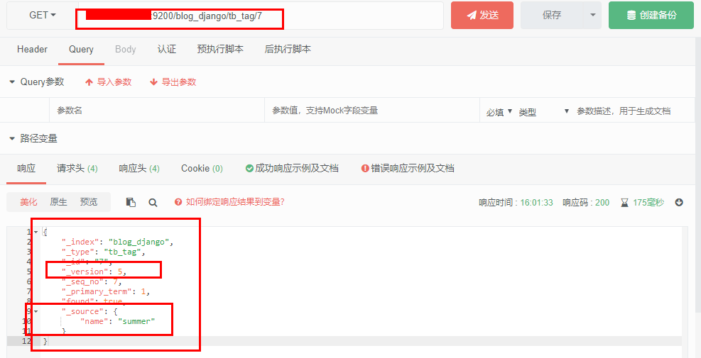

如果再次使用现在的api发送数据，查看相应的数据是什么：

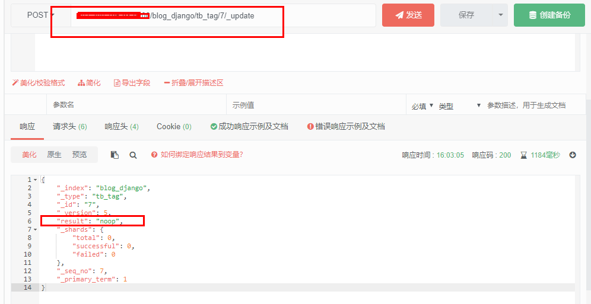

我们发现，原本的update现在变成了noop也就是未发生任何修改，那我们就可以得出一个**小结论**，如果使用_update来修改数据，如果进行了修改，则返回状态时update如果没有进行数据修改的，则返回状态为noop。

#### 4-2 第二种：POST不带update

```
POST /blog_django/tb_tag/7
```

这个与上面的区别在于，如果带了update会进行数据的检查，而不带update则不会进行数据检查，每次提交都会进行version与seq的自增1，并且result为update

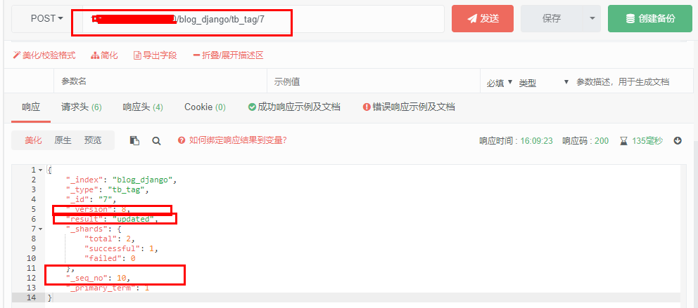

#### 4-3 第三种：PUT

put方法与第二种不带update作用相同。这里就不在截图了

```
PUT /blog_django/tb_tag/7
```

####  4-4 第四种：修改数据时，增加属性

添加属性不管使用上面哪一种方式，都是可以进行操作的。注意一点：如果POST使用update则需要再json数据中添加doc。

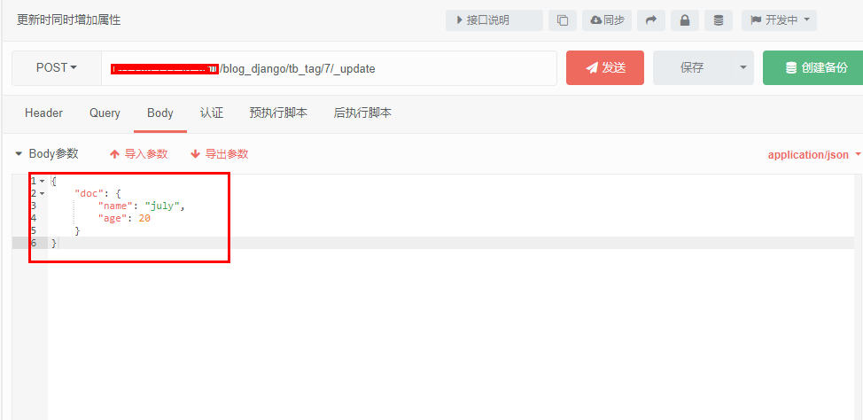

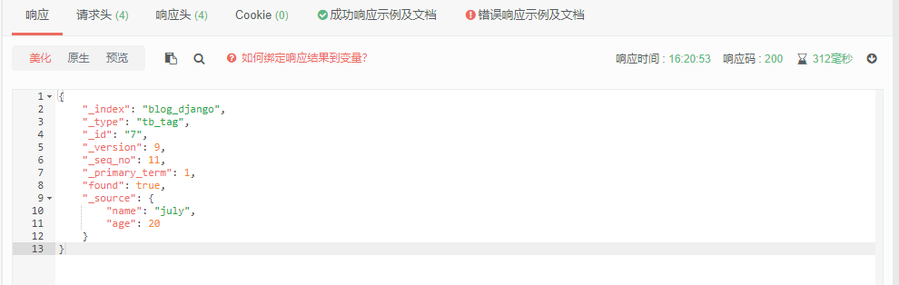

### 5. 删除文档

#### 5-1 删除文档

```
DELETE /blog_django/tb_tag/7
```

删除还是一样，输入索引名，类型名与唯一标识符就是删除该文档

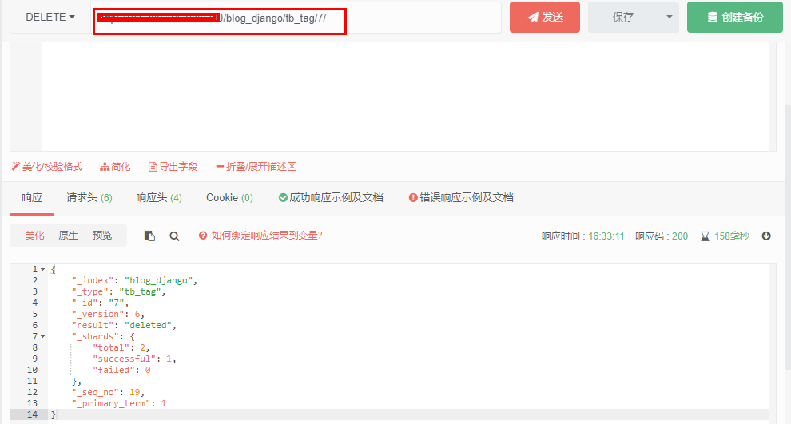

这里注意一下，需要把文件格式改为json不然会报406错误。

此时，你再去查看这个文档，就会发现已经找不到了

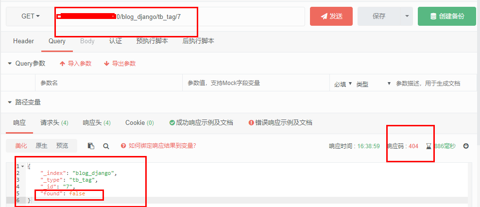

#### 5-2 删除索引

```
DELETE /blog_django/
```

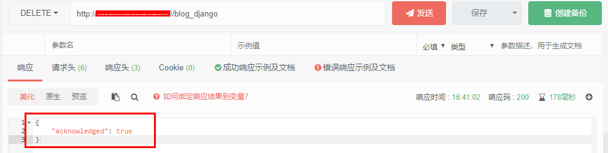

而此时你再去查看数据的时候，他就会报404错误

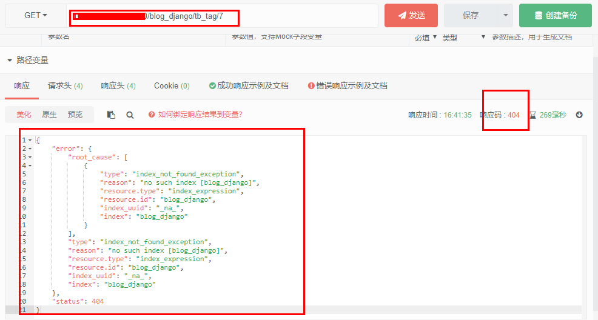

### 6. bulk批量API

这个请求必须使用POST发送。

**语法格式**：

```
{action:{metadata}}\n
{request body}\n

{action:{metadata}}\n
{request body}\n
```

在上面，两行为一个单元，其中第一个大括号中，用来表示请求方式，他的里面存放着一些元数据。而下面的是真正的请求数据。

#### 6-1 使用kabana进行数据操作

此时，再使用ApiPost或者Postman就已经不再适合了，应为会报如下错误：`The bulk request must be terminated by a newline [\\n]`

所以，我们使用kabana来进行数据操作。

首先进入kabana：

```
127.0.0.1:5601
```

其次进入主页：

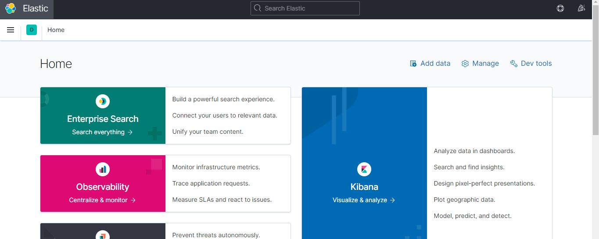

然后选择开发工具：

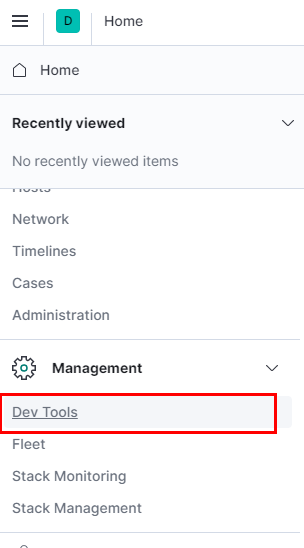

最后就可以直接再里面进行数据操作

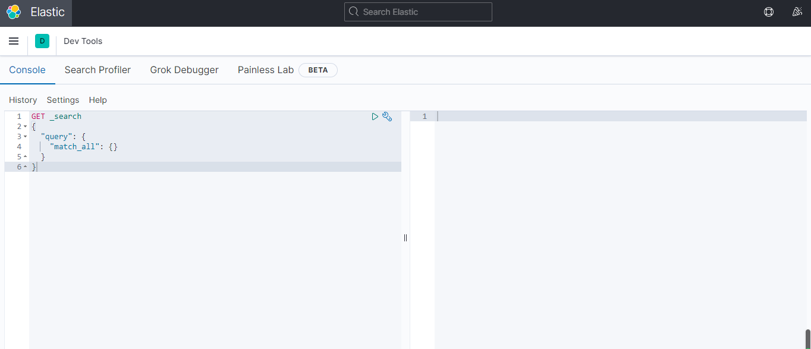

#### 6-2 批量处理文档操作

```
POST /blog_django/tb_tag/_bulk
{"index":{"_id":"1"}}
{"name":"summer"}
{"index":{"_id":"2"}}
{"name":"tom"}
```

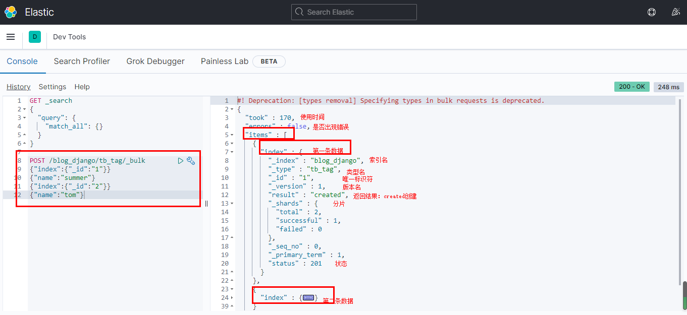

因为我们存储了两条数据，因此在展示的时候，会独立显示出两条数据，并且一条数据创建成功与否并不会影响第二条数据的创建。

#### 6-3 批量操作

```
POST _bulk
{"delete":{"_index":"blog_django","_type":"tb_tag","_id":"123"}}
{"create":{"_index":"blog_django","_type":"tb_tag","_id":"123"}}
{"title":"My first blog post"}
{"index":{"_index":"blog_django","_type":"tb_tag"}}
{"title":"My second blog post"}
{"update":{"_index":"blog_django","_type":"tb_tag","_id":"123"}}
{"doc":{"title":"My second blog post"}}
```

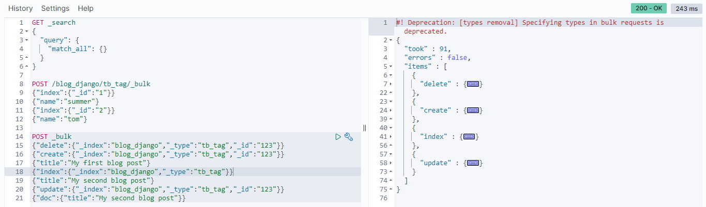

#### 6-4 数据导入

为了后面的大量数据操作，因此我们可以从es官方拿去数据来进行操作。

```
POST /bank/account/_bulk
{"index":{"_id":"1"}}
{"account_number":1,"balance":39225,"firstname":"Amber","lastname":"Duke","age":32,"gender":"M","address":"880 Holmes Lane","employer":"Pyrami","email":"amberduke@pyrami.com","city":"Brogan","state":"IL"}
{"index":{"_id":"6"}}
{"account_number":6,"balance":5686,"firstname":"Hattie","lastname":"Bond","age":36,"gender":"M","address":"671 Bristol Street","employer":"Netagy","email":"hattiebond@netagy.com","city":"Dante","state":"TN"}
```

```
数据地址：https://download.elastic.co/demos/kibana/gettingstarted/accounts.zip
```

我们可以使用cat来查看当前的索引

```
GET /_cat/indices
```

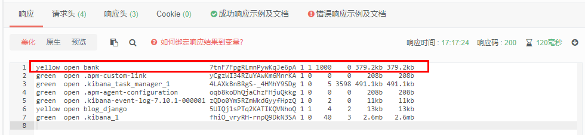

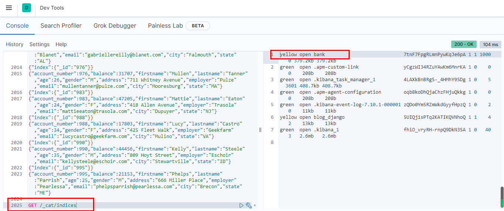

## 二、进阶检索

查看下篇