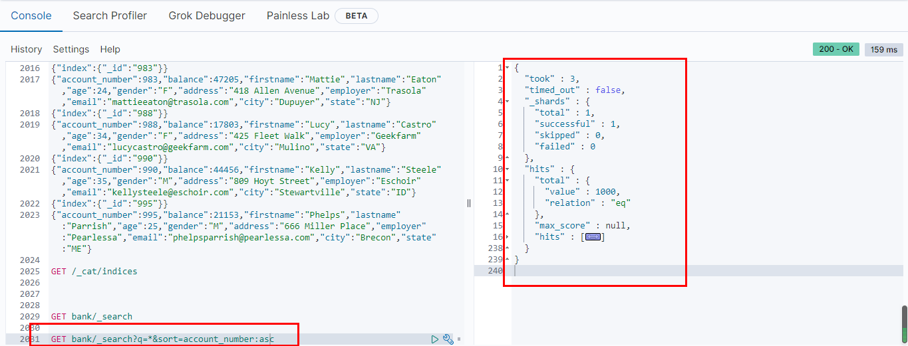
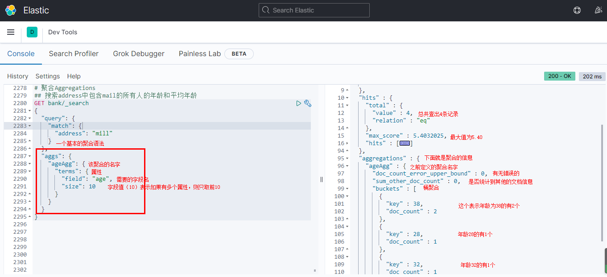
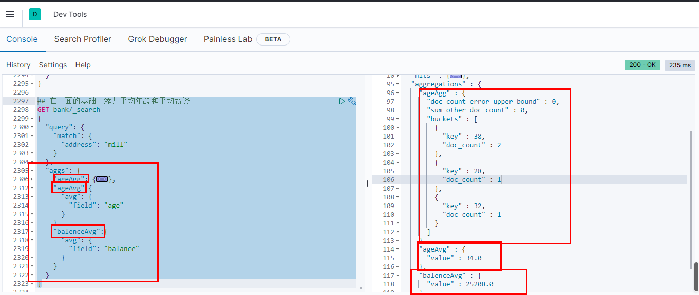
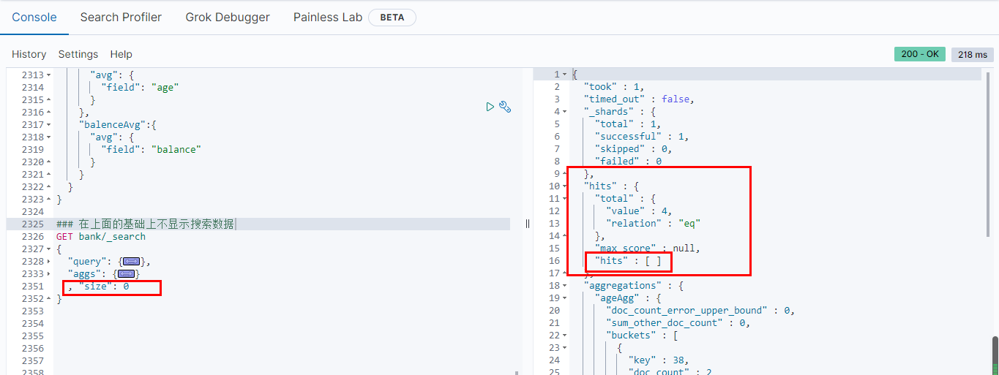

# Elasticsearch进阶检索

[TOC]

## 一、SearchAPI

[官方文档](https://www.elastic.co/guide/en/elasticsearch/reference/current/getting-started-search.html)

ES支持两种基本方式检索：

-   一个是通过REST request URI发送搜索参数（url+检索参数）
-   另一个是通过REST requst body来发送他们（url+请求体）

### 1. 第一种方式

一切请求从_search开始

-   `GET bank/_search`

检查bank下所有的信息，包括type和docs

-   `GET bank/_search?q=*&sort=account_number:asc`

检查bank下的所有信息，按照account_number来顺序排列。

默认情况下，`hits`响应部分包括符合搜索条件的前10个文档



该响应还提供有关搜索请求的以下信息：

-   `took` – Elasticsearch运行查询多长时间（以毫秒为单位）
-   `timed_out` –搜索请求是否超时
-   `_shards` –搜索了多少个分片，以及成功，失败或跳过了多少个分片。
-   `max_score` –找到的最相关文件的分数
-   `hits.total.value` -找到了多少个匹配的文档
-   `hits.sort` -文档的排序位置（不按相关性得分排序时）
-   `hits._score`-文档的相关性得分（使用时不适用`match_all`）

### 2. 第二种方式

```bash
GET bank/_search
{
  "query": {
    "match_all": {}
  },
  "sort": [
    {
      "account_number": "asc"
    },
    {
      "balance": "desc"
    }
  ]
}
```

-   query为查询条件
-   sort为排序条件

每个搜索请求都是独立的：Elasticsearch不会在请求中维护任何状态信息。要浏览搜索结果，请在请求中指定`from`和`size`参数。

例如，查询接下来的10-19的数据：

```bash
GET /bank/_search
{
  "query": {
    "match_all": {}
  },
  "sort": [
    {
      "account_number": "asc"
    }
  ],
  "from": 10,
  "size": 10
}
```

一般，我们使用第二种进行查询操作

## 二、Query DSL

### 1. 基础语法

Elasticsearch提供了可以执行查询的JSON风格的DSL（领域特定语言）。这个被称为Query DSL。该查询语言非常全面。

-   一个查询语句的典型结构

```bash
{
	QUERY_NAME: {
		ARGUMENT:VALUE,
		ARGUMENT:VALUE...
	},
}
```

-   如果是针对某个字段，那么它的结构如下

```bash
{
	QUERY_NAME: {
		FIELD_NAME: {
			ARGUMENT:VALUE,
			ARGUMENT:VALUE...
		}
	},
}
```

### 2. `_source`：指定返回字段

```
GET bank/_search
{
  "query": {
    "match_all": {}
  },
  "sort": [
    {
      "balance": {
        "order": "desc"
      }
    }
  ],
  "from": 0,
  "size": 2,
  "_source": [
    "firstname",
    "lastname", 
    "balance"
  ]
}
```

数据展示：

```
{
  "took" : 1,
  "timed_out" : false,
  "_shards" : {
    "total" : 1,
    "successful" : 1,
    "skipped" : 0,
    "failed" : 0
  },
  "hits" : {
    "total" : {
      "value" : 1000,
      "relation" : "eq"
    },
    "max_score" : null,
    "hits" : [
      {
        "_index" : "bank",
        "_type" : "account",
        "_id" : "248",
        "_score" : null,
        "_source" : {
          "firstname" : "West",
          "balance" : 49989,
          "lastname" : "England"
        },
        "sort" : [
          49989
        ]
      },
      {
        "_index" : "bank",
        "_type" : "account",
        "_id" : "854",
        "_score" : null,
        "_source" : {
          "firstname" : "Jimenez",
          "balance" : 49795,
          "lastname" : "Barry"
        },
        "sort" : [
          49795
        ]
      }
    ]
  }
}
```

### 3. `match`：匹配查询

#### 3-1 精确匹配

```
GET bank/_search
{
  "query": {
    "match": {
      "account_number": "20"
    }
  }
}
```

```
{
  "took" : 0,
  "timed_out" : false,
  "_shards" : {
    "total" : 1,
    "successful" : 1,
    "skipped" : 0,
    "failed" : 0
  },
  "hits" : {
    "total" : {
      "value" : 1,
      "relation" : "eq"
    },
    "max_score" : 1.0,
    "hits" : [
      {
        "_index" : "bank",
        "_type" : "account",
        "_id" : "20",
        "_score" : 1.0,
        "_source" : {
          "account_number" : 20,
          "balance" : 16418,
          "firstname" : "Elinor",
          "lastname" : "Ratliff",
          "age" : 36,
          "gender" : "M",
          "address" : "282 Kings Place",
          "employer" : "Scentric",
          "email" : "elinorratliff@scentric.com",
          "city" : "Ribera",
          "state" : "WA"
        }
      }
    ]
  }
}
```

上面可以看出，我们的最大得分为1.0，并且hits命中的这个文档得分也是1.0，就表示与我们需要查找的文档是100%相同的。

#### 3-2 全文检索

全文检索会按照评分进行排序，会对检索条件进行分词匹配

```bash
# 全文检索
GET bank/_search
{
  "query": {
    "match": {
      "address": "mill lane"
    }
  }
}
# 全文检索按照评分进行索引也就是之前说的倒排索引
```

上面，会先对`mill lane`进行分词，变成`mill`和`lane`，然后去进行检索，得出相关的分数

```
{
  "took" : 5,
  "timed_out" : false,
  "_shards" : {
    "total" : 1,
    "successful" : 1,
    "skipped" : 0,
    "failed" : 0
  },
  "hits" : {
    "total" : {
      "value" : 19,
      "relation" : "eq"
    },
    "max_score" : 9.507477,
    "hits" : [
      {
        "_index" : "bank",
        "_type" : "account",
        "_id" : "136",
        "_score" : 9.507477,
        "_source" : {
          "account_number" : 136,
          "balance" : 45801,
          "firstname" : "Winnie",
          "lastname" : "Holland",
          "age" : 38,
          "gender" : "M",
          "address" : "198 Mill Lane",
          "employer" : "Neteria",
          "email" : "winnieholland@neteria.com",
          "city" : "Urie",
          "state" : "IL"
        }
      }
}
```

上面显示一共找到19条匹配的记录，并且最大的相关度放在第一个位置。这是使用倒排索引而产生的结果。

### 4. `match_phrase`：短语匹配

将需要匹配的值当成一个整体单词（不分词）进行检索

```
# 短语匹配
GET bank/_search
{
  "query": {
    "match_phrase": {
      "address": "mill lane"
    }
  }
}
```

上面的`match_phrase`就是取消分词，而是直接使用整个`mill lane`去进行检索。

```
{
  "took" : 9,
  "timed_out" : false,
  "_shards" : {
    "total" : 1,
    "successful" : 1,
    "skipped" : 0,
    "failed" : 0
  },
  "hits" : {
    "total" : {
      "value" : 1,
      "relation" : "eq"
    },
    "max_score" : 9.507477,
    "hits" : [
      {
        "_index" : "bank",
        "_type" : "account",
        "_id" : "136",
        "_score" : 9.507477,
        "_source" : {
          "account_number" : 136,
          "balance" : 45801,
          "firstname" : "Winnie",
          "lastname" : "Holland",
          "age" : 38,
          "gender" : "M",
          "address" : "198 Mill Lane",
          "employer" : "Neteria",
          "email" : "winnieholland@neteria.com",
          "city" : "Urie",
          "state" : "IL"
        }
      }
    ]
  }
}
```

### 5. `multi_match`：多字段匹配

```
# 多字段匹配
## 用来查找address或者city种包含mill的文档
GET bank/_search
{
  "query": {
    "multi_match": {
      "query": "mill",
      "fields": ["address","city"]
    }
  }
}
```

这个也是一个分词的匹配模式，只是可以在多个字段进行匹配

```
{
  "took" : 5,
  "timed_out" : false,
  "_shards" : {
    "total" : 1,
    "successful" : 1,
    "skipped" : 0,
    "failed" : 0
  },
  "hits" : {
    "total" : {
      "value" : 4,
      "relation" : "eq"
    },
    "max_score" : 5.4032025,
    "hits" : [
      {
        "_index" : "bank",
        "_type" : "account",
        "_id" : "970",
        "_score" : 5.4032025,
        "_source" : {
          "account_number" : 970,
          "balance" : 19648,
          "firstname" : "Forbes",
          "lastname" : "Wallace",
          "age" : 28,
          "gender" : "M",
          "address" : "990 Mill Road",
          "employer" : "Pheast",
          "email" : "forbeswallace@pheast.com",
          "city" : "Lopezo",
          "state" : "AK"
        }
      }...
```

### 6. `bool`：复合查询

bool用来做复合查询：

​	复合语句可以合并任何其他的拆线呢语句，包括复合语句。简言之：**复合语句之间可以相互嵌套**，可以表达非常复杂的逻辑。

#### 6-1 `must`：必须达到must列举的所有条件

我们要查找地址包含mill并且是男性的所有人。

```
GET bank/_search
{
  "query": {
    "bool": {
      "must": [
        {"match": {
          "address": "mill"
        }},
        {"match": {
            "gender": "M"
          }}
      ]
    }
  }
}
```

查找每个文档add中包含mill和gender是M的文档

```
{
  "took" : 7,
  "timed_out" : false,
  "_shards" : {
    "total" : 1,
    "successful" : 1,
    "skipped" : 0,
    "failed" : 0
  },
  "hits" : {
    "total" : {
      "value" : 3,
      "relation" : "eq"
    },
    "max_score" : 6.0824604,
    "hits" : [
      {
        "_index" : "bank",
        "_type" : "account",
        "_id" : "970",
        "_score" : 6.0824604,
        "_source" : {
          "account_number" : 970,
          "balance" : 19648,
          "firstname" : "Forbes",
          "lastname" : "Wallace",
          "age" : 28,
          "gender" : "M",
          "address" : "990 Mill Road",
          "employer" : "Pheast",
          "email" : "forbeswallace@pheast.com",
          "city" : "Lopezo",
          "state" : "AK"
        }
      }...
```

#### 6-2 `must_not`：必须不满足所列举的条件

例如我们在上面的结果之上需要让他们满足所有年龄都不允许是38的客户

```
GET bank/_search
{
  "query": {
    "bool": {
      "must": [
        {"match": {
          "address": "mill"
        }},
        {"match": {
            "gender": "M"
          }}
      ],
      "must_not": [
        {"match": {
          "age": "38"
        }}
      ]
    }
  }
}
```

以下是结果：

```
{
  "took" : 1,
  "timed_out" : false,
  "_shards" : {
    "total" : 1,
    "successful" : 1,
    "skipped" : 0,
    "failed" : 0
  },
  "hits" : {
    "total" : {
      "value" : 1,
      "relation" : "eq"
    },
    "max_score" : 6.0824604,
    "hits" : [
      {
        "_index" : "bank",
        "_type" : "account",
        "_id" : "970",
        "_score" : 6.0824604,
        "_source" : {
          "account_number" : 970,
          "balance" : 19648,
          "firstname" : "Forbes",
          "lastname" : "Wallace",
          "age" : 28,
          "gender" : "M",
          "address" : "990 Mill Road",
          "employer" : "Pheast",
          "email" : "forbeswallace@pheast.com",
          "city" : "Lopezo",
          "state" : "AK"
```

#### 6-3 `should`：应该满足，即满足可以不满足也行

例如，我们在第一次的基础上查找满足38的客户，如果不满足也行

```
GET bank/_search
{
  "query": {
    "bool": {
      "must": [
        {"match": {
          "address": "mill"
        }},
        {"match": {
            "gender": "M"
          }}
      ],
      "should": [
        {"match": {
          "age": "38"
        }}
      ]
    }
  }
}
```

```
{
  "took" : 2,
  "timed_out" : false,
  "_shards" : {
    "total" : 1,
    "successful" : 1,
    "skipped" : 0,
    "failed" : 0
  },
  "hits" : {
    "total" : {
      "value" : 3,
      "relation" : "eq"
    },
    "max_score" : 7.0824604,
    "hits" : [
      {
        "_index" : "bank",
        "_type" : "account",
        "_id" : "136",
        "_score" : 7.0824604,
        "_source" : {
          "account_number" : 136,
          "balance" : 45801,
          "firstname" : "Winnie",
          "lastname" : "Holland",
          "age" : 38,
          "gender" : "M",
          "address" : "198 Mill Lane",
          "employer" : "Neteria",
          "email" : "winnieholland@neteria.com",
          "city" : "Urie",
          "state" : "IL"
        }
      }...
```

可以发现，我们的数据还是和之前一样是三条，但是年龄为38的人，他们的分数却已经有所上升。

### 7. `filter`：结果过滤

并不是所有的查询都需要产生分数，特别是那些仅用于‘filtering’的文档。为了不计算分数，Elasticsearch会自动检查场景并且优化查询的执行。

如果我们想查询工资位于20000到30000并且地址包含mill的所有人员，之前我们可以使用match来进行查找：

```
GET /bank/_search
{
  "query": {
    "bool": {
      "must": [
        {"range": {
          "balance": {
            "gte": 20000,
            "lte": 30000
          }
        }},
        {"match": {
          "address": "mill"
        }}
      ]
    }
  }
}
```

```
{
  "took" : 8,
  "timed_out" : false,
  "_shards" : {
    "total" : 1,
    "successful" : 1,
    "skipped" : 0,
    "failed" : 0
  },
  "hits" : {
    "total" : {
      "value" : 1,
      "relation" : "eq"
    },
    "max_score" : 6.4032025,
    "hits" : [
      {
        "_index" : "bank",
        "_type" : "account",
        "_id" : "472",
        "_score" : 6.4032025,
        "_source" : {
          "account_number" : 472,
          "balance" : 25571,
          "firstname" : "Lee",
          "lastname" : "Long",
          "age" : 32,
          "gender" : "F",
          "address" : "288 Mill Street",
          "employer" : "Comverges",
          "email" : "leelong@comverges.com",
          "city" : "Movico",
          "state" : "MT"
        }
      }
    ]
  }
}
```

会发现这里是有一个得分的。

而如果使用我们的filter，会是下面的情况：

```
GET /bank/_search
{
  "query": {
    "bool": {
      "filter": {
        "range": {
          "balance": {
            "gte": 20000,
            "lte": 30000
          }
        }
      }
    }
  }
}
```

```
{
  "took" : 0,
  "timed_out" : false,
  "_shards" : {
    "total" : 1,
    "successful" : 1,
    "skipped" : 0,
    "failed" : 0
  },
  "hits" : {
    "total" : {
      "value" : 217,
      "relation" : "eq"
    },
    "max_score" : 0.0,
    "hits" : [
      {
        "_index" : "bank",
        "_type" : "account",
        "_id" : "49",
        "_score" : 0.0,
        "_source" : {
          "account_number" : 49,
          "balance" : 29104,
          "firstname" : "Fulton",
          "lastname" : "Holt",
          "age" : 23,
          "gender" : "F",
          "address" : "451 Humboldt Street",
          "employer" : "Anocha",
          "email" : "fultonholt@anocha.com",
          "city" : "Sunriver",
          "state" : "RI"
        }
      }...
```

会发现，这里面的分数为0.0

### 8. `term`：查询特定值

和match一样。匹配某个属性的值。全文检索用match，其他非text字段匹配用term。

```
Avoid using the term query for text fields.
By default, Elasticsearch changes the values of text fields as part of analysis. This can make finding exact matches for text field values difficult.
To search text field values, use the match query instead.
```

```
# term查询
GET /bank/_search
{
  "query": {
    "term": {
      "balance": {
        "value": "32838"
      }
    }
  }
}
```

```
{
  "took" : 0,
  "timed_out" : false,
  "_shards" : {
    "total" : 1,
    "successful" : 1,
    "skipped" : 0,
    "failed" : 0
  },
  "hits" : {
    "total" : {
      "value" : 1,
      "relation" : "eq"
    },
    "max_score" : 1.0,
    "hits" : [
      {
        "_index" : "bank",
        "_type" : "account",
        "_id" : "13",
        "_score" : 1.0,
        "_source" : {
          "account_number" : 13,
          "balance" : 32838,
          "firstname" : "Nanette",
          "lastname" : "Bates",
          "age" : 28,
          "gender" : "F",
          "address" : "789 Madison Street",
          "employer" : "Quility",
          "email" : "nanettebates@quility.com",
          "city" : "Nogal",
          "state" : "VA"
        }
      }
    ]
  }
}
```

而使用term来进行text检索时：

```
## 使用term查询text
GET /bank/_search
{
  "query": {
    "term": {
      "address": {
        "value": "789 Madison Street"
      }
    }
  }
}
```

```
{
  "took" : 0,
  "timed_out" : false,
  "_shards" : {
    "total" : 1,
    "successful" : 1,
    "skipped" : 0,
    "failed" : 0
  },
  "hits" : {
    "total" : {
      "value" : 0,
      "relation" : "eq"
    },
    "max_score" : null,
    "hits" : [ ]
  }
}
```

会发现并没有任何的数据，这是应为ES在存储text文档时，会进行**分词**操作，因此不适合term去进行检索。

### 9. `match`衍生

在使用match的时候，我们知道，在全文检索时，可以使用match_phrase来进行短语匹配，与此同时字段里面还有一个keyword字段，我们来分别使用看看：

-   使用短语匹配

```
GET /bank/_search
{
  "query": {
    "match_phrase": {
      "address": "789 Madison"
    }
  }
}
```

结果：

```
{
  "took" : 0,
  "timed_out" : false,
  "_shards" : {
    "total" : 1,
    "successful" : 1,
    "skipped" : 0,
    "failed" : 0
  },
  "hits" : {
    "total" : {
      "value" : 1,
      "relation" : "eq"
    },
    "max_score" : 11.981658,
    "hits" : [
      {
        "_index" : "bank",
        "_type" : "account",
        "_id" : "13",
        "_score" : 11.981658,
        "_source" : {
          "account_number" : 13,
          "balance" : 32838,
          "firstname" : "Nanette",
          "lastname" : "Bates",
          "age" : 28,
          "gender" : "F",
          "address" : "789 Madison Street",
          "employer" : "Quility",
          "email" : "nanettebates@quility.com",
          "city" : "Nogal",
          "state" : "VA"
        }
      }
    ]
  }
}
```

-   使用keyword字段

```
GET /bank/_search
{
  "query": {
    "match": {
      "address.keyword": "789 Madison"
    }
  }
}
```

结果

```
{
  "took" : 0,
  "timed_out" : false,
  "_shards" : {
    "total" : 1,
    "successful" : 1,
    "skipped" : 0,
    "failed" : 0
  },
  "hits" : {
    "total" : {
      "value" : 0,
      "relation" : "eq"
    },
    "max_score" : null,
    "hits" : [ ]
  }
}
```

会发现，我们在使用keyword的时候，是需要该字段值必须与检索的值一样时才返回，如果不相同就不会返回任何值。

因此，就可以进行一个如下的规范：

-   如果查找的字段是非text类型的，则可以使用term进行查询
-   如果是文本字段就是要match进行匹配

### 10. `aggregations`：执行聚合

[官方地址](https://www.elastic.co/guide/en/elasticsearch/reference/current/search-aggregations.html)

聚合提供了从数据中分组和提取数据的能力。最简单的聚合大致等于SQL的聚合函数。

在ElasticSearch中，你有执行搜索返回hit，并且同时返回聚合结果，把一个响应中所有hits分隔开的能力，这是非常强大且有效的。您可以执行查询和多个聚合并且在一次使用中得到各自的返回结果，使用一次简介和简化的api来避免网络往返

#### 10-1 聚合的种类

-   度量聚合：计算度量，诸如总和或平均值，从字段值。
-   桶聚合：根据字段值，范围或其他条件将文档分组为桶（也称为箱）。
-   管道聚合：从其他聚合（而不是文档或字段）获取输入。

#### 10-2 聚合的基本格式

```bash
 "aggregations": {
    "aggregations_NAME": {
      "aggregations_TYPE": {
      		<aggregations_body>
      }
      [,"meta":{[<meta_data_body>]}]?
      [,"aggregations":{[<sub_aggregation>]}]?
    }
    [,"aggregations_NAME_2":{...}}]
  }
```

#### 10-3 简单实例

我们想查询地址中包含mill的人员的年龄分布：

```
GET bank/_search
{
  "query": {
    "match": {
      "address": "mill"
    }
  },
  "aggs": {
    "ageAgg": {
      "terms": {
        "field": "age",
        "size": 10
      }
    }
  }
}
```



在上面查出来的基础上添加平均年龄和平均薪资：

```
## 在上面的基础上添加平均年龄和平均薪资
GET bank/_search
{
  "query": {
    "match": {
      "address": "mill"
    }
  },
  "aggs": {
    "ageAgg": {
      "terms": {
        "field": "age",
        "size": 10
      }
    },
    "ageAvg":{
      "avg": {
        "field": "age"
      }
    },
    "balenceAvg":{
      "avg": {
        "field": "balance"
      }
    }
  }
}
```



最后，我们如果想不显示数据则只需要添加一个size即可：



#### 10-4 复杂实例

按照年龄聚合，并且求这些年龄段的这些人的平均薪资（涉及聚合嵌套）

```bash
# 实现年龄聚合，并且实现该年龄端内的平均薪资
GET bank/_search
{
  "query": {
    "match_all": {}
  }
  ,
  "aggs": {
    "ageAgg": {
      "terms": {
        "field": "age",
        "size": 100
      },
      "aggs": {
        "ageAvg": {
          "avg": {
            "field": "balance"
          }
        }
      }
    }
  },
  "size": 0
}
```

#### 10-5 进阶

查出所有的年龄分布，并且这些年龄段中M的平均薪资和F的平均薪资，以及这个年龄段总体的平均薪资

```
# 查出所有的年龄分布，并且这些年龄段中M的平均薪资和F的平均薪资，以及这个年龄段总体的平均薪资
GET bank/_search
{
  "query": {
    "match_all": {}
  },
  "aggs": {
    "aggAgg": {
      "terms": {
        "field": "age",
        "size": 100
      },
      "aggs": {
        "genderAgg": {
          "terms": {
            "field": "gender.keyword",
            "size": 10
          },
          "aggs": {
            "balanceAvg": {
              "avg": {
                "field": "balance"
              }
            }
          }
        },
        "ageBananceAvg":{
          "avg": {
            "field": "balance"
          }
        }
      }
    }
  },
  "size": 0
}
```

## 三、映射

看下篇