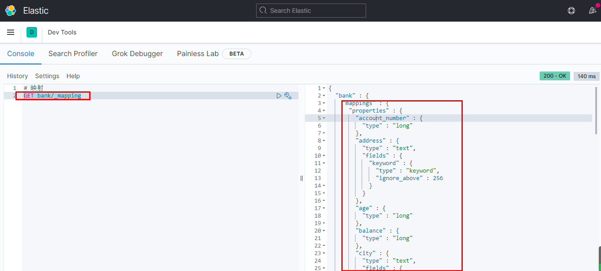
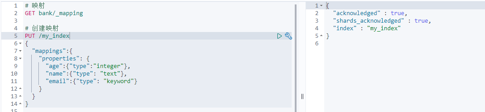
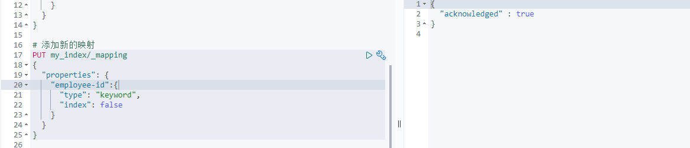
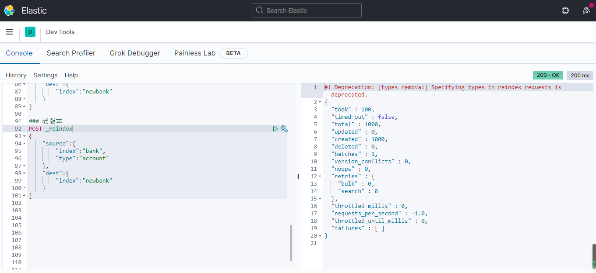

# Elasticsearch映射

[官方文档](https://www.elastic.co/guide/en/elasticsearch/reference/current/mapping.html)

## 一、ElasticSearch6去掉type的概念

关系数据库中两个数据表示是独立的，即使他们里面有相同名称的列也不影响使用，但ES中不是这样的。elasticsearch是基于Lucene开发的搜索引擎，而Es中不同type下名称相同的field最终在Lucene中的处理方式是一样的

-   两个不同type下的user-name，在es同一个索引下其实被认为是同一个field,你必须在不同的type中定义相同的field映射。否则，不同type中的相同字段名称就会在处理时出现冲突的情况，导致Lucene处理效率下降
-   Elasticsearch 7.X
    -   URL中的type参数可选。比如，索引一个文档不再要求提供文档类型
-   Elasticsearch 8.X
    -   不再支持URL中的type参数
-   解决：将索引从多类型迁移到但类型，每种类型文档一个索引

[相关文档](https://www.elastic.co/guide/en/elasticsearch/reference/current/removal-of-types.html)

## 二、Mapping（映射）

Mapping是用来定义一个文档，以及它所包含的属性是如何存储和索引的。比如，使用mapping来定义：

-   哪些字符串属性应该被看做全文本属性（full text fields）
-   哪些属性包含数字，日期或者地理位置
-   文档中的所有属性是否都能被索引
-   日期的格式
-   自定义映射规则来执行动态添加属性

## 三、查看映射

```
GET bank/_mapping
```



【注意】text属性的field，都会有一个keyword子属性

## 四、创建映射

**方法**：PUT

**格式**：

```bash
"mappings":{
    "properties": {
        "TYPE_NAME":{"type":"TYPE_DATA_NAME"},
        ...
    }
}
```

**实例**：

```
# 创建映射
PUT /my_index
{
  "mappings":{
    "properties": {
      "age":{"type":"integer"},
      "name":{"type": "text"},
      "email":{"type": "keyword"}
    }
  }
}
```



## 五、添加新的映射字段

```bash
# 添加新的映射
PUT my_index/_mapping
{
  "properties": {
    "employee-id":{
      "type": "keyword",
      "index": false  //控制该字段能不能被检索,默认为True
    }
  }
}
```



## 六、更新映射

不能修改映射，只能新建一个索引和映射关系，并将旧的数据迁移过去

### 1. 创建新索引

**方法**：PUT

```
## 创建新的索引
PUT newbank
{
  "mappings": {
    "properties": {
      "account_number": {
        "type": "long"
      },
      "address": {
        "type": "text"
      },
      "age": {
        "type": "integer"
      },
      "balance": {
        "type": "long"
      },
      "city": {
        "type": "keyword"
      },
      "email": {
        "type": "keyword"
      },
      "employer": {
        "type": "keyword"
      },
      "firstname": {
        "type": "text"
      },
      "gender": {
        "type": "keyword"
      },
      "lastname": {
        "type": "text",
        "fields": {
          "keyword": {
            "type": "keyword",
            "ignore_above": 256
          }
        }
      },
      "state": {
        "type": "keyword"
      }
    }
  }
}
```

### 2. 数据迁移

**方法**：POST

```
## 进行数据迁移
### 6.0以后的版本
POST _reindex
{
    "source":{
        "index":"bank"
    },
    "dest":{
        "index":"new_bank"
    }
}

### 老版本
POST _reindex
{
    "source":{
        "index":"bank",
        "type":"account"
    },
    "dest":{
        "index":"new_bank"
    }
}
```



## 七、分词

看下章