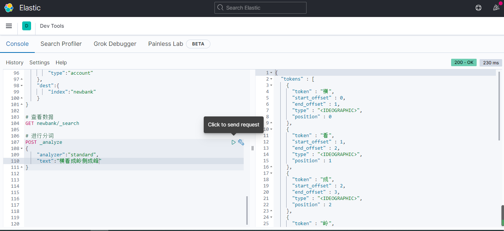
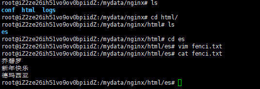
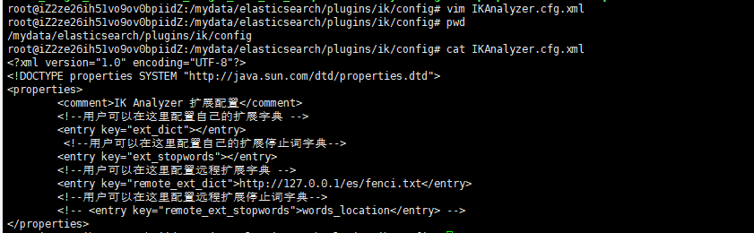

# Elasticsearch分词

[TOC]

[官方文档](https://www.elastic.co/guide/en/elasticsearch/reference/current/analysis.html)

## 一、简介

一个tokenizer（分词器）接收一个字符流，将之分割为独立的tokens（词元，通常是独立的单词），然后输出tokens流。

例如：whitesepace tokenizer遇到空白字符时分割文本。它会将文本”Quick beown fox！“分割为[Quick,beown,fox!]。

该分词器还负责记录各个term（词条）的顺序或position位置，以及term所代表的原始word的start和end的字符偏移量（用于高亮显示搜索内容）。

## 二、格式

```
POST _analyze
{
    "analyzer":"选择分词器",
    "text":"分词内容"
}
```

我们就使用默认的分词器来进行分词：

```
POST _analyze
{
    "analyzer":"standard",
    "text":"横看成岭侧成峰"
}
```



我们看到，这里每一个字一个词，而并不是我们想要的。我们就可以使用ik来进行中文分词。

## 三、安装中文（ik）分词器

github地址：https://github.com/medcl/elasticsearch-analysis-ik

具体文章看这篇：[Elasticsearch安装IK](https://blog.csdn.net/jiangSummer/article/details/113853051)

## 四、自定义扩展库

我们自己写一个新项目来出处理每个请求，让ik向我们的项目发送请求。

地址路径：`/usr/share/elasticsearch/plugins/ik/config/IKAnalyzer.cfg.xml`

原来的数据

```xml
<?xml version="1.0" encoding="UTF-8"?>
<!DOCTYPE properties SYSTEM "http://java.sun.com/dtd/properties.dtd">
<properties>
	<comment>IK Analyzer 扩展配置</comment>
	<!--用户可以在这里配置自己的扩展字典 -->
	<entry key="ext_dict"></entry>
	 <!--用户可以在这里配置自己的扩展停止词字典-->
	<entry key="ext_stopwords"></entry>
	<!--用户可以在这里配置远程扩展字典 -->
	<!-- <entry key="remote_ext_dict">words_location</entry> -->
	<!--用户可以在这里配置远程扩展停止词字典-->
	<!-- <entry key="remote_ext_stopwords">words_location</entry> -->
</properties>
```

要使用自己的ip来放置这个文本，就需要使用**nginx**。

### 1. 安装nginx

安装与配置：[传送门](https://blog.csdn.net/jiangSummer/article/details/113854108)

### 2. 新建配置文件

当下载并配置完成之后，我们就可以进入html文件夹，然后创建一个es文件夹。在里面新建一个自己的分词文档即可。




### 3. 测试

只需要打开浏览器，输入自己的ip然后外加es与文本名字即可


### 4. 修改ik分词器配置

上面我们展示过原来的数据，我们只需要在修改一行即可

```xml
<?xml version="1.0" encoding="UTF-8"?>
<!DOCTYPE properties SYSTEM "http://java.sun.com/dtd/properties.dtd">
<properties>
	<comment>IK Analyzer 扩展配置</comment>
	<!--用户可以在这里配置自己的扩展字典 -->
	<entry key="ext_dict"></entry>
	 <!--用户可以在这里配置自己的扩展停止词字典-->
	<entry key="ext_stopwords"></entry>
	<!--用户可以在这里配置远程扩展字典 -->
	<entry key="remote_ext_dict">http://127.0.0.1/es/fenci.txt</entry>
	<!--用户可以在这里配置远程扩展停止词字典-->
	<!-- <entry key="remote_ext_stopwords">words_location</entry> -->
</properties>
```



### 5. 重启es

```
docker restart elasticsearch
```


