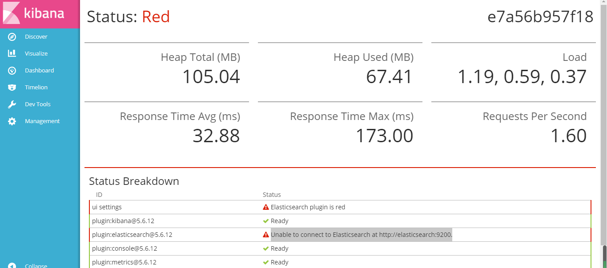
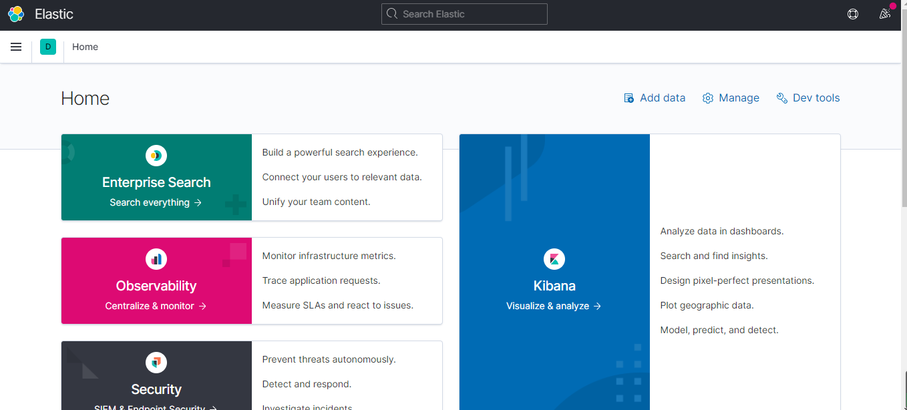

# 解决docker报Unable to connect to Elasticsearch at http://elasticsearch:9200和Unable to revive connection: http://elasticsearch:9200/

当我们兴高采烈的下载好Elasticsearch并且把Kibana安装好之后，在浏览器上输入`ip地址:6501`却出现如下情景：



这还真的欲哭无泪，然后就在网上找办法，以下是最常见的3种：

### 第一种

将ElasticSearch的ip改成`127.0.0.1`或`localhost`

```
docker run -it -d -e ELASTICSEARCH_URL=http://127.0.0.1:9200 --name kibana_es -p 5601:5601 kibana
```

### 第二种

将ip设为与ElasticSearch配置文件中network.host的值一致：

-   进入ElasticSearch容器

    ```bash
    docker exec -it elasticsearch /bin/bash
    ```

-   查看配置文件

    ```bash
    cd config/
    ```

-   编辑配置文件

    ```bash
    vim elasticsearch.yml
    ```

-   添加如下配置信息

    ```bash
    http.cors.enabled: true
    http.cors.allow-origin: "*"
    network.host:  ip#具体的ip要根据自己的情况来定，此处是本人虚拟机的ip
    ```

-   创建Kibana容器

    ```
    docker run -it -d -e ELASTICSEARCH_URL=http://ip:9200 --name kibana_es -p 5601:5601 kibana
    ```

### 第三种

-   进入ES容器

    ```bash
    docker exec -it elasticsearch /bin/bash
    ```

-   查看ip（docker内部局域网的ip）

    ```bash
    cat /etc/hosts
    ```

    我们将看到下面的内容：
    

    我们可以知道es容器在docker中的ip是`172.17.0.3`

-   接下来就可以根据这个ip来创建容器啦

    ```
    docker run -it -d -e ELASTICSEARCH_URL=http://172.17.0.3:9200 --name kibana -p 5601:5601 kibana
    ```

好巧不巧，上面三种方法都对我无效，我就自己摸索，下面是我自己的方法：

### 自己的办法

-   先进入kibana容器

    ```
    docker exec -it kibana /bin/bash
    ```

-   修改kibana的配置文件

    注：如果没有vim，下载即可

    ```
    vim /etc/kibana/kibana.yml
    ```

    进入之后，把*elasticsearch.url*后面的elasticsearch:9200改为自己的ip:9200

当启动之后，却报了

```
This version of Kibana requires Elasticsearch v5.6.12 on all nodes. I found the following incompatible nodes in your cluster: v7.10.1 @ 127.0.0.1:9200 (127.0.0.1)
```

这是应为我的elasticsearch版本为7.10.1。但是kibana的版本确实lastest。这里不知什么原因帮我选到了5.6.12，因此，我们只需要把现在的容器删除，选择与elasticsearch对应的版本即可。

接下来就是重新创建容器：

```
docker run --name kibana -e ELASTICSEARCH_HOSTS=http://自己的ip地址:9200 -p 5601:5601 -d kibana:7.10.1
```

这时，回去打开网页，就会发现界面已经出来了。

