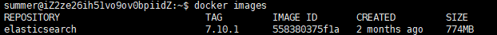

# Docker安装与配置Elasticsearch

[TOC]

## 一、 安装

### 1. 查找当前最新版本

要查找最新版本，可以先去镜像仓库查找：[docker hub地址](https://hub.docker.com/)

当前最新版本为7.10.1

### 2. 下拉镜像

```dockerfile
docker pull elasticsearch:7.10.1
```

如果下拉时，出现速度慢，可以查看这篇文章：[解决docker pull镜像时网速慢的问题](https://blog.csdn.net/jiangSummer/article/details/113815717)

如果直接使用`docker pull elasticsearch`可能会报错应为他不知道你想拉去的确切版本，因此，必须加个版本号

### 3. 查看镜像

```dockerfile
docker images
```



## 二、创建Elasticsearch容器

### 1. 创建所需文件

```
sudo mkdir -p /mydata/elasticsearch/config  //用来存放elasticsearch的配置文件
sudo mkdir -p /mydata/elasticsearch/data
```

为了方便，可以直接将host放入：

```
echo "http.host: 0.0.0.0">>/mydata/elasticsearch/config/elasticsearch.yml
```

如果出现权限问题，可以`su - root`进入root然后创建，之后使用`chwod summer:summer elasticsearch.yml `来将这个文件的所属组和用户进行更改

当然，如果想配置文件看起来专业一点，可以放入下面的参数：

```
# ======================== Elasticsearch Configuration =========================
#
# NOTE: Elasticsearch comes with reasonable defaults for most settings.
#       Before you set out to tweak and tune the configuration, make sure you
#       understand what are you trying to accomplish and the consequences.
#
# The primary way of configuring a node is via this file. This template lists
# the most important settings you may want to configure for a production cluster.
#
# Please see the documentation for further information on configuration options:
# <http://www.elastic.co/guide/en/elasticsearch/reference/current/setup-configuration.html>
#
# ---------------------------------- Cluster -----------------------------------
#
# Use a descriptive name for your cluster:
#
# cluster.name: my-application
#
# ------------------------------------ Node ------------------------------------
#
# Use a descriptive name for the node:
#
# node.name: node-1
#
# Add custom attributes to the node:
#
# node.rack: r1
#
# ----------------------------------- Paths ------------------------------------
#
# Path to directory where to store the data (separate multiple locations by comma):
#
# path.data: /path/to/data
#
# Path to log files:
#
# path.logs: /path/to/logs
#
# ----------------------------------- Memory -----------------------------------
#
# Lock the memory on startup:
#
# bootstrap.memory_lock: true
#
# Make sure that the `ES_HEAP_SIZE` environment variable is set to about half the memory
# available on the system and that the owner of the process is allowed to use this limit.
#
# Elasticsearch performs poorly when the system is swapping the memory.
#
# ---------------------------------- Network -----------------------------------
#
# Set the bind address to a specific IP (IPv4 or IPv6):
#
network.host: 0.0.0.0
#
# Set a custom port for HTTP:
#
# http.port: 9200
#
# For more information, see the documentation at:
# <http://www.elastic.co/guide/en/elasticsearch/reference/current/modules-network.html>
#
# --------------------------------- Discovery ----------------------------------
#
# Pass an initial list of hosts to perform discovery when new node is started:
# The default list of hosts is ["127.0.0.1", "[::1]"]
#
# discovery.zen.ping.unicast.hosts: ["host1", "host2"]
#
# Prevent the "split brain" by configuring the majority of nodes (total number of nodes / 2 + 1):
#
# discovery.zen.minimum_master_nodes: 3
#
# For more information, see the documentation at:
# <http://www.elastic.co/guide/en/elasticsearch/reference/current/modules-discovery.html>
#
# ---------------------------------- Gateway -----------------------------------
#
# Block initial recovery after a full cluster restart until N nodes are started:
#
# gateway.recover_after_nodes: 3
#
# For more information, see the documentation at:
# <http://www.elastic.co/guide/en/elasticsearch/reference/current/modules-gateway.html>
#
# ---------------------------------- Various -----------------------------------
#
# Disable starting multiple nodes on a single system:
#
# node.max_local_storage_nodes: 1
#
# Require explicit names when deleting indices:
#
# action.destructive_requires_name: true
```

但是仔细看，还是就一句话可以用。就是上面那一行

### 2. 文件夹赋权

```
chmod -R 777 elasticsearch/
```

### 3. 命令启动

#### 最基础命令：

```
docker run --name elasticsearch -p 9200:9200 elasticsearch:7.10.1
```

#### 更加可靠命令：

```
docker run --name elasticsearch -p 9200:9200 \
 -p 9300:9300 \
 -e "discovery.type=single-node" \
 -e ES_JAVA_OPTS="-Xms64m -Xmx128m" \
  -v /mydata/elasticsearch/config/elasticsearch.yml:/usr/share/elasticsearch/config/elasticsearch.yml \
 -v /mydata/elasticsearch/data:/usr/share/elasticsearch/data \
 -v /mydata/elasticsearch/plugins:/usr/share/elasticsearch/plugins \
 -d elasticsearch:7.10.1
```

### 4. 参数说明

```
--name elasticsearch：将容器命名为 elasticsearch
-p 9200:9200：将容器的9200端口映射到宿主机9200端口
-p 9300:9300：将容器的9300端口映射到宿主机9300端口，目的是集群互相通信
-e "discovery.type=single-node"：单例模式
-e ES_JAVA_OPTS="-Xms64m -Xmx128m"：配置内存大小
-v /mydata/elasticsearch/config/elasticsearch.yml:/usr/share/elasticsearch/config/elasticsearch.yml：将配置文件挂载到宿主机
-v /mydata/elasticsearch/data:/usr/share/elasticsearch/data：将数据文件夹挂载到宿主机
-v /mydata/elasticsearch/plugins:/usr/share/elasticsearch/plugins：将插件目录挂载到宿主机(需重启)
-d elasticsearch:7.7.0：后台运行容器，并返回容器ID
```

### 5. 查看容器的基本信息

```
docker inspect ID前三位
```

### 6. 查看容器

```
docker ps -a
```

### 7. 验证是否成功

```
curl http://127.0.0.1:9200/
```


## 三、Docker容器自启

```
docker update elasticsearch --restart=always
```

