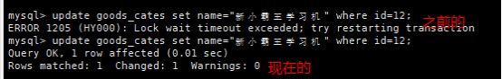

# 事务

## 1. 为什么要有事务

​		事务广泛的运用于订单系统、银行系统等多种场景

​		例如：

>   A用户和B用户是银行的储户，现在A要给B转账500元，那么需要做以下几件事：
>
>   1.  检查A的账户余额>500元；
>   2.  A 账户中扣除500元;
>   3.  B 账户中增加500元;

​		正常的流程走下来，A账户扣了500，B账户加了500，皆大欢喜。

​		那如果A账户扣了钱之后，系统出故障了呢？A白白损失了500，而B也没有收到本该属于他的500。

​		以上的案例中，隐藏着一个前提条件：A扣钱和B加钱，要么同时成功，要么同时失败。事务的需求就在于此所谓事务,它是一个操作序列，这些操作要么都执行，要么都不执行，它是一个不可分割的工作单位。

​		例如，银行转帐工作：从一个帐号扣款并使另一个帐号增款，这两个操作要么都执行，要么都不执行。所以，应该把他们看成一个事务。**事务是数据库维护数据一致性的单位，在每个事务结束时，都能保持数据一致性**

## 2. 事务四大特性(简称ACID)

-   **原子性(Atomicity)**
-   **一致性(Consistency)**
-   **隔离性(Isolation)**
-   **持久性(Durability)**

以下内容出自《高性能MySQL》第三版，了解事务的ACID及四种隔离级有助于我们更好的理解事务运作。

​		下面举一个银行应用是解释事务必要性的一个经典例子。假如一个银行的数据库有两张表：支票表（checking）和储蓄表（savings）。现在要从用户Jane的支票账户转移200美元到她的储蓄账户，那么至少需要三个步骤：

1.  检查支票账户的余额高于或者等于200美元。
2.  从支票账户余额中减去200美元。
3.  在储蓄帐户余额中增加200美元。

上述三个步骤的操作必须**打包在一个事务**中，任何一个步骤失败，则必须**回滚**所有的步骤。

可以用`START TRANSACTION`语句开始一个事务，然后要么使用`COMMIT`提交将修改的数据持久保存，要么使用`ROLLBACK`撤销所有的修改。事务SQL的样本如下：

1.  start transaction;
2.  select balance from checking where customer_id = 10233276;
3.  update checking set balance = balance - 200.00 where customer_id = 10233276;
4.  update savings set balance = balance + 200.00 where customer_id = 10233276;
5.  commit;

一个很好的事务处理系统，必须具备这些标准特性：

-   **原子性（atomicity）**

>   一个事务必须被视为一个不可分割的最小工作单元，整个事务中的所有操作要么全部提交成功，要么全部失败回滚，对于一个事务来说，不可能只执行其中的一部分操作，这就是事务的原子性

-   一致性（consistency）

>   数据库总是从一个一致性的状态转换到另一个一致性的状态。（在前面的例子中，一致性确保了，即使在执行第三、四条语句之间时系统崩溃，支票账户中也不会损失200美元，因为事务最终没有提交，所以事务中所做的修改也不会保存到数据库中。）

-   **隔离性（isolation）**

>   通常来说，一个事务所做的修改在最终提交以前，对其他事务是不可见的。（在前面的例子中，当执行完第三条语句、第四条语句还未开始时，此时有另外的一个账户汇总程序开始运行，则其看到支票帐户的余额并没有被减去200美元。）

-   持久性（durability）

>   一旦事务提交，则其所做的修改会永久保存到数据库。（此时即使系统崩溃，修改的数据也不会丢失。）

## 3. 事务命令

表的引擎类型必须是innodb类型才可以使用事务，这是mysql表的默认引擎

### 3.1 查看表的创建语句，可以看到engine=innodb

```sql
-- 选择数据库
use jing_dong;
-- 查看goods表
show create table goods;
```

### 3.2 开启事务，命令如下：

-   开启事务后执行修改命令，变更会维护到本地缓存中，而不维护到物理表中

```sql
begin;
或者
start transaction;
```

### 3.3 提交事务，命令如下

-   将缓存中的数据变更维护到物理表中

```sql
commit;
```

### 3.4 回滚事务，命令如下：

-   放弃缓存中变更的数据

```sql
rollback;
```

## 4. 注意

1.  修改数据的命令会自动的触发事务，包括insert、update、delete。即你执行一条上述操作他就自动提交了。
2.  而在SQL语句中有手动开启事务的原因是：**可以进行多次数据的修改，如果成功一起成功，否则一起会滚到之前的数据**

## 5.提交操作详解

### 5.1 插入操作

#### step1：连接

-   终端1：查询商品分类信息

```sql
select * from goods_cates;
```


#### step2：增加数据

-   终端2：开启事务，插入数据

```sql
begin;
insert into goods_cates(name) values('小霸王游戏机');
```

-   终端2：查询数据，此时有新增的数据

```sql
select * from goods_cates;
```


​		此时我们可以看到，在终端2中，是可以完全的显示这个小霸王学习机的

#### step3：查询

-   终端1：查询数据，发现并没有新增的数据

```sql
select * from goods_cates;
```


#### step4：提交

-   终端2：完成提交

```sql
commit;
```


#### step5：查询

-   终端1：查询，发现有新增的数据

```sql
select * from goods_cates;
```


### 5.2 修改操作

#### step1：连接

-   终端1：查询商品分类信息

```sql
select * from goods_cates;
```


#### step2：增加数据

-   终端2：开启事务，修改数据

```sql
begin;
update goods_cates set name="新小霸王" where id=12;
```

-   终端2：查询数据，此时有新的修改数据

```sql
select * from goods_cates;
```


#### step3：查询

-   终端1：同样修改id为12的数据

```sql
update goods_cates set name="新小霸王学习机" where id=12;
```

首先可以看得到光标一直停留在第一行，像是在等待什么。


等过了一会，自动报出lock等待超时错误，请重试。这里的锁就是属于Innodb的**行级锁**。

当一个事务需要给自己需要的某个资源加锁的时候如果遇到自己需要锁定的资源已经被一个排他锁占有之后，则只能等待该锁定释放资源之后自己才能获取锁定资源并添加自己的锁定。

我们这里在终端2中应为没有提交，所以该行一直处于上锁状态，所以任何其他终端如果想修改这一行就只能等待。

具体的内容可以看这篇博客：[传送门](https://www.cnblogs.com/huangfuyuan/p/9510022.html)

#### step4：提交

-   终端2：完成提交

```sql
commit;
```

#### step5：查询

-   终端1：修改12行数据

```sql
update goods_cates set name="新小霸王学习机" where id=12;
```

可以看到修改操作马上就执行了。



### 5.3 删除操作

#### step1：删除数据

-   终端2：开启事务，删除

```sql
begin;
delete from goods_cates where id=12;
```

-   终端2：查询数据，此时有新增的数据

```sql
select * from goods_cates;
```


#### step2：查询

-   终端1：查询数据，发现并没有发现数据被删除

```sql
select * from goods_cates;
```

-   终端1：修改12行数据

```sql
update goods_cates set name="新新小霸王学习机" where id=12;
```

执行的时候还是会发现处于等待状态，需要终端2解锁才行


#### step3：提交

-   终端2：完成提交

```sql
commit;
```

#### step5：查询

-   终端1：查询，发现12行数据已被删除

```sql
select * from goods_cates;
```


## 6. 回滚

### step1：连接

-   终端1

```sql
select * from goods_cates;
```

### step2：增加数据

-   终端2：开启事务，插入数据

```sql
begin;
insert into goods_cates(name) values('小霸王游戏机');
```

-   终端2：查询数据，此时有新增的数据

```sql
select * from goods_cates;
```

### step3：查询

-   终端1：查询数据，发现并没有新增的数据

```sql
select * from goods_cates;
```

### step4：回滚

-   终端2：完成回滚

```sql
rollback;
```


### step5：查询

-   终端1：查询数据，发现没有新增的数据

```sql
select * from goods_cates;
```

-   终端2：查询数据，也没有发现新增的数据，而此时id号变成了14。说明增加的这条的确存在过，只是没有保存到硬盘中。在随着`rollback;`命令的按下随之消失了。


## 7. 总结

​		从上面的例子来看，事务的作用是可以有效的保持几个相关数据表在一系列操作后能数据一致。

​		事务包含四个特性：**原子性、一致性、隔离性和持久性**。

​		在mysql客户端中，我们虽然只是执行了一条语句，可是在客户端眼里这就是一个事务，只是在你写这条命令前自动开启了事务，在你写完这条数据然后提交之后，事务也自动提交。

​		mysql存在锁，锁的种类有许多，这里使用了行级锁：即多个用户一起执行一条数据，谁先抢到锁谁用，后抢到的只能等待前面的解开锁才可以继续抢新的锁去使用该资源。

​		python中语句执行默认开启事务，如果需要使用修改、删除和添加操作就需要使用commit来提交事务或者回滚。

​		关于mysqsl的Innodb引擎更多只是可以看下这篇文章：[传送门](https://www.jianshu.com/p/519fd7747137)