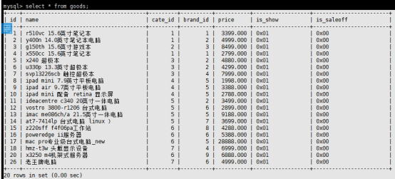
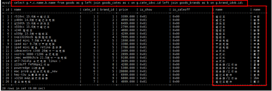
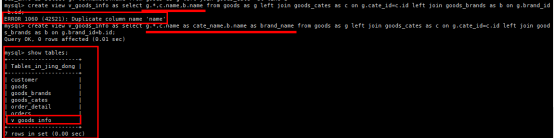
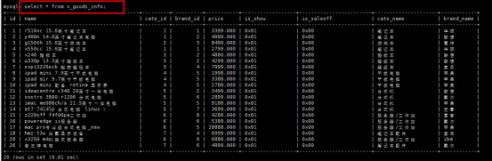
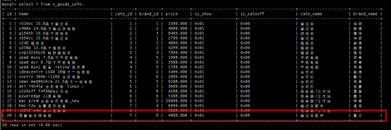

# Mysql-视图

## 1. 问题

​		对于复杂的查询，往往是有多个数据表进行关联查询而得到，如果数据库因为需求等原因发生了改变，为了保证查询出来的数据与之前相同，则需要在多个地方进行修改，维护起来非常麻烦

解决办法：定义视图

## 2. 视图是什么

​		通俗的讲，视图就是一条SELECT语句执行后返回的结果集。所以我们在创建视图的时候，主要的工作就落在创建这条SQL查询语句上。

​		视图是对若干张基本表的引用，一张**虚表**，查询语句执行的结果，不**存储具体的数据**（**基本表数据发生了改变，视图也会跟着改变**）；

​		方便操作，特别是查询操作，减少复杂的SQL语句，增强可读性；

## 3. 定义视图

建议以v_开头

```sql
create view 视图名称 as select语句;
```

## 4. 查看视图

查看表会将所有的视图也列出来

```sql
show tables;
```

## 5. 使用视图

视图的用途就是查询

```sql
select * from v_stu_score;
```

## 6. 删除视图

```sql
drop view 视图名称;
例：
drop view v_stu_sco;
```

## 7. 操作视图

​		先查看goods中的所有记录：`select * from goods`



​		查询三张表中的所有信息：`select * from goods as g left join goods_cates as c on g.cate_id=c.id left join goods_brands as b on g.brand_id=b.id;`

​		当执行上面的操作之后会发现整个结果会很长，我们可以进行一些简化：

`select g.*,c.name,b.name from goods as g left join goods_cates as c on g.cate_id=c.id left join goods_brands as b on g.brand_id=b.id;`



​		每次都执行这么长的代码会觉得很麻烦，因此如果我们可以引入视图，来简化后续的操作：

`create view v_goods_info as select g.*,c.name,b.name from goods as g left join goods_cates as c on g.cate_id=c.id left join goods_brands as b on g.brand_id=b.id;` 

​		如果直接执行上面这段代码，会发现我们在c.name和b.name上都是用的是name，并且goods自己也带有一个name，我们同时可以取一个别名：`create view v_goods_info as select g.*,c.name as cate_name,b.name as brand_name from goods as g left join goods_cates as c on g.cate_id=c.id left join goods_brands as b on g.brand_id=b.id;`



​		可以看到，我们在查询表的时候，这个视图已经出现在这里了，并且这个只是一个虚表，内部并不会存在任何的数据，只是你什么时候去查找，他在去查找相当于一个中间人。

-   查看视图内的数据：`select * from v_goods_info;`



-   尝试修改数据：`update v_goods_info set name="隔壁老王牌电脑" where id=26;`

```sql
ERROR 1288 (HY000): The target table v_goods_info of the UPDATE is not updatable
```

-   修改主表的数据，查看视图如何改变

`update goods set name="隔壁老王牌电脑" where id=26;`

``select * from v_goods_info;``



​		可以看到，如果主表发生改变，这个视图也会更着变，也就间接证明：视图只是一个虚表，你什么时候查询，他什么时候去找。

## 8. 视图的作用

1.  提高了重用性，就像一个函数
2.  对数据库重构，却不影响程序的运行
3.  提高了安全性能，可以对不同的用户
4.  让数据更加清晰