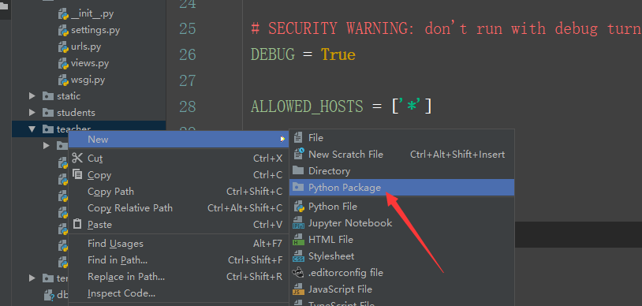

## 本节课安排：

### 8:30前有问题随时抛出来，现场解答

### 8:30到9:30补一个小时

### 9:30后继续可以做作业复习，有问题来教室

url：https://docs.djangoproject.com/en/2.1/topics/http/urls/

内置模板标签和过滤器：https://docs.djangoproject.com/en/2.1/ref/templates/builtins/

自定义模板标签和过滤器：https://docs.djangoproject.com/en/2.1/howto/custom-template-tags/

```
内置过滤器语法：

{{ 变量名|first }}

{{ 变量名|add:"2" }}

内置标签：




```

### 自定义模板过滤器

1.设置数据时，通常不会直接使用男，女；而是使用数字来表示（女---》0，男---》1）

2.但是显示在页面上时，我需要看到中文或者英文

3.代码布局

- 某个app特有

- 根目录，多个app共用

  #### 常用设置：某个app特有

步骤

1.创建一个叫templatetags的包（`__init__.py`)

2.app必须要在INSTALLED_APPS中进行配置

3.重启服务



4.写自定义过滤器函数

```
def to_sex(value, flag='zh'):
    change = {
        'zh': ('女', '男'),
        'en': ('Female', 'Male'),
    }
    return change[flag][value]
```

5.注册

```
# customer_filters.py

from django import template


register = template.Library()   # 变量名必须是register


def to_sex(value, flag='zh'):
    change = {
        'zh': ('女', '男'),
        'en': ('Female', 'Male'),
    }
    return change[flag][value]


register.filter("sex", to_sex)
register.filter(to_sex)	# 如果name参数不指定的话，就会用函数名作为过滤器名
```

6.使用

```
# teacher/index.html

....
<td>{{ student.sex|to_sex:'en' }}</td>
```


