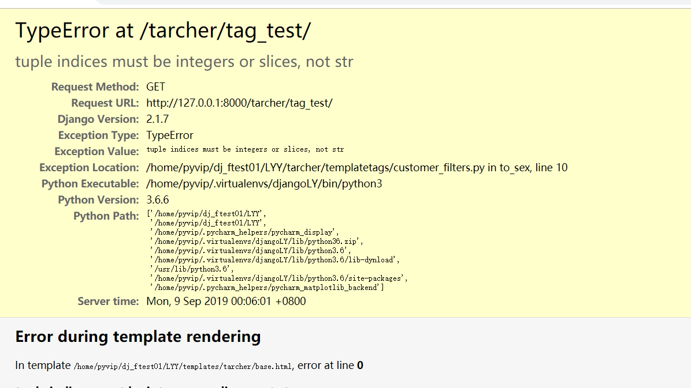
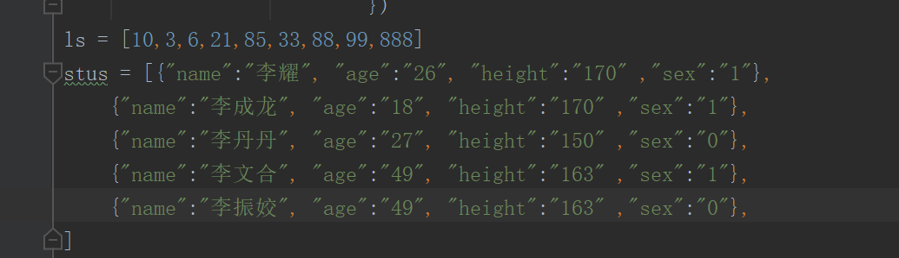
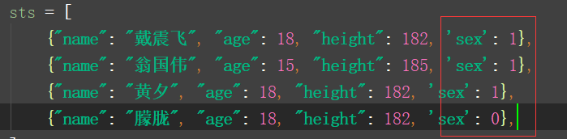
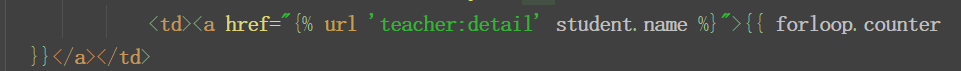
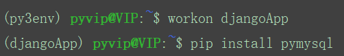

当你看到上面的报错的时候，请去你的视图函数那看看，是不是和下面一样“sex”后面放的是字符串而不是整数（错误示例如下）



请记住用整数，不要用字符串（正确示例如下）




### 模板标签----可以干任何事情

templatetags

```
INSTALLED_APPS配置好app的路径
```

1.简单标签：



```
自定义模板标签的步骤
1.创建文件夹（templatetags包），创建py文件
# customer_tags.py

from datetime import datetime


def current_time(format_str):
    now = datetime.now().strftime(format_str)
    return now

2.注册
from datetime import datetime
from django.template import Library

register = Library()


def current_time(format_str):
    now = datetime.now().strftime(format_str)
    return now


register.simple_tag(current_time, name='current')
3.使用
4.上下文管理
视图函数中通过context传递到自定义标签
@register.simple_tag(name='current', takes_context=True)
def current_time(context):
    return datetime.now().strftime(context['format_str'])
```

2.包含标签：一个模板通过渲染另一个模板来展示数据

前提：

- 表格内多行内容显示`<td>{{ student.course }}</td>`

- 通过for实现：`<td>{{ course }}</td>`

- 利用模板+自定义标签来实现

  1. 创建

     ```
     
     ```

  2. 注册

  3. 使用

  4. 优化


### 数据库的连接配置

1.数据接口

```
DATABASES = {
    'default': {
        'ENGINE': 'django.db.backends.sqlite3',
        'NAME': os.path.join(BASE_DIR, 'db.sqlite3'),
    }
}
```

2.配置mysql数据库：同数据库阶段

- 安装pymysql（API）`pip install pymysql`注意：要在你对应的环境中安装




- 创建数据库

  - 可以远程访问的数据库用户

  - 创建数据库

    ```
    mysql -uroot -pqwe123
    show databases;
    create database CRM charset=utf8;
    ```

  - 修改配置

  ```
  DATABASES = {
      'default': {
          'ENGINE': 'django.db.backends.mysql',
          'NAME': 'CRM',  # 数据库名
          'USER': 'develop',
          'PASSWORD': 'QWEqwe123',
          'HOST': '127.0.0.1',
          'PORT': 3306,
      }
  }
  ```

  - 导入pymysql

    

    ```
    # CRM/__init__.py
    # 关闭重启
    
    pymysql.install_as_MySQLdb()
    ```

    


