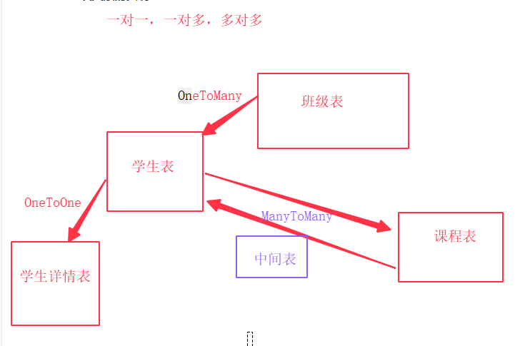

### 模型二 -- 常用查询和表关系的实现

#### 一:字段类型+参数

字段类型：<https://docs.djangoproject.com/en/2.1/ref/models/fields/#field-types>

字段参数：<https://docs.djangoproject.com/en/2.1/ref/models/fields/#field-options常用查询>


#### 二：常用查询

```
# get all filter

# all
In [8]: Student.objects.all()                                                                                         
Out[8]: <QuerySet [<Student: Lucy>, <Student: lucy>, <Student: 赵小玮>, <Student: 李国林>, <Student: lily>]>

# filter
In [10]: res = Student.objects.filter(name="lily")                                                                       
In [11]: print(res.query)                                                                                                
SELECT `teacher_student`.`num`, `teacher_student`.`name`, `teacher_student`.`age`, `teacher_student`.`height`, `teacher_student`.`sex`, `teacher_student`.`qq`, `teacher_student`.`phone`, `teacher_student`.`c_time`, `teacher_student`.`x_time` FROM `teacher_student` WHERE `teacher_student`.`name` = lily

# get
In [12]: Student.objects.get(name="lily")                                                                               
Out[12]: <Student: lily>
```

**共同点:**

`都是通过objects去实现的----》objects：每个django模型类，都有一个默认的管理器，objects`

##### 查询方法：

```
In [13]: Student.objects.first()   # 查询第一条数据                                                                                 
Out[13]: <Student: Lucy>	# 返回一个对象     

In [14]: Student.objects.last()   # 查询最后一条数据                                                                                        
Out[14]: <Student: lily>	# 返回一个对象   

In [15]: Student.objects.filter(name="lily")                                                                             
Out[15]: <QuerySet [<Student: lily>]>

In [16]: Student.objects.exclude(name="lily")  # 与filter用法相同，作用相反，排除的意思                                                                          
Out[16]: <QuerySet [<Student: Lucy>, <Student: lucy>, <Student: 赵小玮>, <Student: 李国林>]>

In [19]: Student.objects.values('name')   # 指定字段查询：只能拿到指定查询的字段值，其他的无法获取                                                                               
Out[19]: <QuerySet [{'name': 'Lucy'}, {'name': 'lucy'}, {'name': '赵小玮'}, {'name': '李国林'}, {'name': 'lily'}]>

In [20]: res = Student.objects.values('name')                                                                            

In [21]: res[2]['name']                                                                                                  
Out[21]: '赵小玮'

# only ：指定字段查询，但是可以获取其他所有字段值
In [26]: res = Student.objects.only('name')                                                                              

In [27]: res                                                                                                             
Out[27]: <QuerySet [<Student: Lucy>, <Student: lucy>, <Student: 赵小玮>, <Student: 李国林>, <Student: lily>]>

In [28]: res[2].name                                                                                                     
Out[28]: '赵小玮'

In [29]: res[2].sex                                                                                                      
Out[29]: 1

# defer：和only相反
# order_by:根据指定字段排序
In [34]: res = Student.objects.order_by('age')                                                                           

In [35]: print(res.query)                                                                                                
SELECT `teacher_student`.`num`, `teacher_student`.`name`, `teacher_student`.`age`, `teacher_student`.`height`, `teacher_student`.`sex`, `teacher_student`.`qq`, `teacher_student`.`phone`, `teacher_student`.`c_time`, `teacher_student`.`x_time` FROM `teacher_student` ORDER BY `teacher_student`.`age` ASC

In [36]: res                                                                                                             
Out[36]: <QuerySet [<Student: Lucy>, <Student: lucy>, <Student: lily>, <Student: 李国林>, <Student: 赵小玮>]>

In [37]: res = Student.objects.order_by('-age')                                                                          

In [38]: print(res.query)                                                                                                
SELECT `teacher_student`.`num`, `teacher_student`.`name`, `teacher_student`.`age`, `teacher_student`.`height`, `teacher_student`.`sex`, `teacher_student`.`qq`, `teacher_student`.`phone`, `teacher_student`.`c_time`, `teacher_student`.`x_time` FROM `teacher_student` ORDER BY `teacher_student`.`age` DESC

In [39]: res                                                                                                             
Out[39]: <QuerySet [<Student: 赵小玮>, <Student: 李国林>, <Student: lily>, <Student: lucy>, <Student: Lucy>]>


# 多条件查询
In [42]: Student.objects.filter(age=18,sex=0)                                                                            
Out[42]: <QuerySet [<Student: lily>]>

In [43]: from django.db.models import Q                                                                                  

In [44]: Student.objects.filter(Q(sex=0),Q(age=18)|Q(age=12))                                                            
Out[44]: <QuerySet [<Student: Lucy>, <Student: lily>]>

```

##### 查询条件

```
# exact：准确匹配
.....WHERE `teacher_student`.`name` = lucy

# iexact:不区分大小写匹配
 .....WHERE `teacher_student`.`name` LIKE lucy

# contains:包含匹配
..... WHERE `teacher_student`.`name` LIKE BINARY %l%

# icontains:不区分大小写包含匹配
......WHERE `teacher_student`.`name` LIKE %L%
# in:指定值
Student.objects.filter(sex__in='01')  
Student.objects.filter(pk__in=[1,3,5]) 

# 子查询
res = Student.objects.filter(name__icontains='l').only("name")   
res1 = Student.objects.filter(pk__in=res).only("name")  
SELECT `teacher_student`.`num`, `teacher_student`.`name` FROM `teacher_student` WHERE `teacher_student`.`num` IN (SELECT U0.`num` FROM `teacher_student` U0 WHERE U0.`name` LIKE %l%)
 
# gt 大于 gte大于等于 lt小于 lte小于等于
Student.objects.filter(pk__gt=2)  
# 范围查询
 res = Student.objects.filter(age__range=(18, 30)) 
 
 # annotate： 分组
 In [66]: res = Student.objects.values('sex').annotate(ren=Count('sex'))  # 聚合分组                                                

In [67]: print(res.query)                                                                                                
SELECT `teacher_student`.`sex`, COUNT(`teacher_student`.`sex`) AS `ren` FROM `teacher_student` GROUP BY `teacher_student`.`sex` ORDER BY NULL

```

##### 表关系的实现



1.表关系

```
from django.db import models


# Create your models here.
class Student(models.Model):
    name = models.CharField('姓名', max_length=20)
    age = models.SmallIntegerField('年龄', null=True)
    sex = models.SmallIntegerField('性别', default=1)
    qq = models.CharField('QQ', max_length=20, unique=True)
    phone = models.CharField('电话', max_length=20, unique=True)
    c_time = models.DateTimeField('创建时间', auto_now_add=True)
    # detail = models.OneToOneField('StudentDetail', on_delete=models.SET_NULL, null=True)
    grade = models.ForeignKey('Grade', on_delete=models.SET_NULL, null=True)

    def __str__(self):
        return "{}-{}".format(self.name, self.age)


class StudentDetail(models.Model):
    college = models.CharField('学院', max_length=20)
    student = models.OneToOneField('Student', on_delete=models.CASCADE)


class Grade(models.Model):
    name = models.CharField("班级名称", max_length=20)
    num = models.CharField("班期", max_length=20)


class Course(models.Model):
    name = models.CharField("课程名称", max_length=20)
    students = models.ManyToManyField('Student', through='Enroll')


# 中间表
class Enroll(models.Model):
    student = models.ForeignKey('Student', on_delete=models.CASCADE)
    course = models.ForeignKey('Course', on_delete=models.CASCADE)
    pay = models.FloatField('缴费金额', default=0)
    c_time = models.DateTimeField('报名时间', auto_now_add=True)
```

2.回滚

```
python manage.py migrate student 0001
注意：回滚后删除最后一次迁移文件
```


