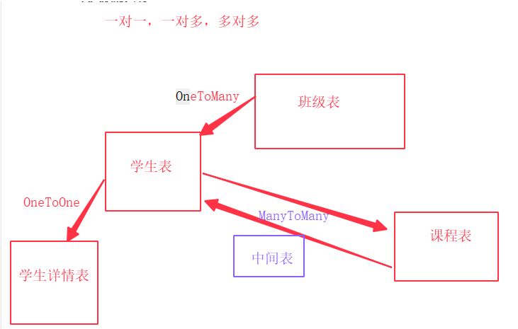

### 模型三：表关联对象操作及多表查询

#### 1.表数据的操作（增删改查）




一个班级----多个学生

问：一个班级里找一个学生

​       一个学生找到一个班级

#### 2.OneToMany(正向/反向增删改查)

```
正向：一个模型有外键字段，通过这个模型对外键进行操作就叫正向
反向：一个模型如果被另一个模型外键关联，通过这个模型对关联它的模型进行操作叫做反向
class Student（models.Model):
	....
	grade = models.ForeignKey('Grade', on_delete=models.SET_NULL, null=True)
```

```
# 增：通过属性赋值
In [11]: s1 = Student(name="朦胧",age=18,sex=0,qq="123",phone="456",grade=g1)                                           
In [12]: s1.save()   
# 增：主键的方式
In [13]: s2 = Student(name="李国林", age=25, qq="567",phone="567")                                                      
In [14]: s2.grade_id = g2.id                                                                                            
In [15]: s2.save() 

# 查
In [18]: s1.grade                                                                                                       
Out[18]: <Grade: Grade object (1)>

In [19]: s2.grade.name                                                                                                  
Out[19]: '爬虫班'

In [20]: Student.objects.filter(grade__name="django框架")                                                               
Out[20]: <QuerySet [<Student: 朦胧-18>]>

# 删
In [21]: s2.grade = None                                                                                                
In [22]: s2.save()                                                                                                      
In [23]: s2.grade  
```

```
方向：如果一个模型(eg：Student)有一个ForeignKey（grade）,那么这个外键模型的实例（eg:g1)将可以返回一个Student模型的所有实例的管理器（student_set)(student是模型名，小写)
# 增
# 1.通过student_set
In [24]: new_s = g2.student_set.create(name="林慧鹏", age=19,qq="234", phone="789")  
# 2.一次多个数据
In [25]: s1,s2,s3 = Student.objects.filter(id__lte=3);                                                                  
In [26]: g1.student_set.add(s1,s2,s3)

# 改
In [28]: g2.student_set.set([s2,s3]) 

# 删
In [29]: g2.student_set.remove(s2,s3)  
In [31]: g2.student_set.clear()

# 查：和objects一样使用
In [32]: g1.student_set.all()                                                                                           
Out[32]: <QuerySet [<Student: 朦胧-18>]>

In [33]: g1.student_set.filter(age=18)                                                                                  
Out[33]: <QuerySet [<Student: 朦胧-18>]>
```

#### 3.ManyToMany

```
class Course(models.Model):
    ...
    students = models.ManyToManyField('Student', through='Enroll')
 
反向模型管理器：course_set 可以通过related_name来指定属性替代course_set
	students = models.ManyToManyField('Student', through='Enroll', related_name='courses')
```

```
# 增

In [3]: c1 = Course.objects.create(name='python')                                                                    
In [4]: s1 = Student.objects.first() 
In [8]: e = Enroll()                                                                                                    
In [9]: e.course = c1                                                                                                   
In [10]: e.student = s1                                                                                                 
In [11]: e.save() 

# 查
In [12]: c1.students.all()                                                                                              
Out[12]: <QuerySet [<Student: 朦胧-18>]>

In [13]: s1.courses.all()                                                                                              
Out[13]: <QuerySet [<Course: Course object (1)>]>

```

#### 4.OneToOne

```
正向：一对一字段所在的模型，通过这个模型去访问关联的模型，正向，与上面类似
In [14]: d1 = StudentDetail(college='武汉理工大学')                                                                     
In [15]: d1.student=s1                                                                                                  
In [16]: d1.save() 

# 查
In [17]: StudentDetail.objects.values('college','student__name','student__qq')                                          
Out[17]: <QuerySet [{'college': '武汉理工大学', 'student__name': '朦胧', 'student__qq': '123'}]>

```

```
反向：前面的反向都是通过管理器，这里反向类似正向
# 增
In [18]: s = Student(name="蔺春琦",age=28,qq="987",phone="987")                                                         
In [19]: s.studentdetail = d1     # 原始模型的小写模型名                                                                                      
In [20]: s.save() 

# 查
 Student.objects.values('name','qq','studentdetail__college')  
```

#### 跨表查询

```
# 要跨越关系，只需要跨模型的相关字段的字段名，以双下划线隔开，直到达到想要的结果为止
# 男生报名的课程
In [41]: Course.objects.filter(students__sex=1)                                                                         
Out[41]: <QuerySet [<Course: Course object (1)>, <Course: Course object (1)>]>

# 报名了‘python’课程的学员
In [43]: Student.objects.filter(courses__name='python')                                                               
Out[43]: <QuerySet [<Student: 朦胧-18>, <Student: 李国林-25>, <Student: 林慧鹏-19>]>

# 报名了python 报名了11期的学员
In [44]: Student.objects.filter(courses__name='python', grade__num__contains='11')                                      
Out[44]: <QuerySet [<Student: 朦胧-18>, <Student: 李国林-25>]>

# 查询缴费金额小于3000的学员
In [51]: Student.objects.filter(enroll__pay__lt=3000)                                                                   
Out[51]: <QuerySet [<Student: 朦胧-18>, <Student: 李国林-25>, <Student: 林慧鹏-19>, <Student: 蔺春琦-28>]>


# 查询学员报名课程的班级有哪些
In [5]: Grade.objects.filter(student__courses__name='english').distinct()                                               
Out[5]: <QuerySet [<Grade: 基础班>]>

In [3]: Grade.objects.filter(student__courses__name='python')                                                           
Out[3]: <QuerySet [<Grade: django框架>, <Grade: django框架>, <Grade: 爬虫班>]>

In [4]: Grade.objects.filter(student__courses__name='python').distinct()                                                
Out[4]: <QuerySet [<Grade: django框架>, <Grade: 爬虫班>]>


```


