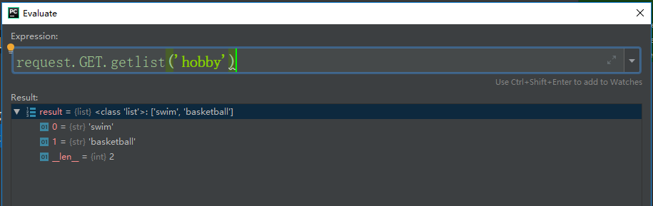

### 请求与响应

django框架是一个web应用框架

流程：

输入网址，请求页面(**GET请求**)，通过路径找到对应的视图函数

django创建的HttpRequest对象，该对象包含了关于请求的源数据

经过处理，视图返回一个HttpResponse对象。

#### HttpRequest对象



总结：

```
1.GET：是从服务器获取数据，不会更改数据库的状态和数据
2.POST:携带数据发送服务器，一般会更改服务器的数据的
3.GET是在URL中携带参数发送给数据库，POST不能在URL中看到参数。
```

 ##### 文件上传存储路径设置

1.项目跟目录下static文件夹中创建media文件夹

2.配置:settings.py文件中

```
MEDIA_ROOT = os.path.join(BASE_DIR, 'static/media')
```

#### HttpResponse对象

render：渲染

redirect：重定向

#### cookie

客户端访问服务器时（发送请求时），服务器在http协议里加上请求头，通过响应，传送到客户端，并保存在客户端，客户端再次访问时，会自动带上这个cookie去访问，这样服务器才能区分不同的客户端。


