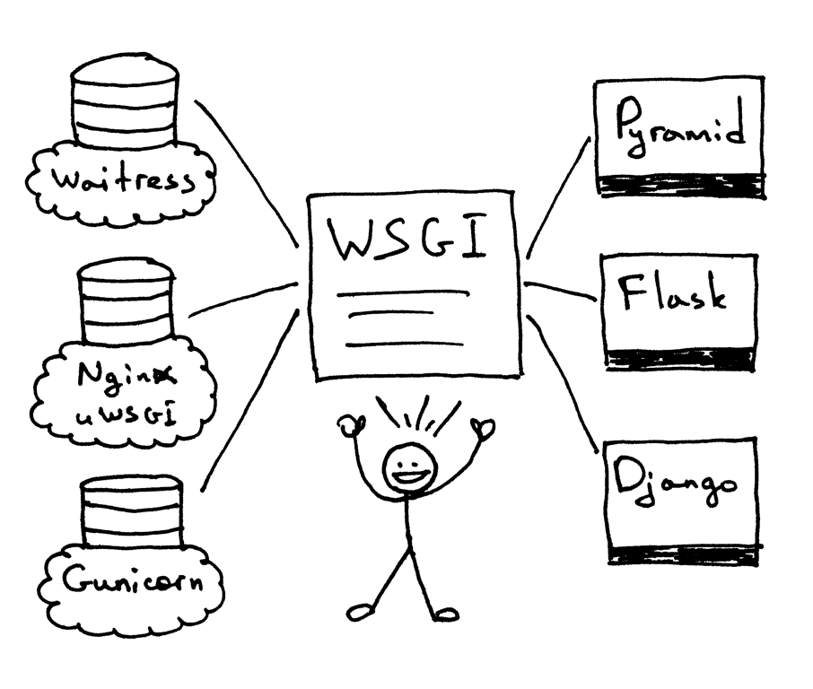
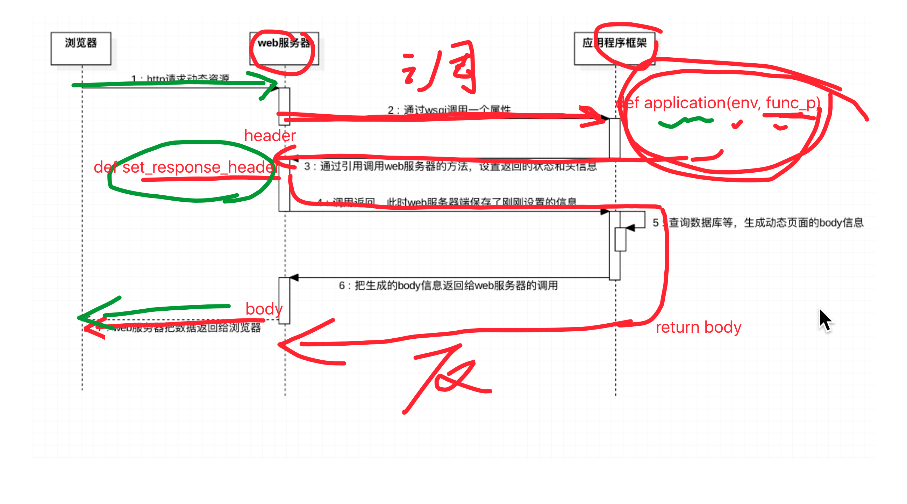

# WSGI

​		PythonWeb服务器[网关](https://baike.baidu.com/item/网关)接口（Python Web Server Gateway Interface，缩写为WSGI)是Python应用程序或框架和Web服务器之间的一种接口，已经被广泛接受, 它已基本达成它的可移植性方面的目标。

​		简单了说，就是服务器（nginx）与应用程序框架（django）之间的纽带，它规定了双方通信的标准。因此不管是什么服务器，不管是什么框架只要遵守了WSGI接口协议的都可以利用WSGI进行相关操作。

## 一、wsgi

​		在以前，选择 `Python web 架构`会受制于可用的`web服务器`，反之亦然。如果架构和服务器可以协同工作，那就好了：


​		但有可能面对（或者曾有过）下面的问题，当要把一个服务器和一个架构结合起来时，却发现他们不是被设计成协同工作的：


​		那么，怎么可以不修改服务器和架构代码而确保可以在多个架构下运行web服务器呢？答案就是 Python Web Server Gateway Interface (或简称 WSGI，读作“wizgy”)。


​		WSGI允许开发者将选择web框架和web服务器分开。可以混合匹配web服务器和web框架，选择一个适合的配对。比如,可以在Gunicorn 或者 Nginx/uWSGI 或者 Waitress上运行 Django, Flask, 或 Pyramid。真正的混合匹配，得益于WSGI同时支持服务器和架构：



​		web服务器必须具备WSGI接口，所有的现代Python Web框架都已具备WSGI接口，它让你不对代码作修改就能使服务器和特点的web框架协同工作。

​		WSGI由web服务器支持，而web框架允许你选择适合自己的配对，但它同样对于服务器和框架开发者提供便利使他们可以专注于自己偏爱的领域和专长而不至于相互牵制。其他语言也有类似接口：java有Servlet API，Ruby 有 Rack。

## 二、WSGI接口

​		WSGI接口定义非常简单，它只要求Web开发者实现一个函数，就可以响应HTTP请求。我们来看一个最简单的Web版本的“Hello World!”：

```python
def application(environ, start_response):
    start_response('200 OK', [('Content-Type', 'text/html')])
    return 'Hello World!'
```

上面的`application()`函数就是符合WSGI标准的一个HTTP处理函数，它接收两个参数：

-   environ：一个包含所有HTTP请求信息的dict对象；
-   start_response：一个发送HTTP响应的函数。

整个`application()`函数本身没有涉及到任何解析HTTP的部分，也就是说，把底层web服务器解析部分和应用程序逻辑部分进行了分离，这样开发者就可以专心做一个领域了

不过，等等，这个`application()`函数怎么调用？如果我们自己调用，两个参数environ和start_response我们没法提供，返回的str也没法发给浏览器。

所以`application()`函数必须由WSGI服务器来调用，有很多符合WSGI规范的服务器。

## 三、浏览器动态请求资源的过程


1.  第一步：浏览器发送http请求给web服务器。
2.  第二步：web服务器根据WSGI协议向框架的application函数发送请求（里面包含一个env(字典)和一个函数引用(这个函数在web服务器内，假设理解为生成头部信息的一个函数header)）。
3.  第三步：应用程序框架更具env进行相应的配置然后将返回状态和头部信息发送给web服务器的header函数。
4.  第四步：此时回到web服务器的header函数，他在服务器内根据应用程序框架所传的参数生成相应的resopnse_header。
5.  第五步：调用完成后，应用程序框架查询数据库，进行动态生成response_body信息。
6.  第六步：应用程序框架将值返回给web服务器
7.  第七步：web服务器组合response_header和response_body然后一起返回给浏览器



## 四、web服务器的功能


## 五、web服务器-----WSGI协议---->web框架 传递的字典

```python
{
    'HTTP_ACCEPT_LANGUAGE': 'zh-cn',
    'wsgi.file_wrapper': <built-infunctionuwsgi_sendfile>,
    'HTTP_UPGRADE_INSECURE_REQUESTS': '1',
    'uwsgi.version': b'2.20.1',
    'REMOTE_ADDR': '127.0.0.1',
    'wsgi.version': (1,0),
    'REMOTE_PORT': '40432',
    'REQUEST_URI': '/',
    'SERVER_PORT': '8000',
    'wsgi.multithread': False,
    'HTTP_ACCEPT': 'text/html,application/xhtml+xml,application/xml;q=0.9,*/*;q=0.8',
    'HTTP_HOST': '127.0.0.1: 8000',
    'wsgi.run_once': False,
    'wsgi.input': <uwsgi._Inputobjectat0x7f7faecdc9c0>,
    'SERVER_PROTOCOL': 'HTTP/1.1',
    'REQUEST_METHOD': 'GET',
    'HTTP_ACCEPT_ENCODING': 'gzip,deflate',
    'HTTP_CONNECTION': 'keep-alive',
    'uwsgi.node': b'ubuntu',
    'HTTP_DNT': '1',
    'UWSGI_ROUTER': 'http',
    'SCRIPT_NAME': '',
    'wsgi.multiprocess': False,
    'QUERY_STRING': '',
    'PATH_INFO': '/index.html',
    'wsgi.url_scheme': 'http',
    'HTTP_USER_AGENT': 'Mozilla/5.0(Macintosh;IntelMacOSX10_12_5)AppleWebKit/603.2.4(KHTML,likeGecko)Version/10.1.1Safari/603.2.4',
    'SERVER_NAME': 'ubuntu'
}
```

## 六、简单实现

server.py

```python
class WSGIServer:
    def main():
        env = dict()  # 这个字典中存放的是web服务器要传递给 web框架的数据信息
        env['PATH_INFO'] = file_name
        body = self.application(env, self.set_response_header)
        header = "HTTP/1.1 %s\r\n" % self.status

        for temp in self.headers:
            header += "%s:%s\r\n" % (temp[0], temp[1])
            header += "\r\n"

        response = header+body
        # 发送response给浏览器
        new_socket.send(response.encode("utf-8"))

    def set_response_header(self, status, headers):
            self.status = status
            self.headers = [("server", "mini_web v8.8")]
            self.headers += headers
```

my_web.py

```python
import re


def index():
    with open("./templates/index.html") as f:
        content = f.read()
    my_stock_info = "哈哈哈哈 这是你的本月名称....."
    content = re.sub(r"\{%content%\}", my_stock_info, content)
    return content

def center():
    with open("./templates/center.html") as f:
        content = f.read()
    my_stock_info = "这里是从mysql查询出来的数据。。。"
    content = re.sub(r"\{%content%\}", my_stock_info, content)
    return content

def application(env, start_response):
    start_response('200 OK', [('Content-Type', 'text/html;charset=utf-8')])
    file_name = env['PATH_INFO']
    if file_name == "/index.py":
        return index()
    elif file_name == "/center.py":
        return center()
    else:
        return 'Hello World! 我爱你中国....'
```

