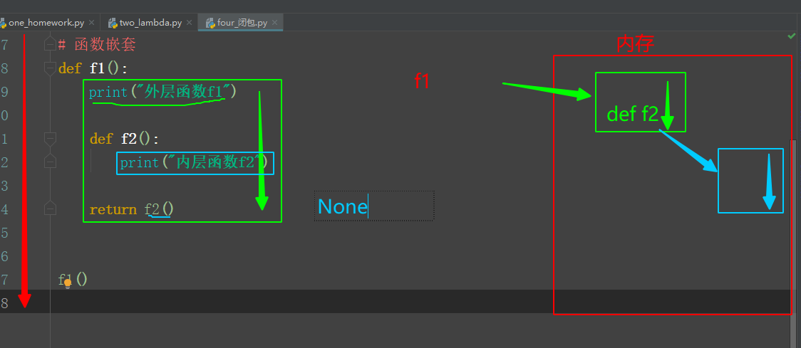
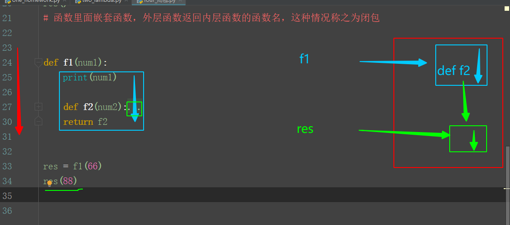
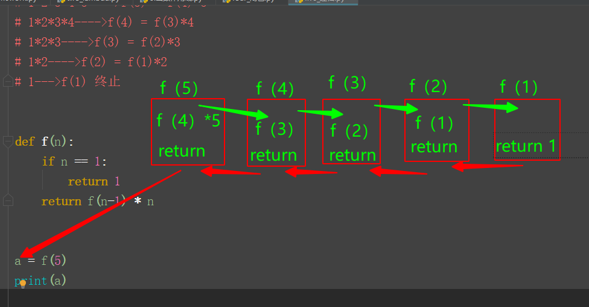

#### 08-函数作用域

##### 0.函数基础复习

```
1.函数定义：函数头、函数接口、函数体、函数返回值
2.函数调用：函数名（）
3.函数参数：形参，必须参数，默认参数，动态参数（*args，**kwargs）；实参，位置参数，关键字参数
```

#####  1.匿名函数

```
f = lambda 变量名：返回值
f()
```

##### 2.函数作用域

```
1.函数内部定义的变量是局部变量，函数外无法调用--局部作用域
2.函数外定义的变量是全局变量
```

```
# 总结：
"""
1.函数内部定义的为局部变量，其作用域是局部作用域，函数外无法调用的
2.函数外定义的为全局变量，其作用域是全局作用域，如果在函数内想要进行修改，需要global
3.外层函数的变量，如果想要在内层函数进行修改，需要nonlocal
"""
```

##### 3.闭包

1. 函数嵌套流程图
2. 注意：函数名（）----》函数调用，不带括号，函数名可以看做是一个变量
3. 闭包的流程图
4. 

##### 4.递归函数

