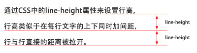
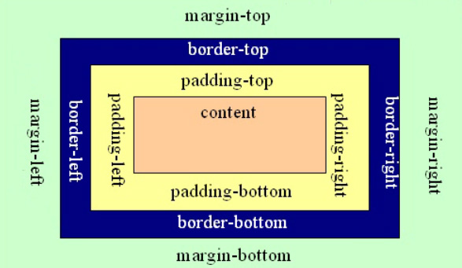
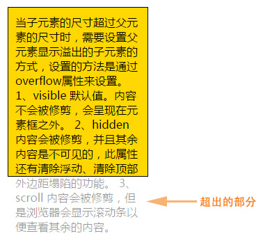
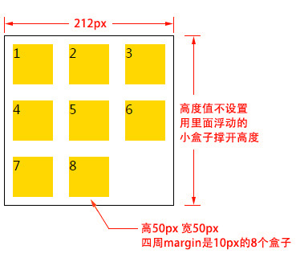

# CSS

为了让网页元素的样式更加丰富，也为了让网页的内容和样式能拆分开，CSS由此思想而诞生，CSS是 Cascading Style Sheets 的首字母缩写，意思是层叠样式表。有了CSS，html中大部分表现样式的标签就废弃不用了，html只负责文档的结构和内容，表现形式完全交给CSS，html文档变得更加简洁。

## 一、css基本语法及页面引用

### 1.1 css基本语法

css的定义方法是：

选择器 { 属性:值; 属性:值; 属性:值;}

选择器是将样式和页面元素关联起来的名称，属性是希望设置的样式属性每个属性有一个或多个值。代码示例：

```
/*
    css注释 ctrl+shift+"/"
*/


div{ 
    width:100px; 
    height:100px; 
    color:red 
}
```

### 1.2 css页面引入方法：

1、外联式：通过link标签，链接到外部样式表到页面中。

```
<link rel="stylesheet" type="text/css" href="css/main.css">
```

2、嵌入式：通过style标签，在网页上创建嵌入的样式表。

```
<style type="text/css">
    div{ width:100px; height:100px; color:red }
    ......
</style>
```

3、内联式：通过标签的style属性，在标签上直接写样式。

```
<div style="width:100px; height:100px; color:red ">......</div>
```

## 二、css文本设置

常用的应用文本的css样式：

-   color 设置文字的颜色，如： color:red;
-   font-size 设置文字的大小，如：font-size:12px;
-   font-family 设置文字的字体，如：font-family:'微软雅黑';
-   font-style 设置字体是否倾斜，如：font-style:'normal'; 设置不倾斜，font-style:'italic';设置文字倾斜
-   font-weight 设置文字是否加粗，如：font-weight:bold; 设置加粗 font-weight:normal 设置不加粗
-   line-height 设置文字的行高，设置行高相当于在每行文字的上下同时加间距， 如：line-height:24px; 

-   font 同时设置文字的几个属性，写的顺序有兼容问题，建议按照如下顺序写： font：是否加粗 字号/行高 字体；如： font:normal 12px/36px '微软雅黑';
-   text-decoration 设置文字的下划线，如：text-decoration:none; 将文字下划线去掉
-   text-indent 设置文字首行缩进，如：text-indent:24px; 设置文字首行缩进24px 
-   text-align 设置文字水平对齐方式，如text-align:center 设置文字水平居中

## 三、css颜色表示法

css颜色值主要有三种表示方法：

1、颜色名表示，比如：red 红色，gold 金色

2、rgb表示，比如：rgb(255,0,0)表示红色

3、16进制数值表示，比如：#ff0000 表示红色，这种可以简写成 #f00

## 四、css选择器

常用的选择器有如下几种：

### 4.1 标签选择器

标签选择器，此种选择器影响范围大，建议尽量应用在层级选择器中。
举例：

```
*{margin:0;padding:0}
div{color:red}   


<div>....</div>   <!-- 对应以上两条样式 -->
<div class="box">....</div>   <!-- 对应以上两条样式 -->
```

### 4.2 id选择器

通过id名来选择元素，元素的id名称不能重复，所以一个样式设置项只能对应于页面上一个元素，不能复用，id名一般给程序使用，所以不推荐使用id作为选择器。
举例：

```
#box{color:red} 

<div id="box">....</div>   <!-- 对应以上一条样式，其它元素不允许应用此样式 -->
```

### 4.3 类选择器

通过类名来选择元素，一个类可应用于多个元素，一个元素上也可以使用多个类，应用灵活，可复用，是css中应用最多的一种选择器。
举例：

```
.red{color:red}
.big{font-size:20px}
.mt10{margin-top:10px} 

<div class="red">....</div>
<h1 class="red big mt10">....</h1>
<p class="red mt10">....</p>
```

### 4.4 层级选择器

主要应用在选择父元素下的子元素，或者子元素下面的子元素，可与标签元素结合使用，减少命名，同时也可以通过层级，防止命名冲突。
举例：

```
.box span{color:red}
.box .red{color:pink}
.red{color:red}

<div class="box">
    <span>....</span>
    <a href="#" class="red">....</a>
</div>

<h3 class="red">....</h3>
```

### 4.5 组选择器

多个选择器，如果有同样的样式设置，可以使用组选择器。
举例：

```
.box1,.box2,.box3{width:100px;height:100px}
.box1{background:red}
.box2{background:pink}
.box2{background:gold}

<div class="box1">....</div>
<div class="box2">....</div>
<div class="box3">....</div>
```

### 4.6 伪类及伪元素选择器

常用的伪类选择器有hover，表示鼠标悬浮在元素上时的状态，伪元素选择器有before和after,它们可以通过样式在元素中插入内容。

```
.box1:hover{color:red}
.box2:before{content:'行首文字';}
.box3:after{content:'行尾文字';}


<div class="box1">....</div>
<div class="box2">....</div>
<div class="box3">....</div>
```

## 五、CSS盒子模型

**盒子模型解释**
元素在页面中显示成一个方块，类似一个盒子，CSS盒子模型就是使用现实中盒子来做比喻，帮助我们设置元素对应的样式。盒子模型示意图如下：



把元素叫做盒子，设置对应的样式分别为：盒子的宽度(width)、盒子的高度(height)、盒子的边框(border)、盒子内的内容和边框之间的间距(padding)、盒子与盒子之间的间距(margin)。

**设置宽高**

```
width:200px;  /* 设置盒子的宽度，此宽度是指盒子内容的宽度，不是盒子整体宽度(难点) */ 
height:200px; /* 设置盒子的高度，此高度是指盒子内容的高度，不是盒子整体高度(难点) */
```

**设置边框**
设置一边的边框，比如顶部边框，可以按如下设置：

```
border-top-color:red;    /* 设置顶部边框颜色为红色 */  
border-top-width:10px;   /* 设置顶部边框粗细为10px */   
border-top-style:solid;  /* 设置顶部边框的线性为实线，常用的有：solid(实线)  
  dashed(虚线)  dotted(点线); */
```

上面三句可以简写成一句：

```
border-top:10px solid red;
```

设置其它三个边的方法和上面一样，把上面的'top'换成'left'就是设置左边，换成'right'就是设置右边，换成'bottom'就是设置底边。

四个边如果设置一样，可以将四个边的设置合并成一句：

```
border:10px solid red;
```

**设置内间距padding**

设置盒子四边的内间距，可设置如下：

```
padding-top：20px;     /* 设置顶部内间距20px */ 
padding-left:30px;     /* 设置左边内间距30px */ 
padding-right:40px;    /* 设置右边内间距40px */ 
padding-bottom:50px;   /* 设置底部内间距50px */
```

上面的设置可以简写如下：

```
padding：20px 40px 50px 30px; /* 四个值按照顺时针方向，分别设置的是 上 右 下 左  
四个方向的内边距值。 */
```

padding后面还可以跟3个值，2个值和1个值，它们分别设置的项目如下：

```
padding：20px 40px 50px; /* 设置顶部内边距为20px，左右内边距为40px，底部内边距为50px */ 
padding：20px 40px; /* 设置上下内边距为20px，左右内边距为40px*/ 
padding：20px; /* 设置四边内边距为20px */
```

**设置外间距margin**

外边距的设置方法和padding的设置方法相同，将上面设置项中的'padding'换成'margin'就是外边距设置方法。

## 六、盒模型使用技巧及相关问题

**margin相关技巧**
1、设置元素水平居中： margin:x auto;
2、margin负值让元素位移及边框合并

**外边距合并**

外边距合并指的是，当两个垂直外边距相遇时，它们将形成一个外边距。合并后的外边距的高度等于两个发生合并的外边距的高度中的较大者。解决方法如下：

1、使用这种特性
2、设置一边的外边距，一般设置margin-top
3、将元素浮动或者定位

**margin-top 塌陷**

在两个盒子嵌套时候，内部的盒子设置的margin-top会加到外边的盒子上，导致内部的盒子margin-top设置失败，解决方法如下：

1、外部盒子设置一个边框
2、外部盒子设置 overflow:hidden
3、使用伪元素类：

```
.clearfix:before{
    content: '';
    display:table;
}
```

## 七、css元素溢出

当子元素的尺寸超过父元素的尺寸时，需要设置父元素显示溢出的子元素的方式，设置的方法是通过overflow属性来设置。

**overflow的设置项：**
1、visible 默认值。内容不会被修剪，会呈现在元素框之外。
2、hidden 内容会被修剪，并且其余内容是不可见的，此属性还有清除浮动、清除margin-top塌陷的功能。
3、scroll 内容会被修剪，但是浏览器会显示滚动条以便查看其余的内容。
4、auto 如果内容被修剪，则浏览器会显示滚动条以便查看其余的内容。
5、inherit 规定应该从父元素继承 overflow 属性的值。

元素溢出示例：



## 八、块元素、内联元素、内联块元素

元素就是标签，布局中常用的有三种标签，块元素、内联元素、内联块元素，了解这三种元素的特性，才能熟练的进行页面布局。

**块元素**
块元素，也可以称为行元素，布局中常用的标签如：div、p、ul、li、h1~h6、dl、dt、dd等等都是块元素，它在布局中的行为：

-   支持全部的样式
-   如果没有设置宽度，默认的宽度为父级宽度100%
-   盒子占据一行、即使设置了宽度

**内联元素**
内联元素，也可以称为行内元素，布局中常用的标签如：a、span、em、b、strong、i等等都是内联元素，它们在布局中的行为：

-   支持部分样式（不支持宽、高、margin上下、padding上下）
-   宽高由内容决定
-   盒子并在一行
-   代码换行，盒子之间会产生间距
-   子元素是内联元素，父元素可以用text-align属性设置子元素水平对齐方式

**解决内联元素间隙的方法**
1、去掉内联元素之间的换行
2、将内联元素的父级设置font-size为0，内联元素自身再设置font-size

**内联块元素**
内联块元素，也叫行内块元素，是新增的元素类型，现有元素没有归于此类别的，img和input元素的行为类似这种元素，但是也归类于内联元素，我们可以用display属性将块元素或者内联元素转化成这种元素。它们在布局中表现的行为：

-   支持全部样式
-   如果没有设置宽高，宽高由内容决定
-   盒子并在一行
-   代码换行，盒子会产生间距
-   子元素是内联块元素，父元素可以用text-align属性设置子元素水平对齐方式。

这三种元素，可以通过display属性来相互转化，不过实际开发中，块元素用得比较多，所以我们经常把内联元素转化为块元素，少量转化为内联块，而要使用内联元素时，直接使用内联元素，而不用块元素转化了。

**display属性**
display属性是用来设置元素的类型及隐藏的，常用的属性有：
1、none 元素隐藏且不占位置
2、block 元素以块元素显示
3、inline 元素以内联元素显示
4、inline-block 元素以内联块元素显示

## 九、浮动

**浮动特性**

1、浮动元素有左浮动(float:left)和右浮动(float:right)两种

2、浮动的元素会向左或向右浮动，碰到父元素边界、其他元素才停下来

3、相邻浮动的块元素可以并在一行，超出父级宽度就换行

4、浮动让行内元素或块元素自动转化为行内块元素(此时不会有行内块元素间隙问题)

5、浮动元素后面没有浮动的元素会占据浮动元素的位置，没有浮动的元素内的文字会避开浮动的元素，形成文字饶图的效果

6、父元素如果没有设置尺寸(一般是高度不设置)，父元素内整体浮动的元素无法撑开父元素，父元素需要清除浮动

7、浮动元素之间没有垂直margin的合并

**清除浮动**

-   父级上增加属性overflow：hidden

-   在最后一个子元素的后面加一个空的div，给它样式属性 clear:both（不推荐）

-   使用成熟的清浮动样式类，clearfix

    ```
    .clearfix:after,.clearfix:before{ content: "";display: table;}
    .clearfix:after{ clear:both;}
    .clearfix{zoom:1;}
    ```

    清除浮动的使用方法：

    ```
    .con2{... overflow:hidden}
    或者
    <div class="con2 clearfix">
    ```

**理解代码**
父级盒子不给高度，子集盒子浮动，父级盒子需要清除浮动


## 十、定位

**文档流**
文档流，是指盒子按照html标签编写的顺序依次从上到下，从左到右排列，块元素占一行，行内元素在一行之内从左到右排列，先写的先排列，后写的排在后面，每个盒子都占据自己的位置。

**关于定位**
我们可以使用css的position属性来设置元素的定位类型，postion的设置项如下：

-   relative 生成相对定位元素，元素所占据的文档流的位置保留，元素本身相对自身原位置进行偏移。
-   absolute 生成绝对定位元素，元素脱离文档流，不占据文档流的位置，可以理解为漂浮在文档流的上方，相对于上一个设置了定位的父级元素来进行定位，如果找不到，则相对于body元素进行定位。
-   fixed 生成固定定位元素，元素脱离文档流，不占据文档流的位置，可以理解为漂浮在文档流的上方，相对于浏览器窗口进行定位。
-   static 默认值，没有定位，元素出现在正常的文档流中，相当于取消定位属性或者不设置定位属性。
-   inherit 从父元素继承 position 属性的值。

**定位元素的偏移**
定位的元素还需要用left、right、top或者bottom来设置相对于参照元素的偏移值。

**定位元素层级**
定位元素是浮动的正常的文档流之上的，可以用z-index属性来设置元素的层级

伪代码如下:

```
.box01{
    ......
    position:absolute;  /* 设置了绝对定位 */
    left:200px;            /* 相对于参照元素左边向右偏移200px */
    top:100px;          /* 相对于参照元素顶部向下偏移100px */
    z-index:10          /* 将元素层级设置为10 */
}
```

**定位元素特性**
绝对定位和固定定位的块元素和行内元素会自动转化为行内块元素

## 十一、background属性

**属性解释**
background属性是css中应用比较多，且比较重要的一个属性，它是负责给盒子设置背景图片和背景颜色的，background是一个复合属性，它可以分解成如下几个设置项：

-   background-color 设置背景颜色
-   background-image 设置背景图片地址
-   background-repeat 设置背景图片如何重复平铺
-   background-position 设置背景图片的位置
-   background-attachment 设置背景图片是固定还是随着页面滚动条滚动

实际应用中，我们可以用background属性将上面所有的设置项放在一起，而且也建议这么做，这样做性能更高，而且兼容性更好，比如：“background: #00FF00 url(bgimage.gif) no-repeat left center fixed”，这里面的“#00ff00”是设置background-color；“url(bgimage.gif)”是设置background-image；“no-repeat”是设置background-repeat；“left center”是设置background-position；“fixed”是设置background-attachment，各个设置项用空格隔开，有的设置项不写也是可以的，它会使用默认值。

## 十二、常用css列表

-   color 设置文字的颜色，如： color:red;
-   font-size 设置文字的大小，如：font-size:12px;
-   font-family 设置文字的字体，如：font-family:'微软雅黑';
-   font-style 设置字体是否倾斜，如：font-style:'normal'; 设置不倾斜，font-style:'italic';设置文字倾斜
-   font-weight 设置文字是否加粗，如：font-weight:bold; 设置加粗 font-weight:normal 设置不加粗
-   line-height 设置文字的行高，设置行高相当于在每行文字的上下同时加间距， 如：line-height:24px;
-   font 同时设置文字的几个属性，写的顺序有兼容问题，建议按照如下顺序写： font：是否加粗 字号/行高 字体；如： font:normal 12px/36px '微软雅黑';
-   text-decoration 设置文字的下划线，如：text-decoration:none; 将文字下划线去掉
-   text-indent 设置文字首行缩进，如：text-indent:24px; 设置文字首行缩进24px
-   text-align 设置文字水平对齐方式，如text-align:center 设置文字水平居中
-   text-overflow 设置一行文字宽度超过容器宽度时的显示方式，如：text-overflow:clip 将多出的文字裁剪掉 text-overflow:ellipsis 将多出的文字显示成省略号
-   white-space 一般用来设置文本不换行，如：white-space:nowrap 设置文本不换行 一般与text-overflow和overflow属性配合使用来让一行文字超出宽度时显示省略号
-   list-style 一般用来设置去掉ul或者ol列表中的小圆点或数字 如：list-style:none
-   width 设置盒子内容的宽度，如： width：100px;
-   height 设置盒子内容的高度，如： height：100px;

-   border-top 设置盒子顶部边框的三个属性 如：border-top:5px solid red;设置盒子顶部边框为3像素宽的红色的实线

-   border-left 设置盒子左边边框的三个属性 如：border-left:3px dotted red;设置盒子左边边框为3像素宽的红色的点线

-   border-right 设置盒子右边边框的三个属性 如：border-right:2px dashed red;设置盒子右边框为2像素宽的红色的虚线

-   border-bottom 设置盒子底部边框的三个属性 如：border-bottom:1px solid red;设置盒子底部边框为1像素宽的红色的实线

-   border 同时设置盒子的四个边框，如果四个边的样式统一就使用它 如：border:1px solid #000 设置盒子四个边都是1像素宽的黑色实线
-   padding 设置盒子四个边的内边距 如：padding:10px 20px 30px 40px 分别设置盒子上边(10px)、右边(20px)、下边(30px)、左边(40px)的内边距(顺时针)

-   margin 设置盒子四个边的外边距 如：margin:10px 20px 30px 40px 分别设置盒子上边(10px)、右边(20px)、下边(30px)、左边(40px)的外边距(顺时针)，详细设置说明

-   overflow 设置当子元素的尺寸超过父元素的尺寸时，盒子及子元素的显示方式 如：overflow:hidden 超出的子元素被裁切
-   display 设置盒子的显示类型及隐藏，如：display:block 将盒子设置为以块元素显示 display:none 将元素隐藏
-   float 设置元浮动 如：float:left 设置左浮动 float:right 设置右浮动
-   clear 在盒子两侧清除浮动 如：clear:both 在盒子两侧都不允许浮动
-   position 设置元素定位 如：position:relative 设置元素相对定位
-   background 设置元素的背景色和背景图片，如：background:url(bg.jpg) cyan;设置盒子的背景图片为bg.jpg，背景色为cyan
-   background-size 设置盒子背景图的尺寸，如：background-size:30px 40px;设置背景图的尺寸宽为30px，高为40px，这个属性不能合到background属性中

-   opacity 设置元素整体透明度，一般为了兼容需要加上filter属性设置 如：opacity:0.1;filter:alpha(opacity=10)
-   cursor 设置鼠标悬停在元素上时指针的形状 如：cursor:pointer 设置为手型
-   outline 设置文本输入框周围凸显的蓝色的线，一般是设为没有 如：outline:none
-   border-radius 设置盒子的圆角 如：border-radius:10px 设置盒子的四个角为10px半径的圆角
-   box-shadow 设置盒子的阴影，如：box-shadow:10px 10px 5px 2px pink;设置盒子有粉色的阴影
-   transition 设置盒子的过渡动画，如：transition:all 1s ease;设置元素过渡动画为1秒完成，所有变动的属性都做动画
-   animation 设置盒子的关键帧动画
-   transform 设置盒子的位移、旋转、缩放、斜切等变形，如：transform:rotate(45deg);设置盒子旋转45度

-   box-sizing 设置盒子的尺寸计算方式，如：box-sizing:border-box 将盒子的尺寸计算方法设置为按边框计算，此时width和height的值就是盒子的实际尺寸

-   border-collapse 设置表格边框是否合并，如：border-collapse:collapse，将表格边框合并，这样就可以制作1px边框的表格。