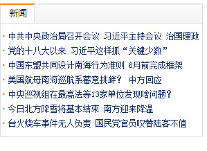

# HTML

## 一、html概述和基本结构

### 1.1 html概述

HTML是 HyperText Mark-up Language 的首字母简写，意思是超文本标记语言，超文本指的是超链接，标记指的是标签，是一种用来制作网页的语言，这种语言由一个个的标签组成，用这种语言制作的文件保存的是一个文本文件，文件的扩展名为html或者htm，一个html文件就是一个网页，html文件用编辑器打开显示的是文本，可以用文本的方式编辑它，如果用浏览器打开，浏览器会按照标签描述内容将文件渲染成网页，显示的网页可以从一个网页链接跳转到另外一个网页。

### 1.2 html基本结构

一个html的基本结构如下：

```
<!DOCTYPE html>
<html lang="en">
    <head>            
        <meta charset="UTF-8">
        <title>网页标题</title>
    </head>
    <body>
          网页显示内容
    </body>
</html>
```

第一行是文档声明，第二行“<html>”标签和最后一行“</html>”定义html文档的整体，“<html>”标签中的‘lang=“en”’定义网页的语言为英文，定义成中文是'lang="zh-CN"',不定义也没什么影响，它一般作为分析统计用。 “<head>”标签和“<body>”标签是它的第一层子元素，“<head>”标签里面负责对网页进行一些设置以及定义标题，设置包括定义网页的编码格式，外链css样式文件和javascript文件等，设置的内容不会显示在网页上，标题的内容会显示在标题栏，“<body>”内编写网页上显示的内容。

### 1.3 HTML文档类型

目前常用的两种文档类型是xhtml 1.0和html5

#### xhtml 1.0

xhtml 1.0 是html5之前的一个常用的版本，目前许多网站仍然使用此版本。
此版本文档用sublime text创建方法： html:xt + tab
文档示例：

```
<!DOCTYPE html PUBLIC "-//W3C//DTD XHTML 1.0 Transitional//EN" "http://www.w3.org/TR/xhtml1/DTD/xhtml1-transitional.dtd">
<html xmlns="http://www.w3.org/1999/xhtml" xml:lang="en">
<head>
    <meta http-equiv="Content-Type" content="text/html;charset=UTF-8">
    <title> xhtml 1.0 文档类型 </title>
</head>
<body>

</body>
</html>
```

#### html5

pc端可以使用xhtml 1.0，也可以使用html5，html5是向下兼容的
此版本文档用sublime text创建方法： html:5 + tab 或者 ! + tab
文档示例：

```
<!DOCTYPE html>
<html lang="en">
<head>
    <meta charset="UTF-8">
    <title> html5文档类型 </title>
</head>
<body>

</body>
</html>
```

### 1.4 两种文档的区别

1、文档声明和编码声明

2、html5新增了标签元素以及元素属性

### 1.5 html注释：

html文档代码中可以插入注释，注释是对代码的说明和解释，注释的内容不会显示在页面上，html代码中插入注释的方法是：

```
<!-- 这是一段注释  -->
```

## 二、html标题标签

通过 <h1>、<h2>、<h3>、<h4>、<h5>、<h6>,标签可以在网页上定义6种级别的标题。6种级别的标题表示文档的6级目录层级关系，比如说： <h1>用作主标题，其后是 <h2>，再其次是 <h3>，以此类推。搜索引擎会使用标题将网页的结构和内容编制索引，所以网页上使用标题是很重要的。

```
<h1>这是一级标题</h1>
<h2>这是二级标题</h2>
<h3>这是三级标题</h3>
```

## 三、html段落标签、换行标签与字符实体

### 3.1 html段落标签

<p>标签定义一个文本段落，一个段落含有默认的上下间距，段落之间会用这种默认间距隔开，代码如下：

```
<!DOCTYPE html>
<html lang="en">
<head>
    <meta charset="UTF-8">
    <title>段落</title>
</head>
<body>
    <p>HTML是 HyperText Mark-up Language 的首字母简写，意思是超文本标记语言，超
    文本指的是超链接，标记指的是标签，是一种用来制作网页的语言，这种语言由一个个的
    标签组成，用这种语言制作的文件保存的是一个文本文件，文件的扩展名为html或者htm。
    </p>

    <p>一个html文件就是一个网页，html文件用编辑器打开显示的是文本，可以用文本的方
    式编辑它，如果用浏览器打开，浏览器会按照标签描述内容将文件渲染成网页，显示的网
    页可以从一个网页链接跳转到另外一个网页。</p>
</body>
</html>
```

### 3.2 html换行标签

代码中成段的文字，直接在代码中回车换行，在渲染成网页时候不认这种换行，如果真想换行，可以在代码的段落中插入<br />来强制换行，代码如下：

```
<p>
一个html文件就是一个网页，html文件用编辑器打开显示的是文本，可以用<br />
文本的方式编辑它，如果用浏览器打开，浏览器会按照标签描述内容将文件<br />
渲染成网页，显示的网页可以从一个网页链接跳转到另外一个网页。
</p>
```

### 3.3 html字符实体

代码中成段的文字，如果文字间想空多个空格，在代码中空多个空格，在渲染成网页时只会显示一个空格，如果想显示多个空格，可以使用空格的字符实体,代码如下：

```
<!--  在段落前想缩进两个文字的空格，使用空格的字符实体：&nbsp;   -->
<p>
&nbsp;&nbsp;一个html文件就是一个网页，html文件用编辑器打开显示的是文本，可以用<br />
文本的方式编辑它，如果用浏览器打开，浏览器会按照标签描述内容将文件<br />
渲染成网页，显示的网页可以从一个网页链接跳转到另外一个网页。</p>
```

在网页上显示 “<” 和 “>” 会误认为是标签，想在网页上显示“<”和“>”可以使用它们的字符实体，比如：

```
<!-- “<” 和 “>” 的字符实体为 &lt; 和 &gt;  -->
<p>
    3 &lt; 5 <br>
    10 &gt; 5
</p>
```

## 四、html块标签、含样式的标签

### 4.1 html块标签

1、<div> 标签 块元素，表示一块内容，没有具体的语义。
2、<span> 标签 行内元素，表示一行中的一小段内容，没有具体的语义。

### 4.2 含样式和语义的标签

1、<em> 标签 行内元素，表示语气中的强调词
2、<i> 标签 行内元素，表示专业词汇
3、<b> 标签 行内元素，表示文档中的关键字或者产品名
4、<strong> 标签 行内元素，表示非常重要的内容

### 4.3 语义化的标签

语义化的标签，就是在布局的时候多使用有语义的标签，搜索引擎在爬网的时候能认识这些标签，理解文档的结构，方便网站的收录。比如：h1标签是表示标题，p标签是表示段落，ul、li标签是表示列表，a标签表示链接，dl、dt、dd表示定义列表等，语义化的标签不多。

## 五、html图像标签、绝对路径和相对路径

### 5.1 html图像标签

标签可以在网页上插入一张图片，它是独立使用的标签，它的常用属性有：

-   src属性 定义图片的引用地址
-   alt属性 定义图片加载失败时显示的文字，搜索引擎会使用这个文字收录图片、盲人读屏软件会读取这个文字让盲人识别图片，所以此属性非常重要。

```

```

### 5.2 绝对路径和相对路径

像网页上插入图片这种外部文件，需要定义文件的引用地址，引用外部文件还包括引用外部样式表，javascript等等，引用地址分为绝对地址和相对地址。

-   绝对地址：相对于磁盘的位置去定位文件的地址
-   相对地址：相对于引用文件本身去定位被引用的文件地址

绝对地址在整体文件迁移时会因为磁盘和顶层目录的改变而找不到文件，相对路径就没有这个问题。相对路径的定义技巧：

-   “ ./ ” 表示当前文件所在目录下，比如：“./pic.jpg” 表示当前目录下的pic.jpg的图片，这个使用时可以省略。
-   “ ../ ” 表示当前文件所在目录下的上一级目录，比如：“../images/pic.jpg” 表示当前目录下的上一级目录下的images文件夹中的pic.jpg的图片。

## 六、html链接标签

<a>标签可以在网页上定义一个链接地址，它的常用属性有：

-   href属性 定义跳转的地址
-   title属性 定义鼠标悬停时弹出的提示文字框
-   target属性 定义链接窗口打开的位置
    -   target="_self" 缺省值，新页面替换原来的页面，在原来位置打开
    -   target="_blank" 新页面会在新开的一个浏览器窗口打开

## 七、html列表

### 7.1 有序列表

在网页上定义一个有编号的内容列表可以用<ol>、<li>配合使用来实现，代码如下：

```
<ol>
    <li>列表文字一</li>
    <li>列表文字二</li>
    <li>列表文字三</li>
</ol>
```

在网页上生成的列表，每条项目上会按1、2、3编号，有序列表在实际开发中较少使用。

### 7.2 无序列表

在网页上定义一个无编号的内容列表可以用<ul>、<li>配合使用来实现，代码如下：

```
<ul>
    <li><a href="#">新闻标题一</a></li>
    <li><a href="#">新闻标题二</a></li>
    <li><a href="#">新闻标题三</a></li>
</ul>
```

在网页上生成的列表，每条项目上会有一个小图标，这个小图标在不同浏览器上显示效果不同，所以一般会用样式去掉默认的小图标，如果需要图标，可以用样式自定义图标，从而达到在不同浏览器上显示的效果相同,实际开发中一般用这种列表。

实际应用实例：


### 7.3 定义列表

定义列表通常用于术语的定义。<dl>标签表示列表的整体。<dt>标签定义术语的题目。<dd>标签是术语的解释。一个<dl>中可以有多个题目和解释，代码如下：

```
<h3>前端三大块</h3>
<dl>
    <dt>html</dt>
    <dd>负责页面的结构</dd>

    <dt>css</dt>
    <dd>负责页面的表现</dd>

    <dt>javascript</dt>
    <dd>负责页面的行为</dd>

</dl>
```

## 八、html表单

表单用于搜集不同类型的用户输入，表单由不同类型的标签组成，相关标签及属性用法如下：

1、<form>标签 定义整体的表单区域

-   action属性 定义表单数据提交地址
-   method属性 定义表单提交的方式，一般有“get”方式和“post”方式

2、<label>标签 为表单元素定义文字标注

3、<input>标签 定义通用的表单元素

-   type属性
    -   type="text" 定义单行文本输入框
    -   type="password" 定义密码输入框
    -   type="radio" 定义单选框
    -   type="checkbox" 定义复选框
    -   type="file" 定义上传文件
    -   type="submit" 定义提交按钮
    -   type="reset" 定义重置按钮
    -   type="button" 定义一个普通按钮
    -   type="image" 定义图片作为提交按钮，用src属性定义图片地址
    -   type="hidden" 定义一个隐藏的表单域，用来存储值
-   value属性 定义表单元素的值
-   name属性 定义表单元素的名称，此名称是提交数据时的键名

4、<textarea>标签 定义多行文本输入框

5、<select>标签 定义下拉表单元素

6、<option>标签 与<select>标签配合，定义下拉表单元素中的选项

**注册表单实例：**

```
<form action="http://www..." method="get">
<p>
<label>姓名：</label><input type="text" name="username" />
</p>
<p>
<label>密码：</label><input type="password" name="password" />
</p>
<p>
<label>性别：</label>
<input type="radio" name="gender" value="0" /> 男
<input type="radio" name="gender" value="1" /> 女
</p>
<p>
<label>爱好：</label>
<input type="checkbox" name="like" value="sing" /> 唱歌
<input type="checkbox" name="like" value="run" /> 跑步
<input type="checkbox" name="like" value="swiming" /> 游泳
</p>
<p>
<label>照片：</label>
<input type="file" name="person_pic">
</p>
<p>
<label>个人描述：</label>
<textarea name="about"></textarea>
</p>
<p>
<label>籍贯：</label>
<select name="site">
    <option value="0">北京</option>
    <option value="1">上海</option>
    <option value="2">广州</option>
    <option value="3">深圳</option>
</select>
</p>
<p>
<input type="submit" name="" value="提交">
<!-- input类型为submit定义提交按钮  
     还可以用图片控件代替submit按钮提交，一般会导致提交两次，不建议使用。如：
     <input type="image" src="xxx.gif">
-->
<input type="reset" name="" value="重置">
</p>
</form>
```

## 九、html表格

1、<table>标签：声明一个表格，它的常用属性如下：

-   border属性 定义表格的边框，设置值是数值
-   cellpadding属性 定义单元格内容与边框的距离，设置值是数值
-   cellspacing属性 定义单元格与单元格之间的距离，设置值是数值
-   align属性 设置整体表格相对于浏览器窗口的水平对齐方式,设置值有：left | center | right

2、<tr>标签：定义表格中的一行

3、<td>和<th>标签：定义一行中的一个单元格，td代表普通单元格，th表示表头单元格，它们的常用属性如下：

-   align 设置单元格中内容的水平对齐方式,设置值有：left | center | right
-   valign 设置单元格中内容的垂直对齐方式 top | middle | bottom
-   colspan 设置单元格水平合并，设置值是数值
-   rowspan 设置单元格垂直合并，设置值是数值

## 十、页面布局概述

布局也可以叫做排版，它指的是把文字和图片等元素按照我们的意愿有机地排列在页面上，布局的方式分为两种：

1、table布局：通过table元素将页面空间划分成若干个单元格，将文字或图片等元素放入单元格中，隐藏表格的边框，从而实现布局。这种布局方式也叫传统布局，目前主要使用在EDM(广告邮件中的页面)中，主流的布局方式不用这种。

2、HTML+CSS布局(DIV+CSS)：主要通过CSS样式设置来布局文字或图片等元素，需要用到CSS盒子模型、盒子类型、CSS浮动、CSS定位、CSS背景图定位等知识来布局，它比传统布局要复杂，目前是主流的布局方式。

## 十一、table布局及实例

table来做整体页面的布局，布局的技巧归纳为如下几点：

1、按照设计图的尺寸设置表格的宽高以及单元格的宽高。

2、将表格border、cellpadding、cellspacing全部设置为0，表格的边框和间距就不占有页面空间，它只起到划分空间的作用。

3、针对局部复杂的布局，可以在单元格里面再嵌套表格，嵌套表格划分局部的空间。

4、单元格中的元素或者嵌套的表格用align和valign设置对齐方式

5、通过属性或者css样式设置单元格中元素的样式