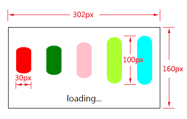

# HTML5与CSS

## 一、CSS权重

CSS权重指的是样式的优先级，有两条或多条样式作用于一个元素，权重高的那条样式对元素起作用,权重相同的，后写的样式会覆盖前面写的样式。

### 1.1 权重的等级

可以把样式的应用方式分为几个等级，按照等级来计算权重

1、!important，加在样式属性值后，权重值为 10000
2、内联样式，如：style=””，权重值为1000
3、ID选择器，如：#content，权重值为100
4、类，伪类和属性选择器，如： content、:hover 权重值为10
5、标签选择器和伪元素选择器，如：div、p、:before 权重值为1
6、通用选择器（*）、子选择器（>）、相邻选择器（+）、同胞选择器（~）、权重值为0

### 1.2 权重的计算实例

1、实例一：

```
<style type="text/css">
    div{
        color:red !important;
    }        
</style>
......
<div style="color:blue">这是一个div元素</div>
<!-- 
两条样式同时作用一个div，上面的样式权重值为10000+1，下面的行间样式的权重值为1000，
所以文字的最终颜色为red 
-->
```

2、实例二：

```
<style type="text/css">
    #content div.main_content h2{
        color:red;    
    }
    #content .main_content h2{
        color:blue;
    }
</style>
......
<div id="content">
    <div class="main_content">
        <h2>这是一个h2标题</h2>
    </div>
</div>
<!-- 
第一条样式的权重计算： 100+1+10+1，结果为112；
第二条样式的权重计算： 100+10+1，结果为111；
h2标题的最终颜色为red
-->
```

## 二、CSS3新增选择器

1、E:nth-child(n)：匹配元素类型为E且是父元素的第n个子元素

```
<style type="text/css">            
    .list div:nth-child(2){
        background-color:red;
    }
</style>
......
<div class="list">
    <h2>1</h2>
    <div>2</div>
    <div>3</div>
    <div>4</div>
    <div>5</div>
</div>

<!-- 第2个子元素div匹配 -->
```

2、E:first-child：匹配元素类型为E且是父元素的第一个子元素
3、E:last-child：匹配元素类型为E且是父元素的最后一个子元素
4、E > F E元素下面第一层子集
5、E ~ F E元素后面的兄弟元素
6、E + F 紧挨着的后面的兄弟元素

属性选择器：
1、E[attr] 含有attr属性的元素

```
<style type="text/css">
    div[data-attr='ok']{
        color:red;
    }
</style>
......
<div data-attr="ok">这是一个div元素</div>
```

2、E[attr='ok'] 含有attr属性的元素且它的值为“ok”
3、E[attr^='ok'] 含有attr属性的元素且它的值的开头含有“ok”
4、E[attr$='ok'] 含有attr属性的元素且它的值的结尾含有“ok”
5、E[attr*='ok'] 含有attr属性的元素且它的值中含有“ok”

## 三、CSS3圆角、rgba

### 3.1 CSS3圆角

设置某一个角的圆角，比如设置左上角的圆角：
border-top-left-radius:30px 60px;

同时分别设置四个角： border-radius:30px 60px 120px 150px;

设置四个圆角相同：
border-radius:50%;

### 3.2 rgba（新的颜色值表示法）

1、盒子透明度表示法：

```
    .box
    {
        opacity:0.1;
        /* 兼容IE */
        filter:alpha(opacity=10); 
    }
```

2、rgba(0,0,0,0.1) 前三个数值表示颜色，第四个数值表示颜色的透明度

## 四、CSS3 transition动画

1、transition-property 设置过渡的属性，比如：width height background-color
2、transition-duration 设置过渡的时间，比如：1s 500ms
3、transition-timing-function 设置过渡的运动方式，常用有 linear(匀速)|ease(缓冲运动)
4、transition-delay 设置动画的延迟
5、transition: property duration timing-function delay 同时设置四个属性

## 五、CSS3 transform变换

1、translate(x,y) 设置盒子位移
2、scale(x,y) 设置盒子缩放
3、rotate(deg) 设置盒子旋转
4、skew(x-angle,y-angle) 设置盒子斜切
5、perspective 设置透视距离
6、transform-style flat | preserve-3d 设置盒子是否按3d空间显示
7、translateX、translateY、translateZ 设置三维移动
8、rotateX、rotateY、rotateZ 设置三维旋转
9、scaleX、scaleY、scaleZ 设置三维缩放
10、tranform-origin 设置变形的中心点
11、backface-visibility 设置盒子背面是否可见

### 5.1 举例：（翻面效果）

```
<!DOCTYPE html>
<html lang="en">
<head>
    <meta charset="UTF-8">
    <title>翻面</title>
    <style type="text/css">
        .box{
            width:300px;
            height:272px;
            margin:50px auto 0;
            transform-style:preserve-3d;
            position:relative;            
        }
        .box .pic{
            width:300px;
            height:272px;
            position:absolute;
            background-color:cyan;
            left:0;
            top:0;
            transform:perspective(800px) rotateY(0deg);
            backface-visibility:hidden;
            transition:all 500ms ease;
        }
        .box .back_info{
            width:300px;
            height:272px;
            text-align:center;
            line-height:272px;
            background-color:gold;
            position:absolute;
            left:0;
            top:0;
            transform:rotateY(180deg);
            backface-visibility:hidden;
            transition:all 500ms ease;            
        }
        .box:hover .pic{
            transform:perspective(800px) rotateY(180deg);
        }
        .box:hover .back_info{
            transform:perspective(800px) rotateY(0deg);
        }
    </style>
</head>
<body>
    <div class="box">        
        <div class="pic"></div>
        <div class="back_info">背面文字说明</div>
    </div>
</body>
</html>
```

## 六、CSS3 animation动画

1、@keyframes 定义关键帧动画
2、animation-name 动画名称
3、animation-duration 动画时间
4、animation-timing-function 动画曲线 linear(匀速)|ease(缓冲)|steps(步数)
5、animation-delay 动画延迟
6、animation-iteration-count 动画播放次数 n|infinite
7、animation-direction 动画结束后是否反向还原 normal|alternate
8、animation-play-state 动画状态 paused(停止)|running(运动)
9、animation-fill-mode 动画前后的状态 none(缺省)|forwards(结束时停留在最后一帧)|backwards(开始时停留在定义的开始帧)|both(前后都应用)
10、animation:name duration timing-function delay iteration-count direction;同时设置多个属性

理解练习：
1、风车动画
2、loading动画


3、人物走路动画

```
<!DOCTYPE html>
<html lang="en">
<head>
    <meta charset="UTF-8">
    <title>走路动画</title>
    <style type="text/css">        
        .box{
            width:120px;
            height:180px;
            border:1px solid #ccc;            
            margin:50px auto 0;
            position:relative;
            overflow:hidden;            
        }

        .box img{
            display:block;
            width:960px;
            height:182px;
            position: absolute;
            left:0;
            top:0;
            animation:walking 1.0s steps(8) infinite;            
        }
        @keyframes walking{
            from{
                left:0px;
            }

            to{
                left:-960px;
            }
        }
    </style>
</head>
<body>
    <div class="box"></div>
</body>
</html>
```

动画中使用的图片如下：


## 七、CSS3 浏览器前缀

### 7.1 浏览器样式前缀

为了让CSS3样式兼容，需要将某些样式加上浏览器前缀：

-ms- 兼容IE浏览器
-moz- 兼容firefox
-o- 兼容opera
-webkit- 兼容chrome 和 safari

比如：

```
div
{    
    -ms-transform: rotate(30deg);        
    -webkit-transform: rotate(30deg);    
    -o-transform: rotate(30deg);        
    -moz-transform: rotate(30deg);    
    transform: rotate(30deg);
}
```

### 7.2 自动添加浏览器前缀

目前的状况是，有些CSS3属性需要加前缀，有些不需要加，有些只需要加一部分，这些加前缀的工作可以交给插件来完成，比如安装： autoprefixer

可以在Sublime text中通过package control 安装 autoprefixer

#### 1）Autoprefixer在Sublime text中的设置：

1、preferences/key Bindings-User

```
{ "keys": ["ctrl+alt+x"], "command": "autoprefixer" }
```

2、Preferences>package setting>AutoPrefixer>Setting-User

```
{
    "browsers": ["last 7 versions"],
    "cascade": true,
    "remove": true
}
```

last 7 versions：最新的浏览器的7个版本
cascade：缩进美化属性值
remove：是否去掉不必要的前缀

## 八、HTML5新增标签

**新增语义标签**

1、`<header> `页面头部、页眉
2、`<nav>` 页面导航
3、`<article>` 一篇文章
4、`<section>` 文章中的章节
5、`<aside> `侧边栏
6、`<footer> `页面底部、页脚

**音频视频**
1、`<audio>`
2、`<video>`

PC端兼容h5的新标签的方法，在页面中引入以下js文件:

```
<script type="text/javascript" src="//cdn.bootcss.com/html5shiv/r29/html5.js"></script>
```

## 九、HTML5 新增表单控件

新增类型：网址 邮箱 日期 时间 星期 数量 范围 电话 颜色 搜索

```
<label>网址:</label><input type="url" name="" required><br><br> 
<label>邮箱:</label><input type="email" name="" required><br><br> 
<label>日期:</label><input type="date" name=""><br><br> 
<label>时间:</label><input type="time" name=""><br><br> 
<label>星期:</label><input type="week" name=""><br><br> 
<label>数量:</label><input type="number" name=""> <br><br>
<label>范围:</label><input type="range" name=""><br><br> 
<label>电话:</label><input type="tel" name=""><br><br> 
<label>颜色:</label><input type="color" name=""><br><br> 
<label>搜索:</label><input type="search" name=""><br><br>
```

新增常用表单控件属性：
1、placeholder 设置文本框默认提示文字
2、autofocus 自动获得焦点
3、autocomplete 联想关键词