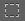

# PS

## 一、常用图片格式

图片是网页制作中很重要的素材，图片有不同的格式，每种格式都有自己的特性，了解这些特效，可以方便我们在制作网页时选取适合的图片格式，图片格式及特性如下：

**1、psd**
photoshop的专用格式。
优点：完整保存图像的信息，包括未压缩的图像数据、图层、透明等信息，方便图像的编辑。
缺点：应用范围窄，图片容量相对比较大。

**2、jpg**
网页制作及日常使用最普遍的图像格式。
优点：图像压缩效率高，图像容量相对最小。
缺点：有损压缩，图像会丢失数据而失真，不支持透明背景，不能制作成动画。

**3、gif**
制作网页小动画的常用图像格式。
优点：无损压缩，图像容量小、可以制作成动画、支持透明背景。
缺点：图像色彩范围最多只有256色，不能保存色彩丰富的图像，不支持半透明，透明图像边缘有锯齿。

**4、png**
网页制作及日常使用比较普遍的图像格式。
优点：无损压缩，图像容量小、支持透明背景和半透明色彩、透明图像的边缘光滑。
缺点：不能制作成动画

**5、webp**
将要取代jpg的图像格式。
优点：同jpg格式，容量相对比jpg还要小。
缺点：同jpg格式，目前不支持所有的浏览器。

**位图和矢量图**
位图也叫点阵图，是由一个个的方形的像素点排列在一起拼接而成的，位图在放大时，图像会失真。上面讲的5种图像都属于位图。
矢量图和位图组成图像的原理不同，它的图像轮廓是由函数曲线生成的，当放大图像时，实际的原理就是将曲线乘以一个倍数，图像可以轻易地放大，而且不会出现像素块，图像边缘也不会出现锯齿。

**svg**
目前首选的网页矢量图格式。
优点：图像容量小、图像放大不失真、支持透明背景和半透明色彩、图像边缘光滑。
缺点：色彩不够丰富。

**flash**
退出历史的重量级网页矢量图格式。
优点：图像容量小、图像放大不失真、支持透明背景和半透明色彩、图像边缘光滑、还可以制作动画、可编写交互。
缺点：不支持搜索引擎、运行慢、浏览器需要装插件才可支持。

**总结**
在网页制作中，如何选择合适的图片格式呢？
1、使用大幅面图片时，如果要使用不透明背景的图片，就使用jpg图片；如果要使用透明或者半透明背景的图片，就使用png图片；
2、使用小幅面图片或者图标图片时，如果图片含多种颜色，可以使用gif或png图片；如果图片是单色，而且要求有很好的显示效果，可以使用svg；如果是图片时动画的，可以使用gif。

## 二、photoshop常用图片处理技巧

photoshop是一款优秀的图像处理软件，作为前端开发工程师，掌握它的一些常用功能是必须的。photoshop的常用功能有：选择、裁剪图像、修图、取色、插入文字等等。除了这些常用功能，前端还需要掌握制作新图像、切图等技巧。本次讲解的photoshop版本为cs6。

**图片格式转换与压缩**
1、文件/存储为 选择图片类型以及压缩比；（不推荐）
2、文件/存储为web所用格式 选择图片类型以及压缩比 （推荐）；

**图像放缩，平移**
1、 放缩工具 图像放大缩小，在图像上点击放大，按住alt键点击缩小，快捷键Ctrl+“+”放大 Ctrl+“-”缩小，双击此工具可以让图像按照原始大小显示。

2、 平移工具 对图像进行移动，在使用其他工具时，按住空格键盘的空格键，可以切换到此工具，移动完后松开空格键回到原来的工具。双击此工具可以让图像放缩到显示区域完全显示。

**新建图像**
执行菜单命令 文件/新建 可以新建一张图片，设置大小，颜色模式选RGB，网页图片一般选择72像素/英寸，如果图像要打印，可设为300/英寸。背景按情况选透明或白色。

**移动选择与图层面板**
1、按住Ctrl，在图像上点击可以选中图层
2、选择此工具，勾选工具属性栏上的“自动选择图层”，可以在图像上点击选中图层
3、移动元素同时按住Alt键可复制一个图层
4、图层面板的操作，包括图层的显示隐藏、图层顺序、新建图层、图层删除

**针对图像中选中图层的操作**
1、移动
2、自由变换 执行菜单命令 编辑/自由变换
3、拖拽到另一张图像上完成图层拷贝

**历史记录面板**
记录20部操作，可以点击已经记录的操作步骤回到之前

**选择工具**
1、矩形选择工具
2、 椭圆选择工具 按住alt+shift键可以从中心拉出正圆
3、 任意套索工具 用手任意画出选区，不精确，不常用
4、 多边形套索 可以选择多边形物体，对于结构复杂的物体，可以点多个小段来选择。
5、 磁性套索 可以自动在物体边缘生成选择线，但是由于太自动了，所以不够精确，也不常用。
6、魔术棒选择工具 按照点击的点的颜色范围来选择，可以设置范围的容差，容差越大，选择区域越大，对于有单色背景的图像中的元素，可以用它点选背景，然后反选，从而选中元素。
7、 快速选择工具 直接在要选的元素上画，按照画的颜色范围进行选择。
8、对图层创建选区：按住Ctrl，用鼠标点击图层面板中图层的图标，在图层外框生成选区。

**选区的编辑技巧**
1、新选区模式下移动选区
2、选区的加、减、乘，工具属性栏上设置
3、调整边缘 工具属性栏或者执行菜单命令 选择/调整边缘
4、变换选区 执行菜单命令 选择/变换选区，可对选区进行缩放、移动等
5、反选 执行菜单命令 选择/反向
6、取消选择 执行菜单命令 选择/取消选择，快捷键ctrl+d

**选区特别注意**
选区（蚂蚁线）只对当前图层器起作用，选区操作失败一般是当前图层弄错了

**裁剪图像**
1、 裁切工具
2、对选区执行菜单命令 图像/裁剪
3、设置矩形框大小，创建固定宽高的矩形框，可进行固定尺寸裁剪

**针对确定选区的操作技巧**
1、复制 执行菜单命令 编辑/拷贝 快捷键ctrl+c
2、粘贴 执行菜单命令 编辑/粘贴 快捷键ctrl+v
3、填充 执行菜单命令 编辑/填充
4、描边 执行菜单命令 编辑/描边
5、删除 执行菜单命令 编辑/清除 快捷键 delete
6、自由变换 执行菜单命令 编辑/自由变换 快捷键 ctrl+t

**擦除与修复工具**
1、擦除工具
2、污点修复工具

**参考线技巧**
1、视图/标尺，显示标尺，在标尺上按住鼠标拖动可以拉出参考线
2、视图/对齐到/参考线 让参考线移动时自动对齐到选框或者图像的边缘
3、视图/新建参考线 可以精确创建参考线

**文本输入**
1、执行菜单命令 编辑/首选项/单位和标尺 设置文字的单位
2、文本输入
3、文本编辑 属性工具栏上点击文本编辑按钮

**取色**
1、取色工具，点击前景色按钮，弹出取色对话框，当前工具切换成取色工具。
2、点击前景色按钮，当前工具自动切换到取色工具

**图像大小与画布大小**
1、图像/图像大小 查看和设置图像的整体大小
2、图像/画布大小 查看和设置图像的画板大小

**尺寸测量**
1、切片工具 双击切片弹出切片对话框
2、切片选择工具
2、 矩形框工具，打开信息面板

## 三、photoshop批量切图技巧

切图，就是从效果图中把网页制作需要的小图片裁剪出来。

1、使用psd格式并且带有图层的图像切图

2、在图像上用切片工具切出需要的小图

3、双击切片，给切片命名

4、将需要制作透明背景图像的切片的背景隐藏

5、执行菜单命令 存储为web所用格式

6、点选切片，设置切片的图片格式

7、存储切片，选择“所有用户切片”，点存储(多个切片会自动存到所选文件夹中的images文件夹中)