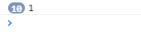

# Submit禁止提交的两种方式

这是一个很小的错误，但是花了5h去找错误，这里分享给大家。

首先，当我们想提交一个表单的时候，他默认的方式是将表单内所有的东西变成一个byte放在request的body里，给后端去使用，而当我们需要使用json数据的时候这个功能就有些鸡肋了，后端会一直报json的错误。此时我们就需要禁止submit的默认提交方式，让程序使用我们自己的函数去提交。默认的方法就是使用preventDefault。

**问题就出现在这里**：对谁去preventDefault。

先写一个简单的html

```html
<form action="" method="post" class="form-contain">
    <div class="form-item">
        <input type="tel" placeholder="请输入手机号" name="telephone" class="form-control" autocomplete="off">
    </div>
    <div class="form-item">
        <input type="password" placeholder="请输入密码" name="password" class="form-control">
    </div>
    <div class="form-login">
        <input type="submit" value="登录" class="login-btn">
    </div>
</form>
```

这里就涉及两个方法，来对submit进行处理。

### 第一种：form

如果我们使用form，那就可以先获取这个form，然后将这个from的submit属性禁止。

一下用jquery操作：

```javascript
$(function(){
    let $login = $(".form-contain"); // 通过class选择器，将form获取
    
    // 进行登录操作
     $login.submit(function (e) {
        // 阻止默认提交操作
        e.preventDefault();
         
        ...
    })
})
```

这里我们对form的submit进行阻止。我们再来看看第二种，然后进行一个对比：

### 第二种：按钮

如果我们是想直接从按钮入手，就需要获取这个按钮，然后再禁止属于他的这个操作。

```javascript
$(function(){
    let $login = $(".flogin-btn"); // 通过class选择器，获取登录按钮
    
    // 进行登录操作
     $login.click(function (e) {
        // 阻止默认提交操作
        e.preventDefault();
         
        ...
    })
})
```

这个时候就必须是使用click，如果你使用submit就会出现不管你里面写的是什么东西，程序都会跳过这个函数（我就是在这里卡了半天）

### 比较

我们就拿第二种按钮来对submit和click进行处理操作：

html还是上面的操作，我们来写两个函数：

```javascript
$(function(){
    let $login = $(".flogin-btn"); // 通过class选择器，获取登录按钮
    
    $login.submit(function(e){
        // 假的阻止
        e.preventDefault();
        
        console.log("2");
    })
    
    $login.click(function(e){
        // 真的阻止
        e.preventDefault();
        
        console.log("1");
    })
})
```

上面的函数，特意把submit放在上面，我们就看看concole是否会出现“2”



可以发现，不管我们按多少次按钮，都只会出现1，而这个2始终无法出现，就是因为对于这个submit来说，他只是一个input框，类型是submit。只是执行click，当click事件触发之后去调用form的submit，所以可以简单的说这个submit对于我们现在这个按钮来讲啥都不是。如果想使用submit就必须对form进行操作。

因此，如果你获取的是input框，那就得使用click。如果获取的是form那就得使用submit。