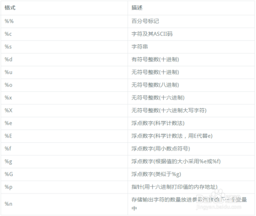

格式化输出分为两种，一种为format，另一种是%

### 一、format

**1.单个**

```
print('{}'.format(n))
```

**2.多个**

```
print('{},{},{}'.format(a,b,c))
```

**3.改变顺序**

```
print('{1},egg,{0}'.format('span','SPAN'))
```

只需要在相应的花括号内加入format内对应的下标就好

**4.指定占位符宽度**

：m.n

m:为整数的个数，如果m小于给定的大小则输出原始值

n:为小数的个数，如果给定值的小数大于n，则进行四舍五入保留n位小数

```
print('{:20}'.format(12412512616))
>>>         12412512616
```

```
print('{:20.6f}'.format(12412512616))
>>>  12412512616.000000
```

```
print('{:5.6f}'.format(12412512616))
>>>12412512616.000000
```

```
print('{:5.6f}'.format(12412512616.1523647282894))
>>>12412512616.152365
```

**5.带千分位符**

```
print("{:20,}".format(1521617.34734))
>>>     1,521,617.34734
```

**6.指定位占位符**

```
print("{:+20,}".format(1521617.34734))
>>>+++++1,521,617.34734
```

7.左中右对齐

```
# 中
print('{:=^20}'.format('python'))
=======python=======
# 左
print('{:=<20}'.format('python'))
python==============
# 右
print('{:=>20}'.format('python'))
==============python
```


### 二、%

**1.打印字符串**

```
print('%s'%('summer'))
>>>summer
```

**2.打印整数**

```
print('%d'%(53261261))
>>>53261261
```

**3.打印浮点数**

```
print('%f'%(5.835853))
>>>5.835853
```

**4.指定占位符宽度**

```
print ("Name:%10s Age:%8d Height:%8.2f"%("Alfred",34742,2626.125))
>>>Name:    Alfred Age:   34742 Height: 2626.12
```

**5.指定占位符宽度（左对齐）**

```
print ("Name:%-10s Age:%-8d Height:%-8.2f"%("Alfred",34742,2626.125))
>>>Name:Alfred     Age:34742    Height:2626.12 
```

**6.指定占位符**

```
print ("Name:%-10s Age:%08d Height:%08.2f"%("Alfred",34742,2626.125))
>>>Name:Alfred     Age:00034742 Height:02626.12
```

**7.科学技术法**

```
format(0.00520,'.2e')
>>>'5.20e-03'
```

字符串格式化代码

