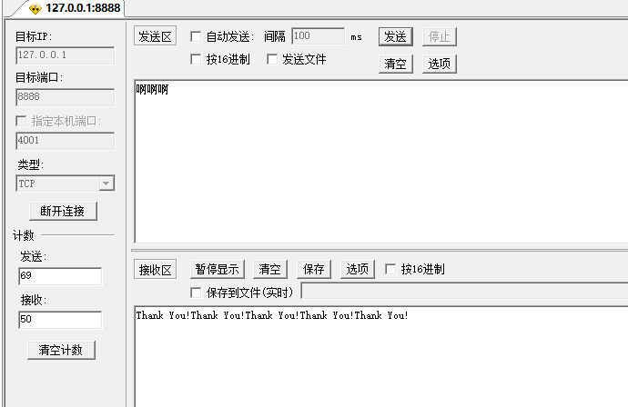
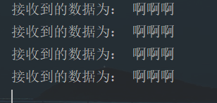

# Python写王者荣耀小游戏

[TOC]

王者荣耀已经成为广大年轻群体的喜好，接下来我们用python来写一个简单的王者荣耀小游戏。

### 说明：

该小游戏，使用tcp服务进行网路通信，包含简单的用户匹配、英雄对抗和战绩显示等功能。该程序比较小，如果某些代码可以优化的，也可以在评论打出来。

## 一、socket创建

工欲善其事，必先利其器。我们要使得整个项目完成，就必须将基地打好，先来回顾一下socket创建TCP的流程：

1.  创建套接字
2.  绑定端口
3.  如果是服务器则主动该被动和等待客户端连接
4.  进行收发数据
5.  关闭套接字

那么，我们先来完成王者小游戏服务器的搭建：

```python
# Server.py
# -*- coding: utf-8 -*-
# @Auther:Summer
import socket


def main():
    # 创建套接字
    WangZhe_Server = socket.socket(socket.AF_INET, socket.SOCK_STREAM)
    # 设置当服务器先close 即服务器端4次挥手之后资源能够立即释放，这样就保证了，下次运行程序时 可以立即绑定相关端口
    WangZhe_Server.setsockopt(socket.SOL_SOCKET, socket.SO_REUSEADDR, 1)

    # 绑定端口
    WangZhe_Server.bind(("", 8888))

    # 该主动为被动
    WangZhe_Server.listen(128)

    # 等待客户端连接accept
    while True:
        recv_data = client_socket.recv(1024)  # 接收24个字节
        if recv_data:
            print("接收的数据为：", recv_data.decode("gbk"))
            client_socket.send("Thank You!".encode("gbk"))
        else:
            break
    client_socket.close()
    WangZhe_Server.close()


if __name__ == '__main__':
    main()

```

测试可以下载一个TCP测试工具，用来查看Server是否可靠。





同样的，你也可以自己写一个客户端来验证：

```python
# Client.py
# -*- coding: utf-8 -*-
# @Auther:Summer
import socket


def main():
    # 1.创建套接字
    WangZhe_Client = socket.socket(socket.AF_INET, socket.SOCK_STREAM)

    # 2.绑定服务器
    WangZhe_Client.connect(("127.0.0.1", 8888))

    # 3.发送数据
    while True:
        send_data = input("请输入要发送的数据：")
        if send_data:
            WangZhe_Client.send(send_data.encode("gbk"))
            print(WangZhe_Client.recv(1024).decode('gbk'))  # 打印返回的信息，这个必须写，不然会在server中出现报错信息
        else:
            break
    # 4.关闭套接字
    WangZhe_Client.close()


if __name__ == '__main__':
    main()

```

当TCP的最基础完成之后，我们就需要将该代码进行升级一下。我们的代码如果按照现在这样，每次就只能给一个客户端服务，只有当一个客户端断开之后，才能进行第二个，因此，我们想要为多个客户端服务，那就必须使用多进程。

## 二、实现多进程

多进程使用`multiprocessing`库，在target放入对应的函数名称，tags放入想要的client即可。对于进程间的通信使用的是自己的队列，后面再进行赘述，这里就先展示最简单的一个多进程版本：

```python
# -*- coding: utf-8 -*-
# @Auther:Summer
import socket
import multiprocessing


# 收发信息
def recv(client_socket):
    while True:
        recv_data = client_socket.recv(1024)  # 接收24个字节
        if recv_data:
            print("接收的数据为：", recv_data.decode("gbk"))
            client_socket.send("Thank You!".encode("gbk"))
        else:
            break
    client_socket.close()


def main():
    # 创建套接字
    WangZhe_Server = socket.socket(socket.AF_INET, socket.SOCK_STREAM)
    # 设置当服务器先close 即服务器端4次挥手之后资源能够立即释放，这样就保证了，下次运行程序时 可以立即绑定相关端口
    WangZhe_Server.setsockopt(socket.SOL_SOCKET, socket.SO_REUSEADDR, 1)

    # 绑定端口
    WangZhe_Server.bind(("", 8888))

    # 该主动为被动
    WangZhe_Server.listen(128)

    try:
        # 等待客户端连接accept
        while True:
            # 接受相应
            wz_client, clint_addr = WangZhe_Server.accept()
            # 注册多进程，
            p = multiprocessing.Process(target=recv, args=(wz_client,))
            p.start()
            wz_client.close()
    except:
        # 关闭套接字
        WangZhe_Server.close()


if __name__ == '__main__':
    main()

```

以上就是最基础的一个socket的版本，为了适应后期的代码版本，我们把这个变成面向对象版本。

## 三、面向对象版本

面向对象还比较简单，首先是init的时候先设置最基础的socket配置，然后设置一个函数用来进行数据的收发：

```python
# Server.py
# -*- coding: utf-8 -*-
# @Auther:Summer
import socket
import multiprocessing


class WangZheServer:
    def __init__(self):
        # 创建套接字
        self.WangZhe_Server = socket.socket(socket.AF_INET, socket.SOCK_STREAM)
        # 设置当服务器先close 即服务器端4次挥手之后资源能够立即释放，这样就保证了，下次运行程序时 可以立即绑定相关端口
        self.WangZhe_Server.setsockopt(socket.SOL_SOCKET, socket.SO_REUSEADDR, 1)

        # 绑定端口
        self.WangZhe_Server.bind(("", 8888))

        # 该主动为被动
        self.WangZhe_Server.listen(128)

    def runferver(self):
        try:
            # 等待客户端连接accept
            while True:
                # 接受相应
                wz_client, clint_addr = self.WangZhe_Server.accept()
                # 注册多进程，
                p = multiprocessing.Process(target=self.recv, args=(wz_client,))
                p.start()
                wz_client.close()
        except:
            # 关闭套接字
            self.WangZhe_Server.close()

    # 收发信息
    def recv(self, client_socket):
        while True:
            recv_data = client_socket.recv(1024)  # 接收24个字节
            if recv_data:
                print("接收的数据为：", recv_data.decode("gbk"))
                client_socket.send("Thank You!".encode("gbk"))
            else:
                break
        client_socket.close()


def main():
    wangzhe = WangZheServer()
    wangzhe.runferver()


if __name__ == '__main__':
    main()
```

```python
# Client.py
# -*- coding: utf-8 -*-
# @Auther:Summer
import socket


class WangZheClient:
    def __init__(self):
        # 1.创建套接字
        self.WangZhe_Client = socket.socket(socket.AF_INET, socket.SOCK_STREAM)

        # 2.绑定服务器
        self.WangZhe_Client.connect(("127.0.0.1", 8888))

    def runforver(self):
        # 3.发送数据
        while True:
            send_data = input("请输入要发送的数据：")
            if send_data:
                self.WangZhe_Client.send(send_data.encode("gbk"))
                print(self.WangZhe_Client.recv(1024).decode('gbk'))  # 打印返回的信息，这个必须写，不然会在server中出现报错信息
            else:
                break
        # 4.关闭套接字
        self.WangZhe_Client.close()


def main():
    wangzheClient = WangZheClient()
    wangzheClient.runforver()


if __name__ == '__main__':
    main()

```

## 四、主体部分搭建

### 1. 服务器主要步骤的实现

我们的主体部分就是要实现登录、选择模式、人员匹配、对战模式和最后的对战信息展示

由于socket无法传送字典和元组，因此我们就需要规定一下信息的传输格式：`收发数据模式step:data`

-   step表示现在是第几步
-   data表示传送的信息

然后来规定一下每一步都需要进行什么操作：

```python
1. 登录 step == 0
2. 模式选择 step == 1
3. 人员匹配（管道） step == 2
4. 英雄选择 step == 3
5. 开始对战 step == 4
6. 展示结果 step == 5 -> step == 0
7. 服务器内部错误 step == 500
8. 客户端主动退出 step == 1000
```

```python
#  Server.py
# -*- coding: utf-8 -*-
# @Auther:Summer
import socket
import multiprocessing


class WangZheServer:
    step = 0
    data = ""

    def __init__(self):
        # 创建套接字
        self.WangZhe_Server = socket.socket(socket.AF_INET, socket.SOCK_STREAM)
        # 设置当服务器先close 即服务器端4次挥手之后资源能够立即释放，这样就保证了，下次运行程序时 可以立即绑定相关端口
        self.WangZhe_Server.setsockopt(socket.SOL_SOCKET, socket.SO_REUSEADDR, 1)

        # 绑定端口
        self.WangZhe_Server.bind(("", 8888))

        # 该主动为被动
        self.WangZhe_Server.listen(128)

    def runferver(self):
        try:
            # 等待客户端连接accept
            while True:
                # 接受相应
                wz_client, clint_addr = self.WangZhe_Server.accept()
                # clint_addr后期放入队列，进行人员匹配（ip,port）

                # 注册多进程，
                p = multiprocessing.Process(target=self.recv, args=(wz_client,))
                p.start()
                wz_client.close()
        except:
            # 关闭套接字
            self.WangZhe_Server.close()

    # 主体
    def recv(self, client_socket):
        """
        该部分为整个小游戏的核心部分，包含如下步骤
        1. 登录 step == 0
        2. 模式选择 step == 1
        3. 人员匹配（管道） step == 2
        4. 英雄选择 step == 3
        5. 开始对战 step == 3
        6. 展示结果 step == 4 -> step == 0

        收发数据模式step:data
        :param client_socket:
        :return:
        """

        while True:
            if self.step == 0:
                """登录操作"""
                self.login(client_socket)
            elif self.step == 1:
                """模式选择"""
                self.choosepattern()
            elif self.step == 2:
                """人员匹配"""
                self.checkplayer()
            elif self.step == 3:
                """英雄选择"""
                self.choosehero()
            elif self.step == 4:
                """对战模式"""
                self.fight()
            elif self.step == 5:
                """结果展示"""
                self.show()
                # 展示结束后，重新回到模式选择
            else:
                # 如果步骤不正确，说明前台传入的数值有误，就必须让用户重新登录
                client_socket.close()
                break

    def get_step_data(self, data, client_socket):
        try:
            self.step = int(data.split(":")[0])  # 获取step
            self.data = data.split(":")[1]
        except:
            self.step = 500
            # 如果前台输入的信息不正确，则返回step为500，表示服务器内部错误
            client_socket.send("{}:{}".format(self.step, self.data).encode("gbk"))

    def login(self, client_socket):
        print("开始进行登录模式")
        self.step += 1

    def choosepattern(self):
        print("开始进行模式选择")
        self.step += 1

    def checkplayer(self):
        print("开始进行人员匹配")
        self.step += 1

    def fight(self):
        print("开始进行对战模式")
        self.step += 1

    def show(self):
        print("结果展示")
        self.step = 1

def main():
    wangzhe = WangZheServer()
    wangzhe.runferver()


if __name__ == '__main__':
    main()
```

以上就是主体的server代码，我们简单的了解一下：

#### 1-1主体部分

```python
# 主体
def recv(self, client_socket):
    """
        该部分为整个小游戏的核心部分，包含如下步骤
        1. 登录 setp == 0
        2. 模式选择 setp == 1
        3. 人员匹配（管道） setp == 2
        4. 开始对战 setp == 3
        5. 展示结果 setp == 4 -> setp == 0

        收发数据模式step:data
        :param client_socket:
        :return:
        """

    while True:  # 循环操作，当用户完成一局之后不会立马结束，而是只有在用户确认退出之后才结束
        if self.step == 0:
            """登录操作"""
            self.login(client_socket)
        elif self.step == 1:
            """模式选择"""
            self.choosepattern()
        elif self.step == 2:
            """人员匹配"""
            self.checkplayer()
            elif self.step == 3:
            """对战模式"""
        	self.fight()
        elif self.step == 4:
            """结果展示"""
            self.show()
            # 展示结束后，重新回到模式选择
        else:
            # 如果步骤不正确，说明前台传入的数值有误，就必须让用户重新登录
            client_socket.close()
            break
```

#### 1-2 收发信息部分

```python
def get_step_data(self, data, client_socket):
    try:
        self.step = int(data.split(":")[0])  # 获取step
        self.data = data.split(":")[1]
    except:
        self.step = 500
        # 如果前台输入的信息不正确，则返回step为500，表示服务器内部错误
        client_socket.send("{}:{}".format(self.step, self.data).encode("gbk"))
```

因为下面的每个步骤都需要接收新消息，然后获取step和data，因此我们可以更加便捷的进行操作，如果数据出现错误，我们就需要让用户重新登陆

#### 1-3 具体的步骤实现函数

```python
def login(self, client_socket):
    print("开始进行登录模式")
    self.step += 1

def choosepattern(self):
    print("开始进行模式选择")
    self.step += 1

def checkplayer(self):
    print("开始进行人员匹配")
    self.step += 1

def fight(self):
    print("开始进行对战模式")
    self.step += 1

def show(self):
    print("结果展示")
    self.step = 1
```

### 2. 客户端主要步骤的实现

客户端的主体和服务器类似：

```python
# -*- coding: utf-8 -*-
# @Auther:Summer
import socket


class WangZheClient:
    step = 0
    data = ""
    def __init__(self):
        # 1.创建套接字
        self.WangZhe_Client = socket.socket(socket.AF_INET, socket.SOCK_STREAM)

        # 2.绑定服务器
        self.WangZhe_Client.connect(("127.0.0.1", 8888))

    def runforver(self):
        # 1. 从server获取现在的step和data
        self.get_step_data(self.WangZhe_Client.recv(1024).decode('gbk'))
        # 通过step来进行每一步的操作
        while True:
            if self.step == 0:  # 如果是step是0，则说明是登陆操作没有完成
                # 登陆功能
                self.login()
                while self.step != 1:
                    print("密码输入错误请重试")
                    self.login()
                else:
                    print("登录成功，请选择游戏模式")
            elif self.step == 1:
                # 模式选择功能
                self.choosepattern()
            elif self.step == 2:
                """人员匹配"""
                pass
            elif self.step == 3:
                """对战模式"""
                pass
            elif self.step == 4:
                "展示对战信息"
                pass
            else:
                print("服务器内部错误，请重新登陆")
                self.WangZhe_Client.close()
                break

    # 将服务器返回的数据进行整理
    def get_step_data(self, data):
        self.step = int(data.split(":")[0])  # 获取step
        self.data = data.split(":")[1]

    # 登录模块
    def login(self):
       	print("开始登录功能")

    # 模式选择功能
    def choosepattern(self):
        print("开始选择模式")

    def checkplayer(self):
        print("开始进行人员匹配")

    def fight(self):
        print("开始进行对战模式")

    def show(self):
        print("结果展示")


def main():
    wangzheClient = WangZheClient()
    wangzheClient.runforver()


if __name__ == '__main__':
    main()
```

### 3. 登陆部分实现

#### 3-1 服务器端

在客户端连接服务器之后，由服务器往客户端发送第一个step信息，接下来等待客户端接收用户输入的用户名和密码。由于这里没有涉及数据库，因此就只能使用死的用户名和密码进行校验。如果校验正确，则step自增1，发送对应的step发送给客户端。如果不正确，则服务器再次进入login函数进行判断。

```python
def login(self, client_socket):
    # 往客户端发送当前的step。客户端更具step进行相应的操作：
    client_socket.send("{}:{}".format(self.step, self.data).encode("gbk"))
    self.get_step_data(client_socket.recv(1024).decode('gbk'), client_socket)
    username = self.data.split("-")[1]
    password = self.data.split("-")[3]
    # print(username, password)
    # 更具数据库判断用户名和密码是否正确
    if username == "summer" and password == "summer":
        print("登陆成功")
        self.step += 1  # 进入下一步，模式选择
        client_socket.send("{}:{}".format(self.step, self.data).encode("gbk"))
```

#### 3-2 客户端

首先让用户输入用户名和密码，通过特定的格式往后台发送数据，完成之后等待接收后台传输的step信息

```python
# 登录模块
def login(self):
    username = input("请输入用户名：")
    password = input("请输入密码：")
    send_data = "username-{}-password-{}".format(username, password)
    self.WangZhe_Client.send("{}:{}".format(self.step, send_data).encode("gbk"))  # 把用户名和密码发送到服务器
    # 接收信息
    self.get_step_data(self.WangZhe_Client.recv(1024).decode('gbk'))
```

### 4. 模式选择部分

为了减少刚刚开始的代码量，我们就主要先开发真人对战的，但还是把人机对战的写上

#### 4-1 服务器端

首先，由服务器开始发送相关的模式选择，然后等待客户端响应数据，如果是1，则说明选择了真人对战，就进入下一个对战模式，如果不是，则根据前台返回的step进行相应操作

```python
def choosepattern(self, client_socket):
    # 模式选择模块
    self.data = "请选择模式：\n1：真人对战\n2：人机对战\n其他：退出"
    client_socket.send("{}:{}".format(self.step, self.data).encode("gbk"))
    # 获取前台发送的数据
    self.get_step_data(client_socket.recv(1024).decode('gbk'), client_socket)
    if self.data == "1":
        self.step += 1
        client_socket.send("{}:{}".format(self.step, self.data).encode("gbk"))
```

#### 4-2 客户端

首先，获取服务器给的data，然后打印出来，用户输入对应的号码，如果是1，则进入真人对战，如果是2，则跳转到1，如果是其他就设置step为1000表示退出。

```python
# 模式选择功能
def choosepattern(self):
    self.get_step_data(self.WangZhe_Client.recv(1024).decode('gbk'))
    choose = input(self.data)
    if choose == "1":
        # 真人对战
        print("准备开启真人对战")
        self.WangZhe_Client.send("{}:{}".format(self.step, choose).encode("gbk"))
        self.get_step_data(self.WangZhe_Client.recv(1024).decode('gbk'))
    elif choose == "2":
        # 人机对战
        print("人机对战暂未开启，已帮您选择真人对战")
        choose = "1"
        self.WangZhe_Client.send("{}:{}".format(self.step, choose).encode("gbk"))
        self.get_step_data(self.WangZhe_Client.recv(1024).decode('gbk'))
    else:
        # 关闭
        self.step = 1000
```

### 5. 人员匹配部分

在此模块之前需要注意一点，多进程之间的资源是不共享的，因此为了能让用户之间进行匹配，我们就现需要引入队列。当用户选择模式完成之后，我们就需要把这个人员的信息放入队列，当别的用户登录之后，他们就可以进行1对1的对战了。

下面是简单的步骤：我们分A和B

1.  首先A进入对手匹配模式，查看队列是否为空
    1.  如果是空，则将自己的socket信息和校验码放入队列，开始等待B的返回相应
2.  B进入对手匹配模式，因为队列不是空，循环判断当前队列中是否存在校验码为0的
    1.  如果有，则将获取该值，第一个为A的socket，此时通过格式化数据，将自己的ip和port**发送**给A，同时把自己的socket和校验码=1放入队列（B->A）,接下来就是等待B的客户端给自己发送step的信息即可
    2.  如果都是1，则重复A的步骤
3.  A的客户端**接收**B的服务端发送的值，然后将数据进行整合**发送**到A的服务端(A->A)
4.  此时回到1，因为A一直在等着B的回信，等到拿到B的ip和port之后，A再通过step+=1告诉A的客户端可以进入下一步。(A->A)
5.  此时，A通过刚刚获得的值循环遍历每一个client，如果是对的，就不需要step+=1,因为传入的step是A发来的，而A已经进入到下一步了。直接将数据发送给B即可（A->B）

这样整个下来，发现客户端A一共接收两次数据，发送一次数据已经完成，但是客户端B只有最后一次接收数据，我们只需要加一个step判断即可。同时，B在发送信息给A客户端之后就无法接收消息了，如果直接在break前加入step+=1会导致后面的接收信息出错，把原本英雄选择的内容和最后确认信息的内容进行混淆。

#### 5-1 服务器端：

```python
def checkplayer(self, client_socket, q):
    """getpeername()可以获取这个socket的远程ip和port"""
    # 第一版
    # 先查看队列是否为空，如果是就把自己的放入，等待别人发信息，如果不为空，则获取该值，把对应的放入dest
    # if q.empty():
    #     # A 缺点（B可以直接发送给A，而A却没有B的任何cli，所以需要进行加强）
    #     q.put(client_socket)
    #     # 等待客户端确认B的连接信息
    #     self.get_step_data(client_socket.recv(1024).decode('gbk'), client_socket)
    #     # 经过切割，将B的值放入dest
    #     self.data = self.data.split("-")
    #     self.dest = (self.data[1], self.data[3])
    #     client_socket.send("{}:{}".format(self.step, self.data).encode("gbk"))  # 同时通过套接字告诉前台可以进行英雄选择
    # else:
    #     # B B通过cli可以直接给A发信息
    #     cli = q.get()
    #     self.dest = cli.getpeername()  # 将远程的信息放入dest
    #     # 使用这个cli发送信息给这个客户端，将自己的ip和post给他
    #     data = "ip-{}-port-{}".format(self.host[0], self.host[1])
    #     self.data = data
    #     self.step += 1
    #     cli.send("{}:{}".format(self.step, self.data).encode("gbk"))  # 告诉a自己的ip和port同时通知他任务完成

    # 第二版
    # 如果q是空的，则直接将client和标识符一起放入，接下来就是等待B的连接信息
    if q.empty():
        # A
        q.put([client_socket, 0])  # 0表示可以拿去，而1表示已经有伙伴了，
        # 等待客户端确认B的连接信息
        self.get_step_data(client_socket.recv(1024).decode('gbk'), client_socket)
        # 经过切割，将B的值放入dest
        self.data = self.data.split("-")
        self.dest = (self.data[1], int(self.data[3]))
        # 将从后台获取的远程端口发送回后台，格式同上
        data = "ip-{}-port-{}".format(self.dest[0], self.dest[1])
        self.data = data
        selt.step += 1
        client_socket.send("{}:{}".format(self.step, self.data).encode("gbk"))
        # 循环判断队列中是否有匹配的cli和对应的标识符是否为1
        # while True:
        for _ in range(q.qsize()):
            cli_mid = q.get()
            if (cli_mid[0].getpeername() == self.dest) and (cli_mid[1] == 1):
                cli = cli_mid[0]
                cli.send("{}:{}".format(self.step, self.data).encode("gbk"))  # 接着只需要单纯的告诉前面进入下一步即可
                break
            else:
                q.put(cli_mid)
    else:
        # while True:
        for _ in range(q.qsize()):
            # B
            cli_mid = q.get()
            if cli_mid[1] == 0:
                # B B通过cli可以直接给A发信息
                cli = cli_mid[0]
                self.dest = cli.getpeername()  # 将远程的信息放入dest
                # 使用这个cli发送信息给这个客户端，将自己的ip和post给他
                data = "ip-{}-port-{}".format(self.host[0], self.host[1])
                self.data = data
                # 上述操作完成之后，将自己的client放入q，并且标识符为1，
                q.put([client_socket, 1])
                cli.send("{}:{}".format(self.step, self.data).encode("gbk"))  # 告诉a自己的ip和port同时通知他任务完成
                # 因此还是需要等待最后一次确认
                self.get_step_data(client_socket.recv(1024).decode('gbk'), client_socket)
                break
            else:
                q.put(cli_mid)
        else:
            # C
            q.put([client_socket, 0])  # 0表示可以拿去，而1表示已经有伙伴了，
            # 等待客户端确认B的连接信息
            self.get_step_data(client_socket.recv(1024).decode('gbk'), client_socket)
            # 经过切割，将B的值放入dest
            self.data = self.data.split("-")
            self.dest = (self.data[1], int(self.data[3]))
            # 将从后台获取的远程端口发送回后台，格式同上
            data = "ip-{}-port-{}".format(self.dest[0], self.dest[1])
            self.data = data
            selt.step += 1
            client_socket.send("{}:{}".format(self.step, self.data).encode("gbk"))
            # 循环判断队列中是否有匹配的cli和对应的标识符是否为1
            # while True:
            for _ in range(q.qsize()):
                cli_mid = q.get()
                if (cli_mid[0].getpeername() == self.dest) and (cli_mid[1] == 1):
                    cli = cli_mid[0]
                    cli.send("{}:{}".format(self.step, self.data).encode("gbk"))  # 接着只需要单纯的告诉前面进入下一步即可
                    break
            else:
                q.put(cli_mid)
   return cli
```

#### 5-2 客户端

```python
def checkplayer(self):
    # 从服务器获取对方的ip和port格式（step:ip-ip-port-port）
    self.get_step_data(self.WangZhe_Client.recv(1024).decode('gbk'))
    if self.step != 3:  # 这一部分是专门给A的，B并不需要
        self.data = self.data.split("-")
        self.dest = (self.data[1], self.data[3])
        # 将从后台获取的远程端口发送回后台，格式同上
        data = "ip-{}-port-{}".format(self.dest[0], self.dest[1])
        self.data = data
        self.WangZhe_Client.send("{}:{}".format(self.step, self.data).encode("gbk"))
        # 获取后台发送的最后一次数据
        self.get_step_data(self.WangZhe_Client.recv(1024).decode('gbk'))
    else:
        self.WangZhe_Client.send("{}:{}".format(self.step, self.data).encode("gbk"))
```

### 6. 英雄选择部分

英雄选择部分比较简单，首先就是由服务器发送可选的英雄给客户端，用户输入对应的英雄之后，传给后台，后台将自己客户端选择的英雄和血量发送给对方之后进入对战模式

#### 6-1 服务器端

```python
def choosehero(self, client_socket):
    self.data = "您可以选择英雄有：\n1：亚瑟\n2：安其拉\n"
    # 发送所有英雄给客户端
    client_socket.send("{}:{}".format(self.step, self.data).encode("gbk"))
    # 接收客户端的信息，并告诉对方自己选择的英雄和血量
    self.get_step_data(client_socket.recv(1024).decode('gbk'), client_socket)
    hero = int(self.data)-1  # 获取用户选择的英雄
    self.hero = [Hero.YaSe(), Hero.AnQiLa()][hero]
    data = "hero-{}-blod-{}".format(self.hero.name, self.hero.blod)
    self.dest_cli.send("{}:{}".format(self.step, data).encode("gbk"))
    # 接收客户端发送的英雄血量进入下一个阶段
    self.get_step_data(client_socket.recv(1024).decode('gbk'), client_socket)
    self.dest_hero_blod = int(self.data)
    self.step += 1
    client_socket.send("{}:{}".format(self.step, self.data).encode("gbk"))
```

#### 6-2 客户端

```python
def choosehero(self):
    self.get_step_data(self.WangZhe_Client.recv(1024).decode('gbk'))
    hero = input(self.data)  # 获取后台的英雄，然后让用户选择
    while (hero != "1") and (hero != "2"):
        hero = input("您输入的号码有误，请重新输入：\n{}".format(self.data))
        self.data = hero
        # 获取用户输入的英雄号码，然后传入后台，等待进入对战阶段
        self.WangZhe_Client.send("{}:{}".format(self.step, self.data).encode("gbk"))
        # 接收对方的英雄选择
        self.get_step_data(self.WangZhe_Client.recv(1024).decode('gbk'))
        hero = self.data.split("-")[1]
        self.data = self.data.split("-")[3]
        print("对方选择的英雄为：{},血量是{}".format(hero, self.data))
        # 将对方英雄的血量发送到后台，供服务器保存
        self.WangZhe_Client.send("{}:{}".format(self.step, self.data).encode("gbk"))
        # 接收自己服务器返回的step
        self.get_step_data(self.WangZhe_Client.recv(1024).decode('gbk'))
```

上面这样能够解决一个人选英雄慢的问题，只有较慢的一方确认之后，两个人才一起进入对战模式。

当然要选择英雄，我们首先就需要由英雄，我们可以创建一个Hero.py文件，往里面写入英雄类

```python
# -*- coding: utf-8 -*-
# @Auther:Summer
# 该类为英雄类，后期可以使用元类按照orm的方式调入数据库
# 对战模式首先就需要知道是谁先开始，为了方便程序，我们就让他们一起选择技能进行进攻，直到血量小于0游戏结束。


class Hero:
	"""
	Hero类包含：
		英雄名称
		英雄血量
		英雄技能（默认三个）+普通攻击
	"""
	protect = False
	move = True
	name = ""
	blod = 0

	def skill(self):
		name = "普通攻击"  # 技能名称
		harm = 200  # 技能伤害
		cool_time = 0  # 冷却时间（回合数）


class YaSe(Hero):
	"""
		英雄名称：亚瑟
		血量：2000
		技能一：skill_one(金身)
			功能：使对方英雄的任何攻击对自己无效
			冷却时间：2回合
			伤害：0

		技能二：skill_two(围绕攻击)
			功能： 使敌方英雄在接下来2回合各收到自身当前血量30%的攻击
			冷却时间：3回合
			伤害：

		技能三：skill_three(爆发冲击)
			功能： 给对方致命一击，如果敌方血量少于自己血量的40%，则敌方直接死亡
			冷却时间： 5回合
			伤害：99999999
	"""
	name = "亚瑟"
	blod = 2000

	def skill_one(self):
		self.protect = True
		harm = 0  # 技能伤害
		cool_time = 2  # 冷却时间

	def skill_two(self):
		harm = int(self.blod*0.3)
		cool_time = 3

	def skill_three(self, Hero):
		if self.blod * 0.4 > Hero.blod:
			harm = 99999999
		else:
			harm = 0
		cool_time = 5


class AnQiLa(Hero):
	"""
		英雄名称：安其拉
		血量：1200
		技能一：skill_one(小火球)
			功能：对敌方英雄造成300伤害
			冷却时间：2回合
			伤害：300

		技能二：skill_two(定身术)
			功能： 使敌方英雄下一回合无法发动任何攻击
			冷却时间：2回合
			伤害：200

		技能三：skill_three(大爆发)
			功能： 给敌方英雄造成700伤害，如果此时自己的血量小于300时，会额外造成500的伤害
			冷却时间： 3回合
			伤害：700+500
	"""
	name = "安其拉"
	blod = 1200

	def skill_one(self):
		harm = 300  # 技能伤害
		cool_time = 2  # 冷却时间

	def skill_two(self):
		harm = 200
		move = False
		cool_time = 3

	def skill_three(self):
		harm = 700
		if self.blod <= 300:
			harm += 500
		cool_time = 3
```

别看了，上面是理想状态，这里是现实：

```python
# -*- coding: utf-8 -*-
# @Auther:Summer
# 该类为英雄类，后期可以使用元类按照orm的方式调入数据库


class Hero:
	"""
	Hero类包含：
		英雄名称
		英雄血量
		英雄技能 + 普通攻击
	"""
	name = ""
	blod = 0
	harm = 200  # 技能伤害


class YaSe(Hero):
	"""
		英雄名称：亚瑟
		血量：2000
	"""
	name = "亚瑟"
	blod = 2000


class AnQiLa(Hero):
	"""
		英雄名称：安其拉
		血量：1200
	"""
	name = "安其拉"
	blod = 1200
	harm = 400
```

因此，上面当用户选择完英雄之后，就需要在自己的服务器上创建该英雄实例了。

### 7. 对战模式

对战模式首先就需要知道是谁先开始，为了方便程序，我们就让他们一起选择技能进行进攻，直到血量小于0游戏结束。

下面是一个对局的简单步骤：

1.  由服务器发送当前英雄可用的技能给客户端
2.  客户端接收之后把相应的技能返回给后台
3.  后台接收技能，将敌方血量减去自己的伤害值
4.  将自己的技能选择和敌方当前血量一起发送给对方客户端
5.  对方返回信息给自己的服务器，表示可以进入下一个流程

#### 7-1 服务器端

```python
def fight(self, client_socket):
    # 只要敌方英雄的血量大于0，就可以进行战斗
    while self.dest_hero_blod > 0:
        # 获取当前可用的技能，返回给客户端
        data = "您可选的技能：\n1：普通攻击（伤害{}）\n".format(self.hero.harm)
        client_socket.send("{}:{}".format(self.step, data).encode("gbk"))
        # 接收客户端使用的技能
        self.get_step_data(client_socket.recv(1024).decode('gbk'), client_socket)
        # 将该技能的伤害发送给对方客户端
        if self.data == "1":
            harm = self.hero.harm
        elif self.data == "gogogo":
            # 用于切断点击慢的一方的连接
            break
            # 将对方血量扣除当前的伤害
        self.dest_hero_blod -= harm
        # 将对方的血量和当前使用技能发送给对方客户端
        data = "对方使用了：{}技能，您当前血量为：{}\n".format("普通攻击", self.dest_hero_blod)
        self.dest_cli.send("{}:{}".format(self.step, data).encode("gbk"))
        self.get_step_data(client_socket.recv(1024).decode('gbk'), client_socket)
    else:
        self.step += 1
        data = "win"
        client_socket.send("{}:{}".format(self.step, data).encode("gbk"))
        data = "lose"
        data += "-do"
        self.dest_cli.send("{}:{}".format(self.step, data).encode("gbk"))
```

#### 7-2 客户端

```python
def fight(self):
    while True:
        self.get_step_data(self.WangZhe_Client.recv(1024).decode('gbk'))
        if self.data == "lose":
            print("对不起，你输了")
            break
        elif self.data == "win":
            print("恭喜你，你赢了")
            break
        elif self.data == "lose-do":
            print("对不起，你输了")
            self.data = "gogogo"
            self.WangZhe_Client.send("{}:{}".format(self.step, self.data).encode("gbk"))
            break
        elif self.data == "win-do":
            print("恭喜你，你赢了")
            self.data = "gogogo"
            self.WangZhe_Client.send("{}:{}".format(self.step, self.data).encode("gbk"))
            break
        else:
            # data为可用的技能
            self.data = input(self.data)
            while self.data != "1":
                self.data = input("您输入的技能有误，请重新输入\n{}".format(self.data))
            self.WangZhe_Client.send("{}:{}".format(self.step, self.data).encode("gbk"))  # 把技能发送给服务器
        # 接收对方返回的自己当前血量和技能值，进行打印
        self.get_step_data(self.WangZhe_Client.recv(1024).decode('gbk'))
        print(self.data)
        if self.data == "lose-do":
            print("对不起，你输了")
            self.data = "gogogo"
            self.WangZhe_Client.send("{}:{}".format(self.step, self.data).encode("gbk"))
            break
        elif self.data == "win-do":
            print("恭喜你，你赢了")
            self.data = "gogogo"
            self.WangZhe_Client.send("{}:{}".format(self.step, self.data).encode("gbk"))
            break
        else:
            # 确认信息收到，将data变成ok返回给服务器进入下一轮
            self.data = "ok"
            self.WangZhe_Client.send("{}:{}".format(self.step, self.data).encode("gbk"))
```

### 8. 展示

展示不会就是将step手动调制1，让代码可以继续进行

#### 8-1 服务器端

```python
def show(self, client_socket):
    self.step = 1
    client_socket.send("{}:{}".format(self.step, self.data).encode("gbk"))
```

#### 8-2 客户端

```python
elif self.step == 5:
    self.get_step_data(self.WangZhe_Client.recv(1024).decode('gbk'))
```

整个代码已上传githu，[传送门]()