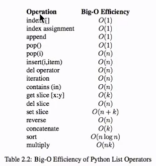
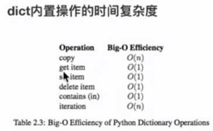

# 数据结构与算法（python）

​		如果将最终写好运行的程序比作战场，程序员表示指挥作战的将军，而我们所写的代码遍是士兵和武器。数据结构和算法就相当于**兵法**。

## 一、引入

如果a+b+c=1000,且a^2+b^2=c^2(a,b,c为自然数)，求a，b，c可能的组合

正常思路：枚举法

​		将a，b，c都从0开始，依次轮流到1000，然后查找出相应每个值即可。

```python
for a in range(1001):
    for b in range(1001):
        for c in range(1001):
            if a+b+c==1000:
                if a**2+b**2==c**2:
                    print("a:{},b:{},c:{}".format(a,b,c))
```

算法求解：

​		根据规则a+b+c=1000，当a知道后，b的循环最大位置即是1000-a，此时知道a和b则已经知道c的值，在利用这些来计算a^2+b^2=c^2是否正确。

```python
for a in range(1000):
    for b in range(1000-a):
        if a**2+b**2==(1000-a-b)**2:
            print("a:{},b:{},c:{}".format(a,b,1000-a-b))
            
>>>
a:0,b:500,c:500
a:200,b:375,c:425
a:375,b:200,c:425
a:500,b:0,c:500
```

## 二、算法的提出

### 2.1 算法的概念

​		算法是计算机处理信息的本质，因为计算机程序本质上时一个算法来高速计算机确切的步骤来执行一个指定的任务，一般的，当算法在处理信息时，会从输入设备或数据的存储地址读取数据，把结果写入输出设备或某个存储地址供以后再调用。

​		算法是独立存在的一种解决问题的方法和思想。

​		对于算法而言，语言不重要，重要的是思想。

### 2.2 算法的五大特征

- 输入：算法具有0个或多个输入
- 输出：算法至少有一个或多个输出
- 有穷性：算法在有限的步骤之后会自动结束而不会无限循环，并且每一个步骤可以再接受的时间内完成
- 确定性：算法中的每一步都有确定的含义，不会出现二义性
- 可行性：算法的每一步都是可行的，也就是说每一步都能够执行有限的次数完成

## 三、算法效率衡量

### 3.1 执行时间反应算法效率

​		对于同一问题，往往有不同的解决算法，这几种不同算法的执行时间也会产生差异。由此我们可以得出一个结论：**实现算法程序的执行时间可以反应出算法的效率，即算法的优劣**。

### 3.2 单靠时间值绝对可信么？

​		如果我们将优良算法放在一台老旧的电脑上运行，可能会出现第二种算法的运算时间长于第一种算法，因此**单纯的依靠运行的时间来比较算法的优劣并不是一定的客观准确**

程序的运行离不开计算机环境（包括硬件和操作系统），这些客观原因会影响程序的运行速度并反应在程序的执行时间上，那么如何才能客观的评判一个算法的优劣呢？

### 3.3 时间复杂度与“大0记法”

​		我们假定计算机执行算法的每一个基本操作的时间都是固定的一个时间单位，那么有多少个基本操作就代表会花费多少时间单位。当然对于不同的计算机环境而言，确切的单位时间是不同的，但是对于算法进行多少个基本操作（即花费多少时间单位）在规模数量级上却是相同的，由此可以忽略机器环境的影响而客观的反应算法的效率。

对于算法的时间效率，我们可以用“大O记法”来表示。

**“大O记法”**：对于单调的整数函数f，如果存在一个整数函数g和实常数c>0，使得对于充分大的n总有f（n）<=c*g(n)，就说函数g是f的一个渐进函数（忽略常数），记为f(n)=O(g(n))。也就是说，在趋向无穷的极限意义下，函数f的增长速度受到函数g的约束，亦即函数f与函数g的特征相似。

**时间复杂度**：假设存在函数g，使得算法A处理规模为n的问题实例所用的时间为T（n）=O（g(n)），则称O（g(n)）为算法A的渐进时间复杂度，简称时间复杂度，记为T（n）。

### 3.4 如何理解“大O记法”

​		对于算法进行特别具体的细致分析虽然很好，但是在实践中的实际价值有限。对于算法的事件性质和空间性质，最重要的是其数量级和趋势，这些是分析算法效率的主要部分。而计算算法基本操作数量的规模和函数中那些常量因子可以忽略不计。例如：可以认为3n^2和100n^2属于同一个数量级，而如果两个算法处理同样规模实例的代价分别为这两个函数，就认为他们的效率“差不多”，都是n^2级。

### 3.5 最坏时间复杂度

分析算法时，存在几种可能的考虑：

- 算法完成工作最少需要多少基本操作，即**最优时间复杂度**
- 算法完成工作最多需要多少基本操作，即**最坏时间复杂度**
- 算法完成工作平均需要多少基本操作，即**平均时间复杂度**

对于最优时间复杂度，其价值不大，因为没有提供什么有用信息，其反映的只是最乐观最理想的情况，没有参考价值。

对于最坏时间复杂度，提供了一种保证，表明算法在此种程度的基本操作中一定能完成工作。

对于平均复杂度，是对算法的一个全面的评价，因此它完整全面的反应了这个算法的性质，但另一方面，这种衡量并没有保证，不是每个计算机都能在这个基本操作内完成。而且，对于平均情况的计算，也会因为应用算法的势力分布可能并不均匀而难以计算。

因此，我们主要关于算法的最坏情况，亦即最坏时间复杂度。

### 3.6 时间复杂度的几条基本计算规则

1、基本操作：即只有常数项，认为其时间复杂度为O(1)

2、顺序结构：时间复杂度按**加法**进行计算

3、循环结构：时间复杂度按**乘法**进行计算

4、分支结构：时间复杂度取最大值

5、判断一个算法的效率时，往往只需要关注操作数量的最高次项，其他次项和常数项可以忽略

6、在没有特殊说明时，我们所分析的算法的时间复杂度都是指**最坏时间复杂度**

## 四、常见时间复杂度

| 执行次数函数举例 |    阶    | 非正式术语 |
| :--------------: | :------: | :--------: |
|        12        |   O(1)   |   常数阶   |
|       2n+3       |   O(n)   |   线性阶   |
|    3n^2+2n+1     |  O(n^2)  |   平方阶   |
|    5log2n+20     | O(logn)  |   对数阶   |
|  2n+3nlog2n+19   | O(nlogn) |  nlogn阶   |
|  6n^3+2n^2+3n+4  |  O(n^3)  |   立方阶   |
|       2^n        |  O(2^n)  |   指数阶   |

注意，经常将log2n(以2位底的对数)简写成logn

所耗时间的大小：

**O(1)<O(logn)<O(n)<O(nlogn)<O(n^2)<O(n^3)<O(2^n)<O(n!)<O(n^n)**

## 五、python内置类型性能分析

### 5.1 list内置操作的时间复杂度



由上面这张表可以知道，如果需要知道a是否在list函数里面，应该使用index而不是in。因为in的时间复杂度为O(n)而index的时间复杂度为O(1)。

### 5.2 dict内置操作的时间复杂度


### 5.3 timeit模块

timeit模块可以用来测试一小段python代码的执行速度。

**class timeti.Timer(stmt="pass", setup="pass", timer=default_timer)**

**Timer**是测试小段代码执行速度的类；

**stmt**参数是要测试的代码语句（statment）；

**setup**参数是运行代码时需要的设置；

**timer**参数是一个定时器函数，与平台有关；

**timeit.Timer.timeit(number=1000000)**

Timer类中测试语句执行速度的对象方法。number参数是测试代码时的测试次数，默认为1000000次，方法返回执行改代码的平均耗时，一个float类型的秒数。

```python
from timeit import Timer


def test1():
    l = []
    for i in range(1000):
        l += [i]
        # l = l + [i]#此时的加效率是非常低的 一般不推荐


def test2():
    l = []
    for i in range(1000):
        l.append(i)


def test3():
    l = [i for i in range(1000)]


def test4():
    l = list(range(1000))
    
    
    
# 测试test1的运算时间
timer1 = Timer("test1()", "from __main__ import test1")
print("Timer1:", timer1.timeit(1000), "seonds")
# 测试test2的运算时间
timer2 = Timer("test2()", "from __main__ import test2")
print("Timer1:", timer2.timeit(1000), "seonds")
# 测试test3的运算时间
timer3 = Timer("test3()", "from __main__ import test3")
print("Timer1:", timer3.timeit(1000), "seonds")
# 测试test4的运算时间
timer4 = Timer("test4()", "from __main__ import test4")
print("Timer1:", timer4.timeit(1000), "seonds")


# 根据每台电脑的不同，得出的值也可能大不相同但是可以确定的是使用list(range)是最快的
Timer1: 0.507679725 seonds
Timer2: 0.4320497019999998 seonds
Timer3: 0.20411319500000014 seonds
Timer4: 0.1011045020000001 seonds
```

## 六、数据结构

> 我们如何用python中的类型来保存一个班的学生信息？如果想要快速的通过学生姓名获取其信息呢？

​		实际上当我们在思考这个问题的时候，我们已经用到了数据结构。列表和字典都可以存储一个班的学生信息，但是想要在列表中获取一名学生的信息时，就要遍历这个列表，其时间复杂度为O（n），而使用字典存储时，可将学生姓名作为字典的键，学生信息作为值，进而查询时不需要遍历可快速获取学会说呢过信息，其时间复杂度为O（1）。

​		我们为了解决问题，需要将数据保存下来，然后根据数据的存储方式来设计算法实现进行处理，那么数据的存储方式不同就会导致需要不同的算法进行处理。我们希望算法解决问题的效率越快越好，于是我们就需要考虑数据究竟如何保存的问题，这就是**数据结构**。

​		在上面的问题中我们可以选择Python中的列表或者字典来存储学生信息。列表和字典就是Python内键帮我们封装好的两种数据结构。

### 6.1 概念

​		**数据**是一种抽象的概念，将其进行分类后得到程序设计语言中的基本类型。如：int，float，char等。数据元素之间不是独立的，存在特定的关系，这些关系便是**结构**。数据结构指数据对象中数据元素之间的关系。

​		python给我们提供了很多现成的数据结构类型，这些系统自己定义好的，不需要我们去定义的数据结构叫做python的内置数据结构，比如**列表，元组，字典**。而有些数据组织方式，python系统里面没有直接定义，需要我们自己去定义实现这些数据的组织方式，这些组织方式称之为python的扩展数据结构，比如栈，队列等。

### 6.2 算法与数据结构的区别

数据结构知识静态的描述了数据元素之间的关系。

高效的程序需要在数据结构的基础上设计和选择算法

**程序=数据结构+算法**

**总结：算法是为了解决实际问题二设计的，数据结构是算法需要处理的问题载体。**

### 6.3 抽象数据类型（Abstracr Data Type）

抽象数据类型的含义是指一个数学模型以及定义在此数学模型上的一组操作。即把数据类型和数据类型上运算捆绑在一起，进行封装。引入抽象数据类型的目的就是把数据类型的表示和数据类型上运算的实现与这些数据类型和运算在程序中的引用隔开，使他们相互独立。

最常用的数据运算有五种：

- 插入
- 删除
- 修改
- 查找
- 排序