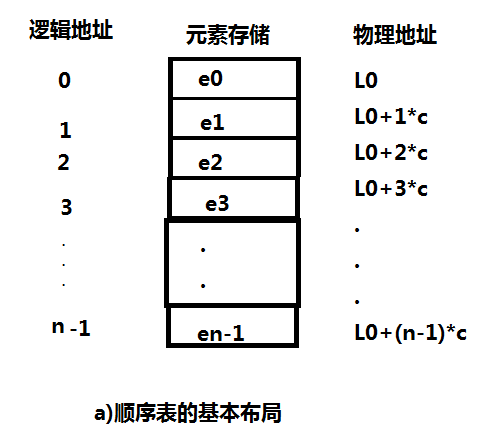
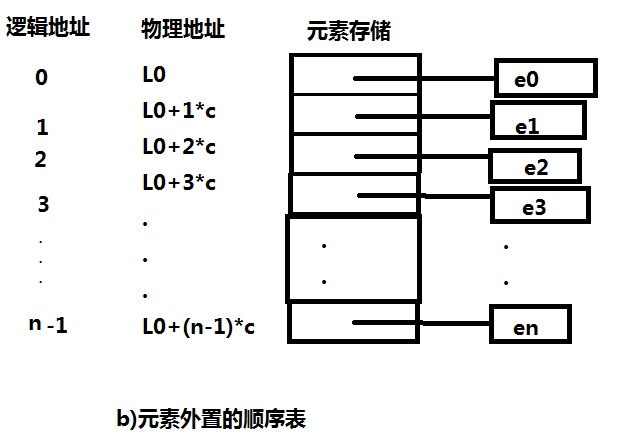

## 内存

​		我们知道，存储的最小单位为字节，一个字节又是由8位组成，内存就是由无数个字节按照顺序排列起来的。在Python中，所有的值都与内存打交道，例如正常的int类型或者在str类型，并且在32位机子中，一个int类型的值在内存中是由4个字节存储的，即如果你存的是1，那么在内存中，它的位即`00000000 00000000 00000000 00000001`，并且我们知道，字符串是由一个或多个字符组成的，一个字符在内存中是由一位存储的。

## 顺序表的基本形式

​		图a表示顺序表的基本形式，数据元素本身连续存储，每个元素所占的存储单元大小固定相同，元素的下标是其逻辑地址，而元素存储的物理地址（实际内存地址）可以通过存储区的起始地址加上逻辑地址与存储单元大小的乘积而得到。因此，访问指定元素时无需从头遍历，通过机选便可获得对应地址，其时间复杂度为O(1)。

​		如果元素的大小不统一，需要采用图b的元素外置的形式，将实际数据元素另行存储，二顺序表中各单元位置保存对应元素的地址信息（即链接），由于每个连接所需的存储量相同，通过上述公式，可以计算出元素链接的存储位置，而后顺着链接找到实际存储的数据元素。上面的c不是数据元素的大小，而是存储一个链接地址所需的存储量，这个通常很小。

​		图b为分离式结构，表对象例只保存与整个表有关的信息，实际数据元素放在另一个独例的元素存储区里，通过链接与表对象关联。

​		在程序中，经常需要将一组（通常是同为某个类型的）数据元素作为整体管理和使用，需要创建这种元素组，用变量来记录他们，传进传出函数等。一组数据中包含的元素个数可能发生变化（可以增加或删除元素）。

​		对于这种需求，最简单的解决方法是将这一组元素看成一个序列，用元素在序列里的位置和顺序，表示实际应用中的某种意义的信息，或者表示数据之间的某种关系。

​		这样的一组序列元素的组织形式，我们可以将其抽象为线性表。一个线性表是某类元素的一个集合，还记录着元素之间的一种顺序关系。线性表是最基本的数据结构之一。在实际程序中应用非常广泛，它还经常被用作更复杂的数据结构的实现基础。

​		线性表的实际存储方式，分为两种实现模型：

- 顺序表，将元素顺序地存放在一块连续的存储区里，元素间的顺序关系由他们的存储顺序自然表示。
- 链表，将元素存放在通过链接构造起来的一系列存储块中。

## Python中的顺序表

​		Python中的list和tuple两种类型采用了顺序表的实现技术，tuple是不可变类型，即不变的顺序表，因此不支持改变其内部状态的任何操作，二其他方面则与list性质类似。

### list的基本实现技术

​		Python标准类型list就是一种元素个数可变的线性表，可以加入和删除元素，并且各种操作中维持已有元素的顺序（即保序），而且还具有一下特征：

- 基于下标（位置）的高效元素访问和更新，时间复杂度应该是O（1）；为满足该特征，应采用顺序表技术，表中元素保存在一块连续的存储区中。
- 允许任意元素加入，而且在不断加入元素的过程中，表对象的标识（函数id得到的值）不变。为满足该特征，就必须能更换元素存储区，并且为保证更换存储区时list对象的标识id不变，只能采用分离式实现技术。

​        在Python的官方实现中，list就是一种采用分离式技术实现的动态顺序表，这就是为什么用list.append(x)比在指定位置插入元素效率高的原因。

​		在Python的官方实现中，list实现采用如下的策略：建立空表（或很小的表）时，系统自动分配一块能容纳8个元素的存储区；在执行插入操作时，如果元素存储区满就换一块4倍大的存储区。但如果此时的表已经很大（目前阈值为50000），则改变策略，采用加一倍的方式，引入这种改变策略的方式，是为了避免出现过多的空闲存储位置。

