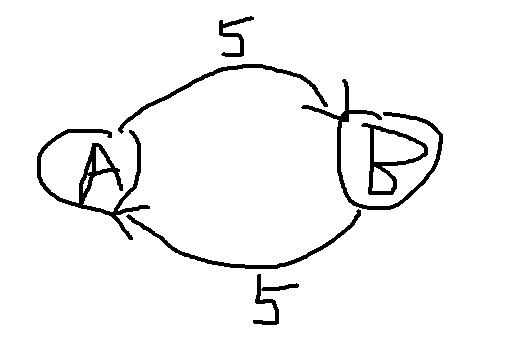
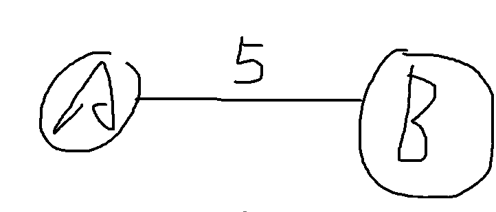
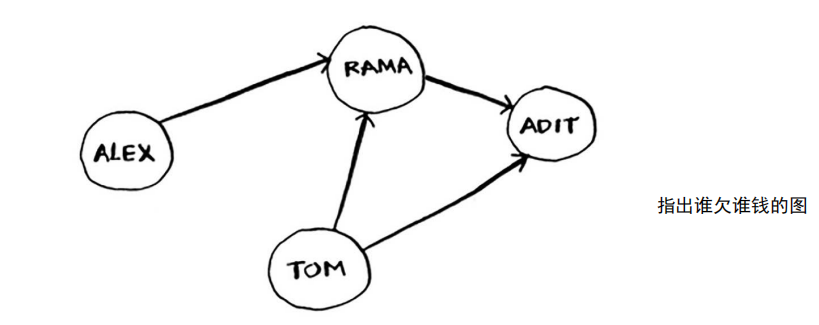

# 广度优先遍历

在谈广度优先遍历之前，我们需要知道图是什么。

## 1.图

​		图（graph）是表示物件与物件之间关系的数学对象，是图论的基本研究对象，图由节点（node）和边（edge）组成。图分为两种：1.有向图、2.无向图。

### 1.1有向图

​		有向图就类似于我们去打牌，如果A欠B5元，则有一条线段从A指向B，如果B欠A5元，那么就又有一条线由B指向A，这个5元我们称之为权重（weight）。



### 1.2 无向图

​		如果有一条线段是由A指向B，并且B指向A。那么这两条线段可以合成一条无箭头的线段在A于B中间。



​		如果当参加打牌的人数变多时，关系也会变的复杂，如下图所示



​		上面表示ALEX欠RAMA钱，RAMA欠ADIT钱，TOM欠RAMA和ADIT的钱。

​		就这么简单！图由节点和边组成。一个节点可能与众多节点直接相连，这些节点被称为邻居。在前面的欠钱图中，Rama是Alex的邻居。Adit不是Alex的邻居，因为他们不直接相连。但Adit既 是Rama的邻居，又是Tom的邻居。

​		图用于模拟不同的东西是如何相连的。

## 2.广度优先遍历

​		广度优先搜索是一种用于图的查找算法，可帮助回答两类问题。

- 第一类问题：从节点A出发，有前往节点B的路径吗？
- 第二类问题：从节点A出发，前往节点B的哪条路径最短？

​		下面我们举个简单的栗子来理解一下广度优先遍历的妙处。

​		假设你是一个木材厂的老板，你手中有一批上等的好木头，需要寻找一个木材爱好者，把木头卖给他。因此你可以在微信中查找你的朋友是否是木材爱好者或者你可以发朋友圈问朋友他们的朋友中是否有木材爱好者。

​		为此，你首先在朋友中查找。这种查找很简单。首先，创建一个朋友名单。然后，一次查找名单中的每个人，看看他们是否是木材爱好者。

​		假设你没有朋友是木材爱好者，那么你就必须在朋友的朋友中查找。检查名单中的每个人时，你都将其朋友加入名单。

​		这样一来，你不仅在朋友中查找，还在朋友的朋友中查找。别忘了，你的目标是在你的人际关系网中找到一位木材爱好者。因此，如果A不是木材爱好者，就将其朋友也加入到名单中。这意味着你将在她的朋友、朋友的朋友等中查找。使用这种算法将搜遍你的整个人际关系网，直到找到木材爱好者。这就是广度优先搜索算法。

​	那么python中如何来实现呢？我们需要引入队列（deque）。队列支持两种操作：入队和出队。

​		如果你将两个元素加入队列，先加入的元素将在后加入的元素之前出队。因此，你可使用队列来表示查找名单！这样，先加入的人将先出队并先被检查。

​		队列是一种先进先出（First In First Out，FIFO）的数据结构，而栈是一种后进先出（Last In  First Out，LIFO）的数据结构。

## 3.手撕代码

​		首先，需要使用代码来实现图。图由多个节点组成。每个节点都与邻近节点相连，如果表示类似于“你→Bob”这样的关系呢？它就是字典！

​		我们可以用字典来将你的所有邻居存入以你为关键字，以邻居为值的字典中。


​		我们现在来帮木材商(A)查找木材爱好者(I)吧

### 3.1 创建graph表

​		我们知道，对于A来说，他有`["B","C","F"]`三个朋友，B没有朋友，因此为`[]`。按照这个思路我们就可以构造出如下的一个表

```python
graph = {}
graph["A"] = ["B","C","F"]
graph["B"] = []
graph["C"] = ["E","F","D"]
graph["D"] = ["H","G"]
graph["E"] = ["I"]
graph["F"] = []
graph["G"] = []
graph["H"] = ["I"]
graph["I"] = []
```

### 3.2 创建队列

​		对于队列，我们可以调用python强大的库collections里的deque(另一篇文章有讲该库，可去查看一下)来创建一个双端队列

```python
from collections import deque  # 从collections库中导入deque类
search_pepole = deque()  # 创建一个队列
search_pepole += graph["A"]  # 将A的朋友加入到队列中
```

### 3.3创建判断函数

```python
def person_is_seller(person):  # 创建判断函数，查看该人是否是I
    return person == "I"


while search_people:  # 如果队列不为空
    person = search_people.popleft()  # 取出当前队列的第一个人
    if person_is_seller(person):  # 检查这个人是否是I
        print(person + " is a love tree'people!")  # 是I
        break
    else:
        search_people += graph[person]  # 如果不是，则把这个人的朋友都加入到队列张红
```

### 3.4 检查代码

​		回去看一下代码，我们会发现，如果B是C的朋友，C是D的朋友，D又是B的朋友，那么我们就会将整个循环进入一个无限的循环之中，我们可以添加一个列表，用来存储已经被查找过的用户

```python
def search(name):
    search_people = deque()  # 创建一个队列
    search_people += graph[name]  # 将name的朋友加入到队列中
    searched = []
    while search_people:  # 如果队列不为空
        person = search_people.popleft()  # 取出当前队列的第一个人
        if not person in searched:  # 如果这个人没有被查找过
            if person_is_seller(person):  # 检查这个人是否是I
                print(person + " is a love tree'people!")  # 是I
                break
            else:
                search_people += graph[person]  # 如果不是，则把这个人的朋友都加入到队列张红
    return False
```

## 4.完整代码

```python
# -*- coding: utf-8 -*-
from collections import deque  # 从collections库中导入deque类

graph = {}
graph["A"] = ["B", "C", "F"]
graph["B"] = []
graph["C"] = ["E", "F", "D"]
graph["D"] = ["H", "G"]
graph["E"] = ["I"]
graph["F"] = []
graph["G"] = []
graph["H"] = ["I"]
graph["I"] = []


def person_is_seller(person):  # 创建判断函数，查看该人是否是I
    return person == "I"


def search(name):
    search_people = deque()  # 创建一个队列
    search_people += graph[name]  # 将name的朋友加入到队列中
    searched = []
    while search_people:  # 如果队列不为空
        person = search_people.popleft()  # 取出当前队列的第一个人
        if not person in searched:  # 如果这个人没有被查找过
            if person_is_seller(person):  # 检查这个人是否是I
                print(person + " is a love tree'people!")  # 是I
                break
            else:
                search_people += graph[person]  # 如果不是，则把这个人的朋友都加入到队列张红
    return False

search("A")
```

